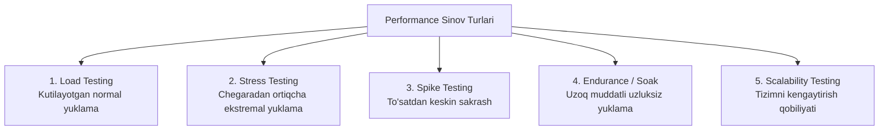

import { Callout } from 'nextra/components'

# Performance Testing: Samaradorlik va Yuklama Sinovi

**Performance Testing** — dasturiy ta'minotning turli darajadagi yuklama (foydalanuvchilar oqimi yoki ma'lumotlar hajmi) ostida qanchalik tez, barqaror va ishonchli ishlashini baholovchi nofunksional sinov turidir.

---

## Asosiy Metrikalar

1. **Javob berish vaqti (Response Time):** Foydalanuvchi so'rov yuborgan paytdan to serverdan to'liq javob kelgunga qadar o'tgan vaqt (odatda millisekundlarda o'lchanadi).
2. **O'tkazuvchanlik qobiliyati (Throughput):** Tizim tomonidan bir soniyada muvaffaqiyatli bajarilgan so'rovlar soni (RPS — Requests Per Second).
3. **Resurslar sarfi (Resource Utilization):** Markaziy protsessor (CPU), operativ xotira (RAM) va tarmoq trafigining yuklanish foizi.
4. **Xatoliklar darajasi (Error Rate):** Umumiy so'rovlar orasida 500, 502, 504 kabi xatolik bergan javoblarning foizi.

---

## Performance Sinovining 5 ta Asosiy Turi

### 1. Load Testing (Yuklama Sinovi):
- Dastur kutilayotgan odatiy va cho'qqi (masalan, 10 000 bir vaqtda kiruvchi mijoz) sharoitida qanday ishlashini tekshiradi.

### 2. Stress Testing (Zo'riqish Sinovi):
- Tizimga ruxsat etilgan maksimal chegaradan ancha yuqori (masalan, 50 000 foydalanuvchi) yuklama beriladi.
- Maqsad: Tizim aynan qaysi nuqtada qulab tushishini (Breaking point) va qulaganidan so'ng qayta tiklana olishini (Graceful degradation) ko'rish.

### 3. Spike Testing (Sapchish Sinovi):
- Yuklama to'satdan, bir necha soniya ichida 10 barobarga oshiriladi va yana pasaytiriladi (masalan, "Qora juma" aksiyasi e'lon qilingan soniya).

### 4. Endurance (Soak / Chidamlilik) Sinovi:
- Tizimga o'rtacha yuklama juda uzoq muddat (12 soatdan bir necha kungacha) davomida beriladi.
- Maqsad: Xotiraning asta-sekin to'lib ketishi (Memory Leak) va ma'lumotlar bazasi ulanishlarining tugab qolishini aniqlash.

### 5. Scalability (Kengayuvchanlik) Sinovi:
- Yangi serverlar qo'shilganda (gorizontal yoki vertikal masshtablash) tizim unumdorligi mutanosib ravishda oshishini tekshirish.

<Callout type="info">
  **Ommabop vositalar:** Ushbu sinovlarni amalga oshirish uchun **Apache JMeter**, **Grafana k6**, **Gatling** va **Locust** kabi zamonaviy vositalar qo'llaniladi.
</Callout>
