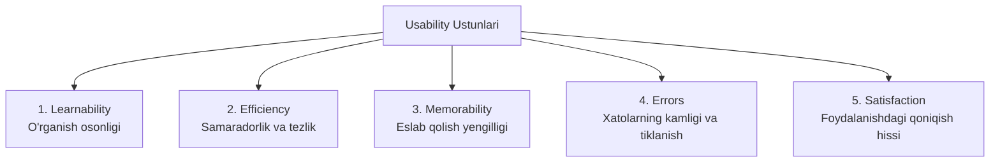

import { Callout } from 'nextra/components'

# Usability Testing: Foydalanish Qulayligi Sinovi

**Usability Testing** — dasturiy interfeysning foydalanuvchi uchun qanchalik tushunarli, intuitiv, o'rganishga oson va qulay ekanligini baholovchi nofunksional sinov turidir.

Ushbu sinovda tizim quyidagi mezon bo'yicha tekshiriladi: yangi foydalanuvchi hech qanday qo'llanma yoki ko'rsatmasiz o'z maqsadiga (masalan: ro'yxatdan o'tish, tovar sotib olish) qanchalik oson va to'siqsiz erisha oladi?

---

## Usability ning 5 Asosiy Ustuni

1. **O'rganish osonligi (Learnability):** Foydalanuvchi dastur bilan birinchi marta to'qnash kelganda asosiy amallarni qanchalik tez bajara oladi?
2. **Harakat samaradorligi (Efficiency):** Interfeysni o'rgangach, foydalanuvchi vazifalarni necha qadam (kliklarni bosish) bilan bajara oladi?
3. **Eslab qolish yengilligi (Memorability):** Foydalanuvchi dasturga ma'lum vaqt tanaffusdan so'ng qaytganda, undan foydalanishni qaytadan o'rganishi shart bo'lmaydimi?
4. **Xatolar chastotasi va yengilligi (Errors):** Foydalanuvchilar qanchalik kam xato qiladilar va xato yuz berganda tizim ularga qanchalik aniq yordam bera oladi?
5. **Qoniqish hissi (Satisfaction):** Tizim dizayni, ranglari va javob tezligi foydalanuvchida yoqimli taassurot qoldiradimi?

---

## Yakob Nilsenning Evristik Baholash Qoidalari (Heuristics)

Dunyo bo'ylab Usability sinovida Jakov Nielsen (Nielsen Norman Group) tomonidan ishlab chiqilgan 10 ta oltin evristika asos qilib olinadi:
- **Tizim holatining ochiqligi:** Foydalanuvchi har soniyada tizim nima qilayotganini ko'rib turishi kerak (masalan: progress bar yoki yuklanish aylanmasi).
- **Haqiqiy dunyo bilan moslik:** Tizimda tushunarsiz texnik jargonlar o'rniga, foydalanuvchiga tanish bo'lgan so'zlar va tushunchalar ishlatilishi lozim.
- **Foydalanuvchi erkinligi va nazorati:** Xato bosilgan harakatni bekor qilish ("Orqaga", "Undo") imkoni mavjud bo'lishi shart.
- **Bir xillik va standartlar (Consistency):** Barcha sahifalarda tugmalar rangi, shriftlar va atamalar yagona standartda bo'lishi kerak.
