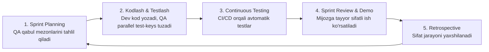

import { Callout } from 'nextra/components'

# Agile Testing va Sprint Sinovlari

Zamonaviy dasturiy ta'minot kompaniyalarining aksariyati Agile (Scrum / Kanban) metodologiyalari asosida faoliyat yuritadi. An'anaviy Waterfall da sinov loyiha oxirida bo'lsa, Agile da sinov har bir sprintning (1-2 haftalik sikl) ajralmas, uzluksiz qismidir.

**Agile Testing** — dasturchilar, biznes tahlilchilar va QA muhandislarining har kuni birgalikda, sprint davomida yangi funksiyalarni ishlab chiqish va darhol sinashga asoslangan hamkorlik jarayonidir.

---

## Butun Jamoa Yondashuvi (Whole-Team Approach)

Agile metodologiyasida "Sifat uchun faqat tester javobgar" degan eskirgan qarash inkor etiladi. Sifat uchun **butun jamoa (dasturchilar ham, testerlar ham, mahsulot egalari ham)** teng javobgar hisoblanadi.

---

## "Definition of Done" (DoD — Bajarilganlik Mezoni)

Agile da biror vazifa (User Story) yoki yangi funksiya dasturchi tomonidan kod yozib bo'lingani uchungina "tayyor" (Done) deb hisoblanmaydi. Vazifani to'liq yakunlangan deb tan olish uchun u oldindan kelishilgan DoD talablaridan o'tishi shart:

- [ ] Manba kodi yozildi va Code Review dan o'tdi.
- [ ] Barcha Birlik sinovlari (Unit Tests) yozildi va 80%+ qamrovga erishildi.
- [ ] QA tomonidan barcha qabul mezonlari (Acceptance Criteria) bo'yicha manual sinovlar o'tdi.
- [ ] Yangi funksionallik uchun asosiy avtomatlashtirilgan regressiya testlari yozildi.
- [ ] Hech qanday Blocker yoki Critical darajadagi ochiq xatoliklar qolmadi.
- [ ] Texnik hujjatlar va reliz qaydlari (Release Notes) yangilandi.

<Callout type="info">
  **Agile Test Kvadrantlari:** Brayan Marik (Brian Marick) tomonidan ishlab chiqilgan ushbu 4 kvadrant texnologiyaga (Unit/API) va biznesga (UAT/Exploratory) yo'naltirilgan sinovlarni to'liq balansda olib borishga yordam beradi.
</Callout>
