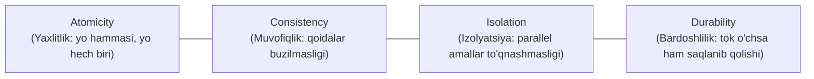

import { Callout } from 'nextra/components'

# Database Testing: Ma'lumotlar Bazasi Sinovi

Veb va mobil ilovalarning orqa tomonida (Backend) ulkan ma'lumotlar bazalari (RDBMS / NoSQL) yotadi. Har qanday foydalanuvchi harakati (ro'yxatdan o'tish, pul o'tkazish, profilni tahrirlash) bazada saqlanadi.

**Database Testing** — ma'lumotlar bazasining tuzilishi (sxemasi), jadvallari, ma'lumotlar yaxlitligi, tranzaksiyalarning to'g'riligi va SQL so'rovlarining unumdorligini tekshirish jarayonidir.

---

## 1. ACID Tamoyillarini Sinash

Har qanday moliya va bank tizimlarida ma'lumotlar bazasi **ACID** talablariga qat'iy javob berishi shart:

- **Atomicity (Atomlilik):** A mijoz B mijozga 100 000 so'm o'tkazayotganda, agar A dan pul yechilib, B ga qo'shilayotgan soniyada server o'chib qolsa — tranzaksiya to'liq bekor qilinishi (Rollback) va A ning puli joyiga qaytarilishi kerak. Pul havoda yo'qolib ketmasligi lozim!
- **Consistency (Muvofiqlik):** Tranzaksiyadan oldin ham, keyin ham barcha cheklovlar (Primary Key, Foreign Key, Not Null) o'zgarmas saqlanishi kerak.
- **Isolation (Izolyatsiya):** Bir vaqtning o'zida yuzlab foydalanuvchilar pul yechayotganida, ularning tranzaksiyalari bir-biriga xalaqit bermasligi lozim.
- **Durability (Chidamlilik):** Tranzaksiya muvaffaqiyatli deb tasdiqlandimi, server qulab tushsa ham bu yozuv diskda abadiy saqlanib qoladi.

---

## 2. CRUD Operatsiyalarini Tekshirish

Har bir jadval bo'yicha 4 ta asosiy amal tekshiriladi:
- **Create (Yaratish):** Yangi yozuv `INSERT` qilinganda barcha maydonlar to'g'ri to'ladimi?
- **Read (O'qish):** `SELECT` so'rovi orqali ma'lumotlar to'g'ri filtrlanib ekranga chiqadimi?
- **Update (Yangilash):** `UPDATE` orqali profil ma'lumotlari o'zgarganda boshqa foydalanuvchilarning ma'lumotlari buzilib ketmaydimi?
- **Delete (O'chirish):** `DELETE` qilinganda unga bog'langan jadvallardagi yozuvlar (Cascade Delete) qanday yo'l tutadi?
