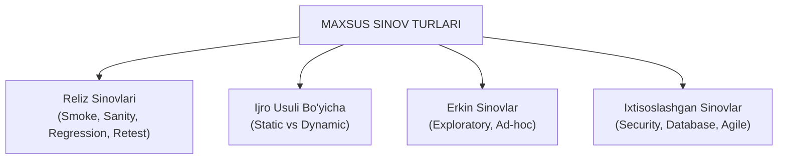

import { Cards, Callout } from 'nextra/components'

# Qo'shimcha va Maxsus Sinov Turlari (Other Types of Testing)

Dasturiy muhandislik amaliyotida loyihaning o'ziga xos talablari, relizlar jadvali va xavfsizlik darajasidan kelib chiqib, o'nlab maxsus sinov turlari qo'llaniladi.

TpointTech dasturida ushbu sinov turlari dastur sifatini har tomonlama, barcha burchaklardan to'liq tekshirish uchun tizimlashtirilgan.

---

## Maxsus Sinov Turlari Guruhlari

---

## Modul Bo'limlari

<Cards num={2}>
  <Cards.Card
    title="▶️ Smoke vs Sanity Testing"
    href="/docs/other-testing-types/smoke-vs-sanity"
  >
    Yangi yig'ilmani qabul qilish sinovi (Smoke) va tuzatilgan qismni tezkor tekshirish (Sanity) farqlari.
  </Cards.Card>
  <Cards.Card
    title="▶️ Regression vs Retesting"
    href="/docs/other-testing-types/regression-vs-retesting"
  >
    Xatolikning rostdan tuzatilganini tekshirish (Retest) va yangi kod eski qismlarni buzmaganligiga ishonch hosil qilish (Regression).
  </Cards.Card>
  <Cards.Card
    title="▶️ Static vs Dynamic Testing"
    href="/docs/other-testing-types/static-vs-dynamic"
  >
    Kodni ishga tushirmasdan hujjatlar va kodni tahlil qilish (Static) hamda ishlayotgan dasturni sinash (Dynamic).
  </Cards.Card>
  <Cards.Card
    title="▶️ Exploratory & Ad-hoc Sinovi"
    href="/docs/other-testing-types/exploratory-testing"
  >
    Oldindan yozilgan test-keyslarsiz, intuitsiya va tadqiqotga asoslangan erkin qidiruv sinovlari.
  </Cards.Card>
  <Cards.Card
    title="▶️ Security Testing (Xavfsizlik)"
    href="/docs/other-testing-types/security-testing"
  >
    Kiberhujumlar, zaifliklar, autentifikatsiya, avtorizatsiya va ma'lumotlar shifrlanishini tekshirish.
  </Cards.Card>
  <Cards.Card
    title="▶️ Database Testing (Ma'lumotlar Bazasi)"
    href="/docs/other-testing-types/database-testing"
  >
    ACID tamoyillari, CRUD operatsiyalari, ma'lumotlar yaxlitligi va SQL so'rovlarining to'g'riligi.
  </Cards.Card>
  <Cards.Card
    title="▶️ Agile Testing & Sprint Sinovlari"
    href="/docs/other-testing-types/agile-testing"
  >
    Scrum va Kanban muhitida sinov faoliyati, jamoaviy hamkorlik va "Definition of Done" (DoD).
  </Cards.Card>
</Cards>
