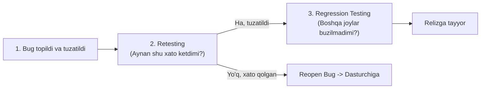

import { Callout } from 'nextra/components'

# Regression Testing va Retesting: Farqlari

Dasturiy kodga har qanday o'zgartirish (yangi funksiya qo'shish yoki xatolikni tuzatish) kiritilgandan so'ng, QA jamoasi oldida ikki muhim vazifa paydo bo'ladi:
1. Xatolik haqiqatan ham tuzatildimi?
2. Ushbu yangi kod dasturning avval mukammal ishlab turgan boshqa qismlarini buzib qo'ymadimi?

Ushbu ikki vazifani mos ravishda **Retesting** va **Regression Testing** hal qiladi.

---

## 1. Retesting (Qayta Sinash)

**Retesting** — dasturda oldinroq yiqilgan (Fail bo'lgan) aniq bir test-keysni, dasturchi xatolikni tuzatganini e'lon qilganidan so'ng, **aynan o'sha xatolik yo'qolganligini tasdiqlash uchun xuddi o'sha qadamlar bilan qayta bajarish jarayonidir**.

- Retesting faqat muvaffaqiyatsiz bo'lgan test-keyslar uchun o'tkaziladi.
- Natijasi: Xatolik yopiladi (*Closed*) yoki qayta ochiladi (*Reopened*).

---

## 2. Regression Testing (Regressiya Sinovi)

**Regression Testing** — dastur kodiga kiritilgan o'zgartirishlar (xatolik tuzatilishi, optimallashtirish yoki yangi funksiya) tizimning **ilgari benuqson ishlab turgan boshqa modullari faoliyatiga salbiy ta'sir ko'rsatmaganligiga (regressiya yuz bermaganligiga)** ishonch hosil qilish uchun o'tkaziladigan sinovdir.

Dasturiy tizimlar o'zaro zich bog'langan bo'ladi. Masalan, foydalanuvchi profilidagi xatolikni tuzatish kodi kutilmaganda to'lov tizimidagi funksiyaning sinishiga olib kelishi mumkin.

---

## Retesting va Regression Testing Qiyosiy Matrisasi

| Mezon | Retesting | Regression Testing |
| :--- | :--- | :--- |
| **Maqsadi** | Muayyan nuqson rostdan tuzatilganini tasdiqlash | Yangi kod eski ishlayotgan qismlarga ziyon yetkazmaganini tekshirish |
| **Bajarilish sababi** | Oldingi testning yiqilishi (*Failed test case*) | Kodga har qanday o'zgartirish kiritilishi |
| **Qamrovi** | Faqat xato chiqqan modul va o'sha test-keys | Tizimning o'zgarishga aloqador barcha bo'limlari (yoki butun tizim) |
| **Test-keyslar** | Faqat yiqilgan test-keys qayta ishlatiladi | Avval yozilgan va muvaffaqiyatli o'tgan testlar to'plami |
| **Avtomatlashtirish** | Odatda qo'lda bajariladi (bir martalik) | **100% avtomatlashtirishga ideal nomzod!** |
| **Ustuvorligi** | Regressiyadan oldin o'tkaziladi | Retesting muvaffaqiyatli o'tgandan keyin boshlanadi |

