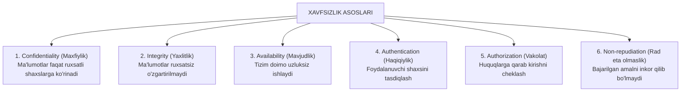

import { Callout } from 'nextra/components'

# Security Testing: Axborot Xavfsizligi Sinovi

**Security Testing** — dasturiy ta'minotning foydalanuvchi maxfiy ma'lumotlarini (parollar, bank kartalari, shaxsiy yozishmalar) begona shaxslardan himoya qila olishi, ruxsatsiz kirishlarga qarshilik ko'rsatishi va kiberhujumlarga bardoshliligini tekshiruvchi nofunksional sinov yo'nalishidir.

---

## Axborot Xavfsizligining 6 Asosiy Asosi

---

## Eng Ko'p Uchraydigan Xavfsizlik Zaifliklari (OWASP Top 10)

QA muhandisi o'z sinovlarida xalqaro OWASP (Open Web Application Security Project) tomonidan e'lon qilinadigan eng xavfli zaifliklarni doimo nazorat qilishi kerak:

1. **SQL Injection (SQL in'ektsiyasi):** Foydalanuvchi kiritish maydoniga maxsus SQL kodlarini (masalan: `' OR '1'='1`) kiritish orqali butun ma'lumotlar bazasini o'g'irlashi yoki buzishi.
2. **Broken Authentication (Buzilgan autentifikatsiya):** Sessiya tokenlarining shifrlanmasligi, parollarning oddiy matnda saqlanishi yoki brute-force (parollarni ketma-ket tanlash) ga qarshi himoyaning yo'qligi.
3. **Cross-Site Scripting (XSS):** Saytga zararli JavaScript kodlarini kiritish orqali boshqa foydalanuvchilarning cookie yoki tokenlarini o'g'irlash.
4. **Security Misconfiguration (Noto'g'ri xavfsizlik konfiguratsiyasi):** Serverlarda standart parollarning qolib ketishi (admin/admin), xatolik yuz berganda butun dastur kodini ekranga chiqarib yuborish (Stack Trace exposure).

<Callout type="warning">
  **Penetration Testing (Pen-Test):** Tizimni haqiqiy xakerlar kabi buzib kirishga urinish orqali barcha zaifliklarni ochib beruvchi chuqur xavfsizlik sinovi. Ushbu sinovda *OWASP ZAP*, *Burp Suite* va *Metasploit* kabi professional asboblar ishlatiladi.
</Callout>
