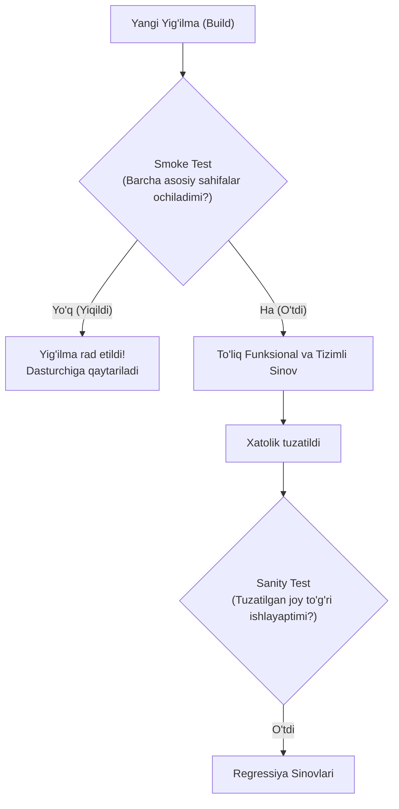

import { Callout } from 'nextra/components'

# Smoke Testing va Sanity Testing: Farqlari va Qo'llanilishi

QA sohasida eng ko'p chalkashtiriladigan, ammo amaliyotda har kuni qo'llaniladigan ikkita asosiy tezkor sinov turi mavjud: **Smoke Testing** va **Sanity Testing**.

Ikkala sinov ham vaqtni tejash va dasturning chuqur sinovlarga tayyorligini zudlik bilan aniqlashga qaratilgan.

---

## 1. Smoke Testing (Tutun Sinovi / Build Verification Testing)

**Smoke Testing** — ishlab chiquvchilar tomonidan taqdim etilgan yangi yig'ilma (Build) ning eng asosiy, kritik funksiyalari ishlayotganligini va ushbu yig'ilmani to'liq sinovga qabul qilish mumkinligini tekshiruvchi **yuzaki, lekin keng qamrovli** sinovdir.

- **Nomining kelib chiqishi:** Elektronika sohasida yangi yasalgan mikrosxemaga tok ulanganda agar undan tutun chiqmasa, demak qurilma yonmadi va uni keyingi sinovlarga ulash mumkin degan qoidadan olingan.
- **Maqsadi:** Yangi yig'ilmaning barqarorligini (Stability) tasdiqlash. Agar smoke test yiqilsa, butun yig'ilma rad etiladi va dasturchilarga qaytariladi. QA vaqtini behuda sarflamaydi.

---

## 2. Sanity Testing (Aqlni Tekshirish / Sog'lom Fikr Sinovi)

**Sanity Testing** — dasturdagi aniq bir xatolik tuzatilgandan (Bug fix) yoki kichik bir funksiya qo'shilgandan so'ng, aynan o'sha modul va unga yaqin sohalar to'g'ri ishlayotganligini tekshiruvchi **tor qamrovli, ammo chuqur** tezkor sinovdir.

- **Maqsadi:** Dasturchi xatolikni tuzataman deb aqlga to'g'ri kelmaydigan boshqa mantiqsiz holatlarni keltirib chiqarmaganligini tezkor tasdiqlash.

---

## Smoke va Sanity Testing Qiyosiy Solishtiruvi

| Mezon | Smoke Testing | Sanity Testing |
| :--- | :--- | :--- |
| **Qachon o'tkaziladi?** | Yangi yig'ilma (Build) chiqarilishi bilanoq | Xatolik tuzatilib, yangi build olingandan keyin |
| **Qamrovi** | **Keng, lekin yuzaki:** Dasturning barcha asosiy funksiyalarini qamrab oladi | **Tor, lekin chuqur:** Faqat tuzatilgan modul va unga bog'liq qismlarni tekshiradi |
| **Bajaruvchi** | QA muhandislari yoki Dasturchilar (ko'pincha CI/CD da avtomatlashgan) | Odatda faqat QA muhandislari tomonidan bajariladi |
| **Hujjatlashuvi** | Odatda oldindan belgilangan rasmiy Smoke Checklist mavjud | Ko'pincha ssenariysiz, tezkor norasmiy tekshiruv |
| **Muvaffaqiyatsizlik natijasi** | Butun yig'ilma rad etiladi (Reject Build) | Faqat tuzatilgan xatolik qayta ochiladi (Reopen Bug) |

