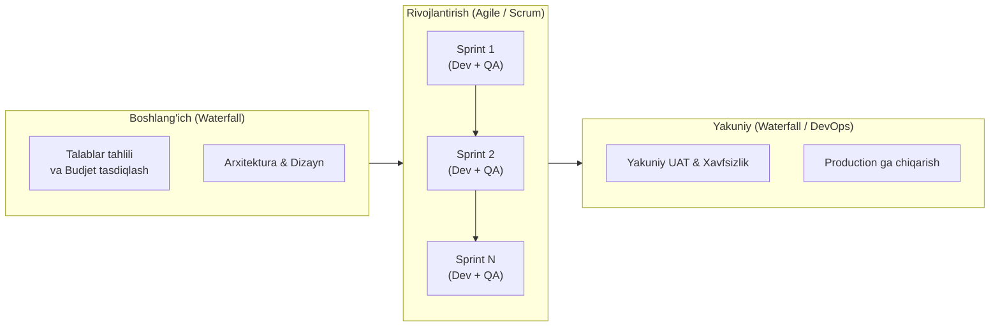

import { Callout } from 'nextra/components'

# Gibrid SDLC Modeli

**Gibrid model** — ikki yoki undan ortiq SDLC modellarining eng yaxshi xususiyatlarini (ko'pincha Waterfall ning tuzilishi va hujjatlashuvi bilan Agile/Spiral ning iterativ moslashuvchanligini) o'zida mujassamlashtirgan amaliy yondashuvdir.

Zamonaviy korporativ tashkilotlarda (Enterprise) bitta sof modelni qo'llash har doim ham samarali bo'lmaydi. Shu sababli, yuqori darajada qat'iy reja va qoidalarga ega bo'lgan, ammo amalda tezkor o'zgarishlarni talab qiluvchi loyihalarda Gibrid model tanlanadi.

---

## Waterfall va Agile Gibridi (Water-Scrum-Fall)

Eng keng tarqalgan gibrid shakl — bu **Water-Scrum-Fall** deb ataladi:

---

## Gibrid Modelning Asosiy Xususiyatlari

1. **Strategik rejalashtirish bosqichi:** Loyihaning umumiy byudjeti, muddatlari va arxitekturaviy asosi klassik tarzda rasmiylashtiriladi.
2. **Tezkor ishlab chiqish (Sprints):** Kodlash va birlamchi sinovlar 2-3 haftalik iteratsiyalarda (Scrum/Kanban) amalga oshiriladi.
3. **Qat'iy sifat nazorati:** Chiqarilish (Release) oldidan to'liq regressiya, xavfsizlik va integratsion sinovlar o'tkaziladi.

---

## SDLC Modellari Qiyosiy Matrisasi

| Xususiyat | Waterfall | Spiral | Prototype | V-Model | Gibrid |
| :--- | :--- | :--- | :--- | :--- | :--- |
| **Talablar moslashuvchanligi** | Juda past | Yuqori | Juda yuqori | Qat'iy | O'rtacha/Yuqori |
| **Xatarlarni boshqarish** | Past | Eng yuqori | O'rtacha | O'rtacha | Yuqori |
| **QA jalb qilinishi** | Eng oxirida | Har bir siklda | O'rtacha | Eng boshidanoq | Doimiy |
| **Hujjatlashtirish** | To'liq | Yuqori | Kam | Juda yuqori | Balanslangan |
| **Katta loyihalarga mosligi** | Yo'q | Ha | Yo'q | Ha | Ha |
