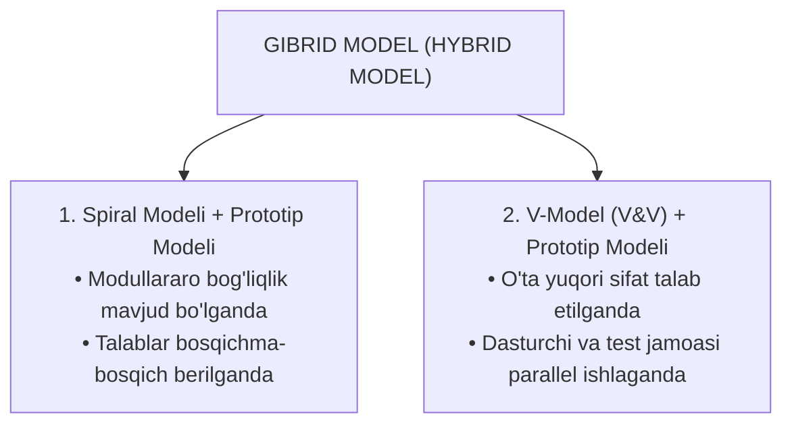
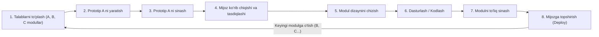
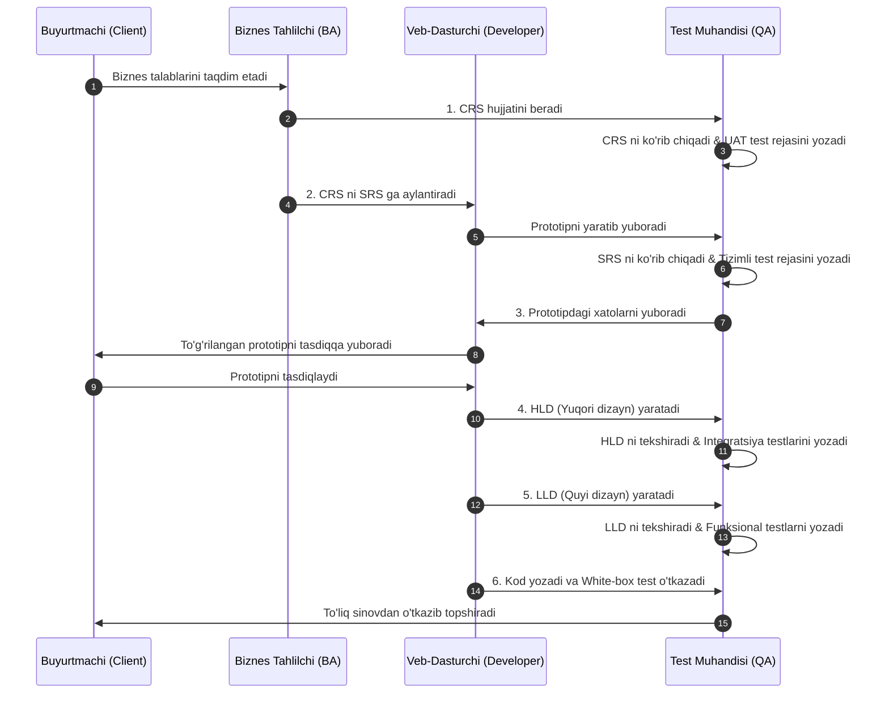

import { Callout } from 'nextra/components'

# Dasturiy Sinovda Gibrid Model (Hybrid Model in Software Testing)

**Gibrid model (Hybrid Model)** — bu ikki yoki undan ortiq dasturiy ta'minotni ishlab chiqish hayotiy davri (SDLC) modellarining eng kuchli xususiyatlarini birlashtiruvchi yondashuvdir. U turli xil ishlab chiqish metodologiyalarining ustun jihatlaridan foydalangan holda loyihaning aniq va o'ziga xos talablariga to'liq javob berish uchun maxsus loyihalashtiriladi.

Ushbu bo'limda siz Gibrid model, uning o'ziga xos xususiyatlari, amaliyotda eng ko'p qo'llaniladigan kombinatsiyalari, ish bosqichlari hamda afzalliklarini batafsil o'rganasiz.

---

## Gibrid Model Nima? (What is the Hybrid Model?)

**Gibrid model** — loyiha talablariga eng mos keladigan ishlab chiqish jarayonini shakllantirish maqsadida ikki yoki undan ortiq SDLC modellarini o'zaro uyg'unlashtiradi. Tanlangan modellar loyiha hajmi, murakkabligi, buyurtmachi talablari va xavflarni boshqarish (risk management) kabi muhim omillarni hisobga olgan holda birlashtiriladi.

Gibrid model kichik, o'rta va yirik dasturiy loyihalarning barchasi uchun birdek mos keladi. U odatda bitta SDLC modelining o'zi loyiha maqsadlariga to'liq javob bera olmaganida yoki loyihaning turli bosqichlari turlicha rivojlanish usullarini talab qilganda tanlanadi.

Gibrid modelda eng ko'p qo'llaniladigan kombinatsiyalar quyidagilardir:
1. **Spiral Modeli va Prototip Modeli (Spiral Model and Prototype Model)**
2. **V-Model (V&V) va Prototip Modeli (V-Model and Prototype Model)**

<Callout type="warning">
**Eslatma:** Klassik **Sharshara modeli (Waterfall Model)** odatda boshqa SDLC modellari bilan birlashtirilmaydi. Sababi u qat'iy chiziqli ketma-ketlikka asoslangan bo'lib, iterativ ko'rib chiqishlar va o'zgarishlar uchun moslashuvchanlik imkoniyatini bermaydi.
</Callout>

---

## 1. Spiral Modeli va Prototip Modeli (Spiral & Prototype)

### Qo'llanilish Shartlari:
Spiral va Prototip modellari kombinatsiyasi quyidagi shartlar mavjud bo'lganda tanlanadi:
- **Modullararo bog'liqlik (dependency) mavjud bo'lganda:** Bitta modul ikkinchisining to'liq tayyor bo'lishiga bog'liq bo'lsa.
- **Bosqichma-bosqich talablar berilganda:** Buyurtmachi talablarni birdaniga emas, bosqichma-bosqich taqdim etganda va mahsulot ham bosqichma-bosqich ishlab chiqilganda.
- **Buyurtmachi IT sohasida yangi bo'lganda:** Mijoz dasturiy ta'minot sohasiga ilk bor kirib kelgan bo'lib, o'z talablarini qanday ifodalashni aniq bilmaganda.
- **Dasturchilar muayyan dasturiy sohaga yangi bo'lganda:** Ishlab chiquvchilar ushbu soha va uning nozik jihatlari bilan yangidan tanishayotganda.

### Spiral va Prototip Modelining Bosqichma-bosqich Ish Jarayoni:
1. **Talablarni to'plash:** Jarayon mijozdan dasturning turli modullari (masalan, A, B va C modullari) uchun biznes ehtiyojlarini to'plashdan boshlanadi.
2. **Prototip A ni yaratish:** Dasturiy ta'minotning biznes ehtiyojlari yig'ilgach, dastlabki **Prototip A** (namunaviy vizual maket) ishlab chiqiladi.
3. **Prototip A ni sinash:** Prototip tayyor bo'lgach, uning tashqi ko'rinishi va qulayligi (Look and Feel) bo'yicha Prototip A sinovdan o'tkaziladi.
4. **Mijoz tasdig'i:** Prototip muvaffaqiyatli sinovdan o'tgach, u buyurtmachiga ko'rib chiqish va tasdiqlash uchun yuboriladi.
5. **Haqiqiy modul dizayni:** Buyurtmachi prototipni ko'rib chiqib, tasdiqlagach, haqiqiy modul uchun yakuniy texnik dizayn ishlab chiqiladi.
6. **Kodlash:** Dizayn bosqichi yakunlangach, dasturchilar ushbu modul uchun to'liq manba kodini yozishga kirishadilar.
7. **Modulni sinash:** Ishlab chiqish yakunlangach, modul test jamoasiga topshiriladi va test muhandislari uni har tomonlama sinovdan o'tkazadilar.
8. **Mijozga yetkazib berish (Deployment):** Sinov bosqichi muvaffaqiyatli yakunlangach, tayyor modul mijozga topshiriladi.
- Ushbu jarayon dasturiy ta'minotda mavjud bo'lgan barcha keyingi modullar (B, C va boshqalar) to'liq tayyor bo'lguniga qadar aynan shu tartibda davom ettiriladi.

---

## 2. V-Model (V&V) va Prototip Modeli (V & V and Prototype Model)

### Qo'llanilish Sabablari:
Ushbu gibrid model quyidagi asosiy sabablarga ko'ra tanlanadi:
- **Mijoz ham, dasturchilar ham sohada yangi bo'lganda:** Ikkala tomon ham loyiha sohasi bo'yicha yetarli tajribaga ega bo'lmaganda.
- **O'ta yuqori sifat talab qilinganda:** Mijoz belgilangan vaqt ichida juda yuqori sifatli va barqaror mahsulot kutayotganda. Chunki bu yondashuvda har bir bosqich qat'iy sinovdan o'tkaziladi hamda ishlab chiquvchilar va sinov jamoasi bir vaqtning o'zida parallel faoliyat yuritadilar.

### Xatolarning Quyi Oqimini To'xtatish:
Gibrid modelda sinov jamoasi eng boshidanoq prototipni tekshirishga jalb etiladi. 

<Callout type="info">
Bunda sinov mahsulot ishlab chiqishning eng erta bosqichidanoq boshlanadi. Bu nuqsonlarning quyi bosqichlarga oqib o'tishining (**downward flow of bugs**) oldini oladi va keyinchalik dasturni qayta tuzatishga (**re-work**) sarflanadigan ortiqcha xarajat va vaqtni keskin qisqartiradi.
</Callout>

### V&V va Prototip Modelining 6 Bosqichli Ish Jarayoni:

#### 1-Bosqich (Step 1)
- Jarayon biznes ehtiyojlarini **CRS (Customer Requirement Specification)** hujjati shaklida to'plashdan boshlanadi.
- Test muhandisi quyidagi vazifalarni bajaradi:
  - CRS hujjatini ko'rib chiqadi (Review the CRS).
  - Foydalanuvchi qabul sinovi ssenariylari va test rejalarini yozadi (**User Acceptance Test Cases & Test Plans**).

#### 2-Bosqich (Step 2)
- Biznes tahlilchi (BA) ushbu CRS hujjatini texnik **SRS (Software Requirement Specification)** hujjatiga aylantiradi.
- Veb-dasturchi ko'rgazmali prototipni loyihalashtiradi va ishlab chiqadi hamda uni test muhandisiga yuboradi.
- Test muhandisi quyidagilarni amalga oshiradi:
  - Dastlab SRS hujjatini sinchkovlik bilan ko'rib chiqadi.
  - Tizimli sinov test keyslari va test rejalarini yozadi (**System Testing Test Cases & Test Plans**).

#### 3-Bosqich (Step 3)
- Sinov jamoasi prototipni tekshirib, undagi nuqsonlarni (bugs) aniqlaydi va tegishli dasturchiga tuzatish uchun qaytaradi.
- Prototip sinovi to'liq yakunlangach, u mijozga ko'rib chiqish va tasdiqlash (approval) uchun yuboriladi.

#### 4-Bosqich (Step 4)
- Buyurtmachi prototipni tasdiqlagach, ushbu prototip uchun yuqori darajali dizayn (**HLD — High-Level Design**) ishlab chiqiladi va test jamoasiga yuboriladi.
- Test muhandislari quyidagilarni bajaradi:
  - HLD hujjatini ko'rib chiqadi.
  - Integratsion sinov hujjatlarini yozadi (**Integration Testing Test Documents**).

#### 5-Bosqich (Step 5)
- HLD tayyor bo'lgach, quyi darajali dizayn (**LLD — Low-Level Design**) ustida ish boshlanadi va u test mutaxassislariga taqdim etiladi.
- Test muhandisi quyidagilarni amalga oshiradi:
  - LLD hujjatini ko'rib chiqadi.
  - Funksional test keyslari va test rejalarini tuzadi (**Functional Test Cases & Test Plans**).

#### 6-Bosqich (Step 6)
- Shundan so'ng dasturchi ushbu prototip uchun haqiqiy dastur kodini yozishga kirishadi va o'z tomonidan bir raund **Oq quti sinovini (White Box Testing)** o'tkazadi.
- Kod sinov jamoasiga yuboriladi, test muhandislari turli xil sinov turlarini (funksional, integratsion, tizimli va qabul sinovlari) keng qamrovli tarzda o'tkazadilar.

Bu jarayon modullar va prototiplar to'liq barqarorlashguncha davom etadi. Shundan so'ng yakuniy mahsulot mijozga muvaffaqiyatli topshiriladi.
