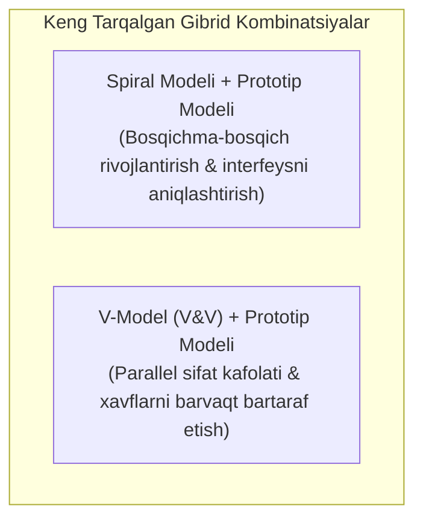
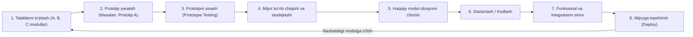
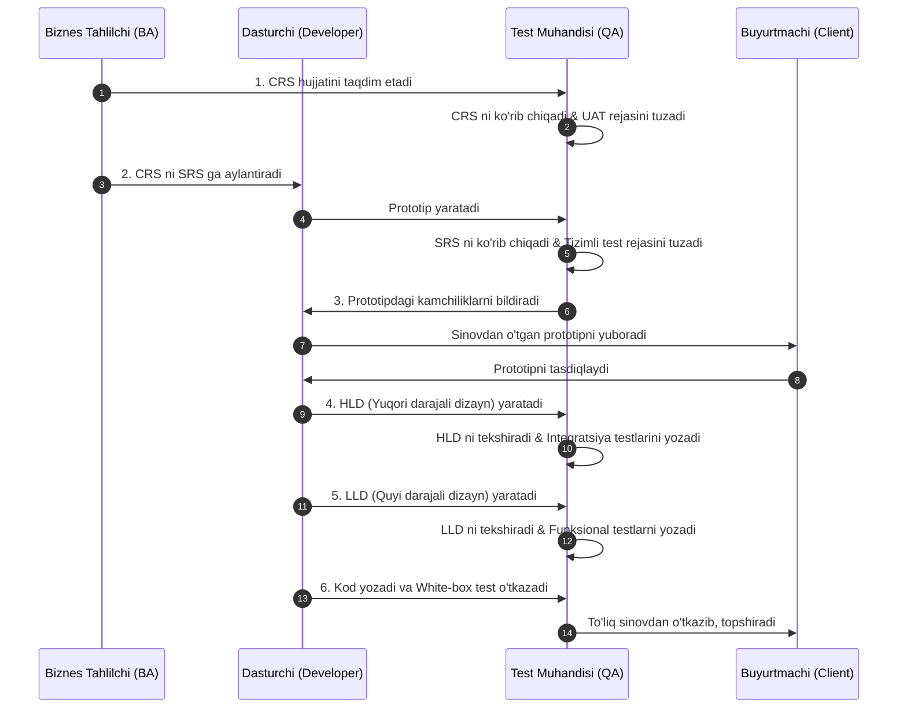

import { Callout } from 'nextra/components'

# Gibrid Model (Hybrid Model)

**Gibrid model (Hybrid Model)** — bu ikki yoki undan ortiq dasturiy ta'minotni ishlab chiqish hayotiy davri (SDLC) modellarining eng samarali jihatlarini o'zida jamlagan yondashuvdir. U loyihaning o'ziga xos xususiyatlari, murakkabligi, byudjeti va sifat talablaridan kelib chiqqan holda maxsus moslashtirilgan ishlab chiqish jarayonini yaratish uchun xizmat qiladi.

Ushbu bo'limda siz Gibrid model tushunchasi, uning eng keng tarqalgan kombinatsiyalari, ish jarayoni va amaliy ahamiyatini o'rganasiz.

---

## Gibrid Model Nima? (What is the Hybrid Model?)

**Gibrid model** — alohida olingan bitta SDLC modeli loyiha maqsadlariga to'liq javob bera olmaganida yoki loyihaning turli bosqichlari turli xil yondashuvlarni talab qilganida qo'llaniladi. Modellar loyihaning ko'lami, xavf-xatarlar darajasi, buyurtmachining tajribasi va sifat standartlarini hisobga olgan holda uyg'unlashtiriladi.

Mazkur model kichik, o'rta va yirik loyihalarning barchasiga birdek muvaffaqiyatli tatbiq etilishi mumkin.

<Callout type="warning">
**Muhim Qoida:**
Klassik **Sharshara modeli (Waterfall Model)** boshqa modellar bilan gibrid qilinmaydi. Chunki u qat'iy chiziqli ketma-ketlikka asoslangan bo'lib, o'zgarishlar va iteratsiyalar uchun moslashuvchanlikka ega emas.
</Callout>

---

## 1. Spiral Modeli va Prototip Modeli Kombinatsiyasi

### Qachon Tanlanadi?
Spiral va Prototip modellarining birlashmasi quyidagi holatlarda eng maqbul yechim sanaladi:
- **Modullar o'rtasida kuchli bog'liqlik (dependency) mavjud bo'lganda:** Bitta modul ikkinchisining ustiga qurilishi kerak bo'lsa.
- **Bosqichma-bosqich talablar:** Buyurtmachi talablarni birdaniga emas, bosqichma-bosqich taqdim etganda.
- **Buyurtmachi IT sohasida yangi bo'lganda:** Buyurtmachi dasturiy ta'minot sohasida tajribasiz bo'lib, o'z talab va istaklarini aniq bayon qila olmaganida.
- **Dasturchilar sohada (domain) yangi bo'lganda:** Jamoa ushbu soha biznes mantig'i bilan ilk bor ishlayotganda.

### Ish Jarayoni Bosqichlari:
1. **Talablarni to'plash:** Dasturiy ta'minotning birinchi navbatdagi modullari (masalan, A, B, C) uchun biznes ehtiyojlar to'planadi.
2. **Prototip A ni yaratish:** Olingan dastlabki talablar asosida faqat A moduli uchun ko'rgazmali prototip yasaladi.
3. **Prototip A ni sinash:** Dastlabki maket foydalanuvchi interfeysi (UI) va qulayligi bo'yicha ko'rib chiqiladi.
4. **Mijoz tasdig'i:** Tayyor prototip mijozga taqdim etiladi. Mijoz ko'rib chiqib, o'z tuzatishlarini kiritadi va tasdiqlaydi.
5. **Haqiqiy modul dizayni:** Tasdiqlangan prototip asosida A modulining to'liq texnik arxitekturasi ishlab chiqiladi.
6. **Kodlash:** Dasturchilar A moduli uchun to'liq ishchi manba kodini yozadilar.
7. **Sinov:** Test muhandislari modul funksionalligi va xavfsizligini to'liq tekshiradilar.
8. **Topshirish (Deployment):** Modul mijozga topshiriladi va jarayon navbatdagi modul (B, C...) uchun yangi spiral ko'rinishida davom ettiriladi.

---

## 2. V-Model (V&V) va Prototip Modeli Kombinatsiyasi

### Qachon Tanlanadi?
- Buyurtmachi ham, ishlab chiquvchilar jamoasi ham mazkur loyiha sohasi bo'yicha yangi bo'lganda.
- Buyurtmachi belgilangan qisqa muddat ichida **o'ta yuqori sifatli va xatosiz** mahsulot talab qilganda.
- Ishlab chiqish (Development) va Sinov (Testing) jamoalari parallel ishlab, xatolarni eng dastlabki bosqichlardayoq yo'q qilish maqsad qilinganda.

<Callout type="info">
Ushbu gibrid usulda sinov jarayoni kod yozilishidan ancha oldin — prototip yaratish va talablarni tahlil qilish bosqichidanoq boshlanadi. Bu quyi bosqichlarga xatolarning o'tishini (downward flow of bugs) to'xtatadi va qayta ishlashga ketadigan xarajatlarni keskin qisqartiradi.
</Callout>

### 6 Bosqichli Tafsilotli Jarayon:

#### 1-Bosqich: CRS va Qabul Sinovlari Rejasi
- Jarayon buyurtmachidan biznes talablarini **CRS (Customer Requirement Specification)** shaklida yig'ish bilan boshlanadi.
- Test muhandisi CRS hujjatidagi xatoliklar, noaniqliklar va zid talablarni tekshiradi hamda **Foydalanuvchi Qabul Sinovi (User Acceptance Test - UAT)** rejalari va test ssenariylarini (test cases) yozadi.

#### 2-Bosqich: SRS va Tizimli Sinov Rejasi
- Biznes tahlilchi CRS hujjatini texnik **SRS (Software Requirement Specification)** hujjatiga aylantiradi.
- Dasturchilar interfeysning ko'rgazmali prototipini loyihalashtirib, test jamoasiga yuboradilar.
- Test muhandisi SRS hujjatini tekshiradi hamda **Tizimli Sinov (System Testing)** test rejalari va keyslarini tuzadi.

#### 3-Bosqich: Prototip Sinovi va Tasdiqlash
- Test jamoasi prototipni vizual va foydalanish qulayligi (look & feel) bo'yicha sinovdan o'tkazadi, topilgan nuqsonlarni dasturchiga yuboradi.
- To'g'rilangan prototip buyurtmachiga ko'rib chiqish va tasdiqlash uchun taqdim etiladi.

#### 4-Bosqich: Yuqori Darajali Dizayn (HLD) va Integratsiya Sinovi Rejasi
- Buyurtmachi prototipni tasdiqlagach, arxitektorlar tizimning yuqori darajali dizaynini (**HLD**) yaratadilar.
- Test muhandisi HLD ni ko'rib chiqadi va modullarning o'zaro aloqasini tekshiruvchi **Integratsion Sinov (Integration Testing)** hujjatlarini tayyorlaydi.

#### 5-Bosqich: Quyi Darajali Dizayn (LLD) va Funksional Sinov Rejasi
- Dasturchilar har bir komponentning quyi darajali dizaynini (**LLD**) ishlab chiqadilar.
- Test muhandisi LLD ni o'rganadi va alohida modullarning mantiqiy ishlashini tekshiruvchi **Funksional Sinov (Functional Testing)** hujjatlarini tuzadi.

#### 6-Bosqich: Dasturlash, Birlik Sinov va To'liq Yakunlash
- Dasturchilar haqiqiy dastur kodini yozadilar va dasturchilar tomonidan bir raund **Oq quti sinovi (White Box / Unit Testing)** o'tkaziladi.
- So'ngra dastur test jamoasiga topshiriladi. Test jamoasi oldindan tayyorlab qo'yilgan test rejalari bo'yicha funksional, integratsion, tizimli va qabul sinovlarini ketma-ket bajaradi.
- Dastur to'liq barqarorlashgach, mijozga yakuniy topshirish amalga oshiriladi.

---

## Gibrid Modelining Afzalliklari va Cheklovlari

| Afzalliklari (Advantages) | Cheklovlari (Limitations) |
| :--- | :--- |
| **Yuqori moslashuvchanlik:** Turli modellarining kuchli jihatlarini bitta loyihaga jamlaydi. | **Boshqaruvning murakkabligi:** Bir nechta turli metodologiyalar qoidalarini muvofiqlashtirish qiyin. |
| **Sifat kafolati:** V-Model integratsiyasi hisobiga xatolar kod yozilishidan oldinroq aniqlanadi. | **Hujjatlashtirish hajmining kattaligi:** Har bir bosqich uchun parallel test hujjatlari talab etiladi. |
| **Mijoz bilan mustahkam aloqa:** Prototip vositasida buyurtmachi talablari boshidanoq to'g'ri shakllanadi. | **Tajribali jamoaga ehtiyoj:** Dasturchi va tahlilchilar ikkala model qoidalarini mukammal bilishi shart. |
| **Qayta ishlash xarajatlarining kamayishi:** Kamchiliklar erta bartaraf etilgani bois kechki jiddiy o'zgarishlar ehtimoli minimal. | **Dastlabki xarajatlar:** Test muhandislarini birinchi kundan jalb etish boshlang'ich byudjetni oshiradi. |
