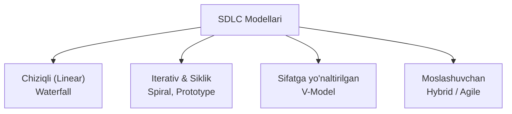

import { Cards, Callout } from 'nextra/components'

# Dasturiy Ta'minotni Ishlab Chiqish Modellari (SDLC Models)

Dasturiy ta'minotni ishlab chiqish modeli — bu loyihaning boshlanishidan to yakuniga qadar jamoaning qanday ketma-ketlikda ishlashini, vazifalar qanday taqsimlanishini va sifat qanday nazorat qilinishini belgilovchi strategik asosdir.

Loyiha ko'lami, mijoz talablarining o'zgaruvchanligi, xavf-xatarlar va byudjetga qarab turli SDLC modellari tanlanadi.

---

## SDLC Modellari Qiyosiy Ko'rinishi

---

## Modul Bo'limlari

<Cards num={2}>
  <Cards.Card
    title="▶️ Waterfall (Sharshara) Modeli"
    href="/docs/sdlc-models/waterfall-model"
  >
    Klassik chiziqli ketma-ketlik: talablar o'zgarmas loyihalarda qo'llanilishi, afzalliklari va cheklovlari.
  </Cards.Card>
  <Cards.Card
    title="▶️ Spiral Modeli"
    href="/docs/sdlc-models/spiral-model"
  >
    Xatarlarni tahlil qilishga (Risk Management) asoslangan to'rt kvadrantli siklik ishlab chiqish modeli.
  </Cards.Card>
  <Cards.Card
    title="▶️ Prototype Modeli"
    href="/docs/sdlc-models/prototype-model"
  >
    Mijoz tushunchasi noaniq bo'lganda tezkor dastlabki prototip yaratish va fikr-mulohazalarni yig'ish.
  </Cards.Card>
  <Cards.Card
    title="▶️ V-Model (Verification & Validation)"
    href="/docs/sdlc-models/v-model"
  >
    Har bir ishlab chiqish bosqichiga mos sinov darajasini parallel rejalashtiruvchi qat'iy sifat modeli.
  </Cards.Card>
  <Cards.Card
    title="▶️ Gibrid Model"
    href="/docs/sdlc-models/hybrid-model"
  >
    Waterfall qat'iyligi va Agile moslashuvchanligini birlashtiruvchi amaliy yondashuv.
  </Cards.Card>
</Cards>
