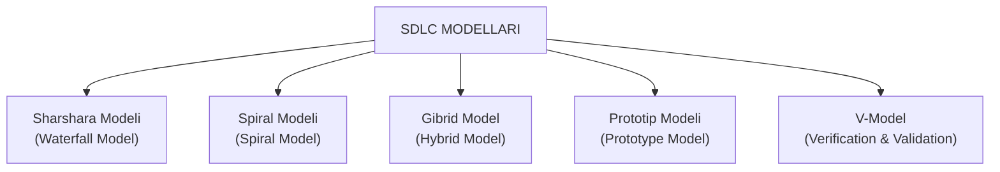

import { Cards } from 'nextra/components'

# Dasturiy Ta'minotni Ishlab Chiqish Modellari (SDLC Models)

**SDLC Modellari (Software Development Life Cycle Models)** — dasturiy ta'minotni yaratish jarayonida loyihaning hajmi, murakkabligi, talablar barqarorligi va xatarlarni boshqarish strategiyasidan kelib chiqqan holda tanlanadigan rivojlanish metodologiyalaridir.

To'g'ri tanlangan SDLC modeli nafaqat dasturlash ishlarini tizimlashtiradi, balki sinov (QA) faoliyatining qachon, qanday va qaysi darajada amalga oshirilishini aniqlab beradi.

---

## SDLC Modellari Xaritasi

---

## Modellarning Asosiy Bo'limlari

Quyida keltirilgan bo'limlar orqali har bir modelning ishlash tamoyillari, bosqichlari, afzalliklari, kamchiliklari va amaliy misollarini batafsil o'rganishingiz mumkin:

<Cards num={2}>
  <Cards.Card
    title="▶️ 1. Sharshara Modeli (Waterfall Model in Software Testing)"
    href="/docs/sdlc-models/waterfall-model"
  >
    Eng dastlabki chiziqli-ketma-ket model: Talablarni yig'ish, texnik-iqtisodiy asoslash, dizayn (HLD/LLD), kodlash, sinov va o'rnatish bosqichlari.
  </Cards.Card>
  <Cards.Card
    title="▶️ 2. Spiral Modeli (Spiral Model in Software Testing)"
    href="/docs/sdlc-models/spiral-model"
  >
    Xatarlarni tahlil qilish bilan iterativ rivojlanishni birlashtiruvchi model. Yirik loyihalar, kichik va katta o'zgarishlarni boshqarish.
  </Cards.Card>
  <Cards.Card
    title="▶️ 3. Gibrid Model (Hybrid Model)"
    href="/docs/sdlc-models/hybrid-model"
  >
    Bir nechta modelning kuchli jihatlarini birlashtiruvchi yondashuv: Spiral + Prototip hamda V-Model + Prototip kombinatsiyalari.
  </Cards.Card>
  <Cards.Card
    title="▶️ 4. Prototip Modeli (Prototype Model)"
    href="/docs/sdlc-models/prototype-model"
  >
    Mijoz tushunchasini aniqlashtirish uchun dastlabki ishchi namunani yaratish: Statik va Dinamik prototiplar hamda ularning sinovi.
  </Cards.Card>
  <Cards.Card
    title="▶️ 5. V-Model (Verification & Validation)"
    href="/docs/sdlc-models/v-model"
  >
    Ishlab chiqish va sinovning parallel muvofiqligi: Tekshirish (Verification) va Tasdiqlash (Validation) bosqichlari, CRS va SRS tahlili.
  </Cards.Card>
</Cards>
