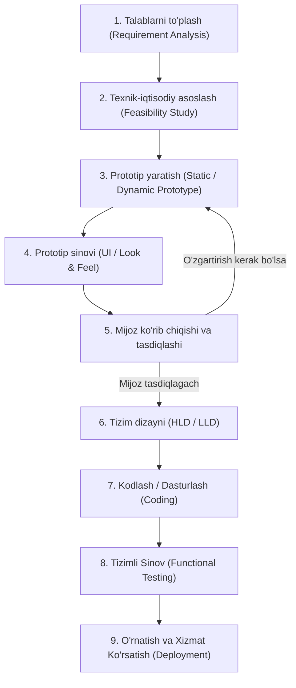
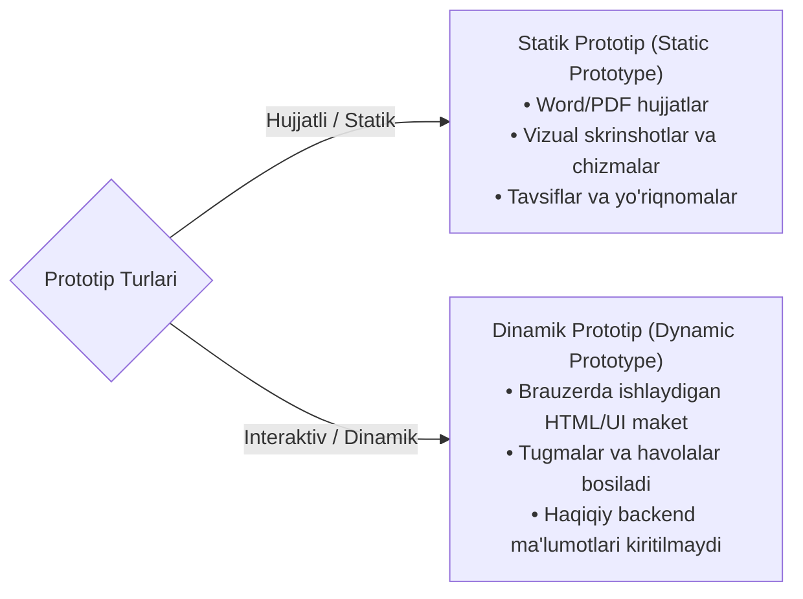

import { Callout } from 'nextra/components'

# Prototip Modeli (Prototype Model)

**Prototip modeli (Prototype Model)** — dasturiy ta'minotni ishlab chiqish hayotiy davrining (SDLC) maxsus modeli bo'lib, unda yakuniy mahsulotni to'liq dasturlashdan oldin mijozning fikr-mulohazalarini to'plash maqsadida dasturiy ta'minotning dastlabki namunasi (prototip) yaratiladi. 

Bu yondashuv talablarni aniqlashtirishga, tushunmovchiliklarni yo'qotishga va loyihaning keyingi bosqichlarida talab o'zgarishi tufayli yuzaga keladigan xarajatlarni keskin qisqartirishga yordam beradi.

---

## Prototip Modeli Nima? (What is the Prototype Model?)

**Prototip modeli** — boshlang'ich talablar asosida mahsulotning ishchi prototipi (namuna yoki vizual maketi) yaratiladigan va haqiqiy dasturlash boshlanishidan oldin mijozga baholash uchun taqdim etiladigan tizimdir.

Buyurtmachining fikr-mulohazalari (feedback) asosida prototip talablar to'liq tushunarli va qoniqarli bo'lmaguncha qayta-qayta takomillashtiriladi. Faqat mijoz prototipni to'liq ma'qullagandan so'nggina loyihalash va asosiy kodlash ishlari boshlanadi.

---

## Prototip Modeli Qachon Ishlatiladi?

Odatda ushbu model quyidagi sabablarga ko'ra tanlanadi:
1. **Mijoz IT sohasida yangi bo'lganda:** Buyurtmachi dasturiy ta'minot sohasida tajribasiz bo'lib, dasturga qo'yiladigan talablarni texnik tilda qanday bayon qilishni bilmaganda.
2. **Dasturchilar sohada (domain) yangi bo'lganda:** Ishlab chiquvchilar jamoasi loyiha sohasining nozik jihatlarini to'liq tushunib yetmaganda.
3. **Talablar noaniq yoki doimiy o'zgaruvchan bo'lganda:** Yakuniy mahsulot qanday ko'rinishda bo'lishi haqida oldindan aniq tasavvur bo'lmaganda.

<Callout type="info">
**Oddiy Sinov va Prototip Sinovi O'rtasidagi Asosiy Farq:**
- **Oddiy Sinov (Testing):** Ilovaning to'liq funksionalligi, ma'lumotlar bazasi bilan aloqasi, kiritilgan ma'lumotlar (inputs) va qaytgan natijalar (outputs) aniqligini tekshiradi.
- **Prototip Sinovi (Prototype Testing):** Faqat tashqi ko'rinish va qulaylikni (**Look and Feel**), ya'ni foydalanuvchi interfeysi (UI), sahifalar dizayni, elementlar joylashuvi va havolalar oqimini tekshiradi.
</Callout>

---

## Prototip Modelining 9 Asosiy Bosqichi

### 1. Talablar Tahlili (Requirement Analysis)
Model mijozdan batafsil biznes talablarini to'plashdan boshlanadi. Bu vazifani tahlilchilar bajaradi:
- **Biznes tahlilchi (Business Analyst — BA):** Odatda xizmat ko'rsatishga yo'naltirilgan (service-based) IT kompaniyalarda buyurtmachilar bilan ishlaydi.
- **Mahsulot tahlilchisi (Product Analyst — PA):** O'z mahsulotiga ega bo'lgan (product-based) kompaniyalarda bozor va foydalanuvchilar ehtiyojlarini tahlil qiladi.

### 2. Texnik-Iqtisodiy Asoslash (Feasibility Study)
Ushbu bosqichda kompaniyaning yetakchi mutaxassislari (BA, kadrlar bo'limi/HR, dasturiy arxitektor va moliya bo'limi rahbarlari) birgalikda yig'ilish o'tkazadilar:
- Mahsulotning umumiy tannarxi va byudjeti.
- Zaruriy inson va texnik resurslar miqdori.
- Qaysi dasturlash tillari va freymvorklardan foydalanilishi.
- Ishlab chiqish va mijozga yetkazib berishning aniq muddatlari kelishib olinadi.

### 3. Prototip Yaratish (Create a Prototype)
Mijozdan to'plangan ma'lumotlar asosida vizual maket (namuna yoki xomaki versiya) tayyorlanadi. Zamonaviy amaliyotda prototiplar ikki xil bo'ladi:

- **Statik Prototip (Static Prototype):** Talablarning butun maketi maxsus hujjatda (masalan, Word yoki PDF) saqlanadi. Unda mahsulot qanday ko'rinishi, yo'riqnomalar, eskizlar va har bir ekranning vazifasi yozma bayon etiladi.
- **Dinamik Prototip (Dynamic Prototype):** Foydalanuvchi brauzerida yoki maxsus dizayn platformalarida (Figma, Adobe XD) ko'riladigan interaktiv sahifalar. Foydalanuvchi tugmalarni bosib, sahifalararo o'tishni ko'rishi mumkin, biroq tizimda real ma'lumotlar bazasi yoki backend logikasi mavjud bo'lmaydi.

### 4. Prototip Sinovi (Prototype Testing)
Prototip tayyor bo'lgach, biznes tahlilchi yoki test muhandisi uning tashqi ko'rinishi va qulayligini (Look and Feel, UI/UX) bir raund tekshiruvdan o'tkazadi.

### 5. Mijoz Ko'rib Chiqishi va Tasdiqlashi (Customer Review and Approval)
Sinovdan o'tgan prototip buyurtmachiga topshiriladi. Agar mijoz berilgan namunadan qoniqmasa, uning taklif va mulohazalari asosida prototipga tuzatish kiritiladi. Bu jarayon mijoz to'liq rozi bo'lguniga qadar takrorlanadi.

### 6. Loyihalash va Dizayn (Design)
Mijoz prototipni rasman tasdiqlagach, dasturchilar va arxitektorlar tizimning yakuniy Yuqori Darajali (HLD) va Quyi Darajali (LLD) texnik arxitekturasini loyihalashtiradilar.

### 7. Kodlash (Coding)
Dizayn tayyor bo'lgach, dasturchilar tanlangan dasturlash tillarida (Java, Python, C#, JavaScript va h.k.) haqiqiy dastur kodini yozishga kirishadilar.

### 8. Tizimli Sinov (Testing)
Dasturiy kod tayyor bo'lgach, u test muhandislariga topshiriladi. Test muhandislari barcha kirish va chiqish ma'lumotlarini, tizim funksiyalarini va xavfsizligini to'liq tekshiradilar.

### 9. O'rnatish va Texnik Xizmat Ko'rsatish (Installation and Maintenance)
Mahsulot to'liq sinovdan o'tgach, ishchi serverlarga (production) joylashtiriladi va keyinchalik nosozliklarning oldini olish uchun doimiy monitoring qilib boriladi.

---

## Prototip Modelining Afzalliklari va Kamchiliklari

| Afzalliklari (Advantages) | Kamchiliklari (Disadvantages) |
| :--- | :--- |
| **Yetishmayotgan funksiyalarni barvaqt aniqlash:** Loyiha boshidanoq unutilgan yoki noto'g'ri tushunilgan talablar yuzaga chiqadi. | **Vaqt sarfi:** Agar mijoz prototipga qayta-qayta yangi o'zgartirishlar kiritaversa, jarayon cho'zilib ketishi mumkin. |
| **Mijoz bilan shaffof muloqot:** Buyurtmachi dasturning qanday chiqishini eng boshidanoq o'z ko'zi bilan ko'radi. | **Asosiy ishning kechikishi:** Prototip ustidagi cheksiz munozaralar haqiqiy dasturlash jarayonini kechiktiradi. |
| **Yuqori mijoz qoniqishi:** Mijoz o'zi tasdiqlagan maket bo'yicha tayyorlangan mahsulotdan maksimal darajada mamnun bo'ladi. | **Parallel ishlashning yo'qligi:** Prototip mijoz tomonidan to'liq tasdiqlanmaguncha, dasturchilar asosiy kodni yoza olmaydilar. |
| **Qayta foydalanish imkoniyati:** Yaratilgan prototip dizayn bosqichida va keyingi o'xshash loyihalarda andaza sifatida ishlatilishi mumkin. | **Mijoz diqqatini yo'qotish xavfi:** Prototip ko'rinishi bilan yakuniy mahsulot o'rtasida texnik farqlar bo'lsa, mijozda tushunmovchilik tug'ilishi mumkin. |
| **Rad etish xavfining pastligi:** Mahsulotning buyurtmachi tomonidan butunlay rad etilishi xavfi deyarli nolga tenglashadi. | **Chala tahlil xavfi:** Dastlabki prototipga haddan tashqari ko'p diqqat qaratilib, chuqur arxitektura va xavfsizlik tahlili e'tibordan chetda qolishi mumkin. |
