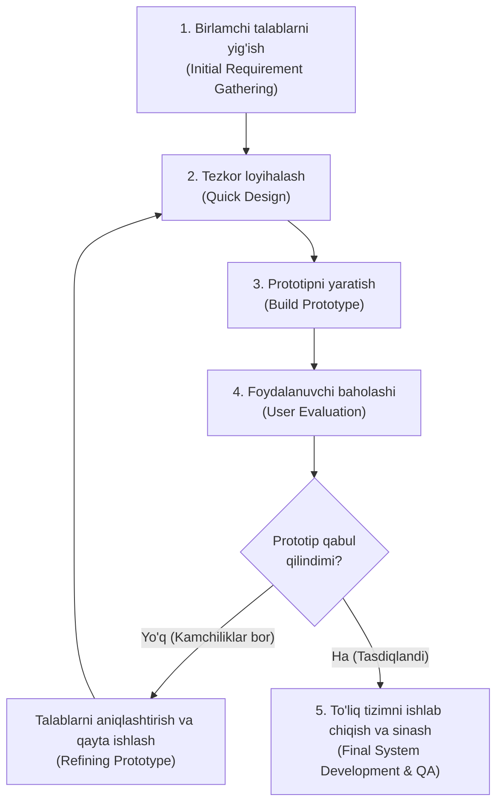

import { Callout } from 'nextra/components'

# Prototype (Prototiplash) Modeli

**Prototiplash modeli** — dasturiy ta'minotning to'liq versiyasini ishlab chiqishdan oldin, uning soddalashtirilgan ishchi namunasini (prototipini) yaratishga asoslangan modeldir.

Bu model, ayniqsa, buyurtmachi tizim aynan qanday ishlashi kerakligini aniq tasavvur qila olmagan hollarda eng yaxshi yechim hisoblanadi.

---

## Prototiplash Hayotiy Sikli

---

## Prototip Turlari

1. **Bir martalik prototip (Throwaway / Rapid Prototyping):**
   - Faqat talablarni tushunish va tasdiqlash uchun tezkor yaratiladi, so'ngra tashlab yuboriladi. Asosiy dastur yangidan noldan yoziladi.
2. **Evolyutsion prototip (Evolutionary Prototyping):**
   - Yaratilgan dastlabki prototip tashlab yuborilmaydi, balki har bir fikr-mulohazadan so'ng asta-sekin to'liq mahsulot darajasigacha rivojlantirib boriladi.
3. **Ekstremal prototip (Extreme Prototyping):**
   - Asosan veb-loyihalarda qo'llaniladi. Avval statik HTML/CSS maketlari, so'ng xizmatlar qatlami, oxirida esa ma'lumotlar bazasi ulanadi.

---

## Afzalliklari va Kamchiliklari

| Afzalliklari | Kamchiliklari |
| :--- | :--- |
| Noto'g'ri tushunilgan talablar loyiha boshidayoq fosh bo'ladi | Buyurtmachi prototipni ko'rib, asosiy tizim allaqachon tayyor deb o'ylashi mumkin |
| Foydalanuvchi interfeysi (UI/UX) bo'yicha tezkor fikr-mulohaza olinadi | Ishlab chiquvchilar tezlikka intilib, kod sifatiga beparvo qarashlari xavfi bor |
| Mijozning yakuniy mahsulotdan qoniqishi eng yuqori darajada bo'ladi | Sikllar soni ko'payib ketishi va byudjet oshishi mumkin |
