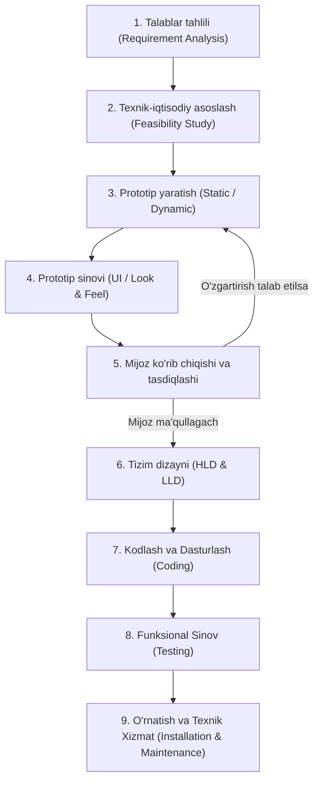
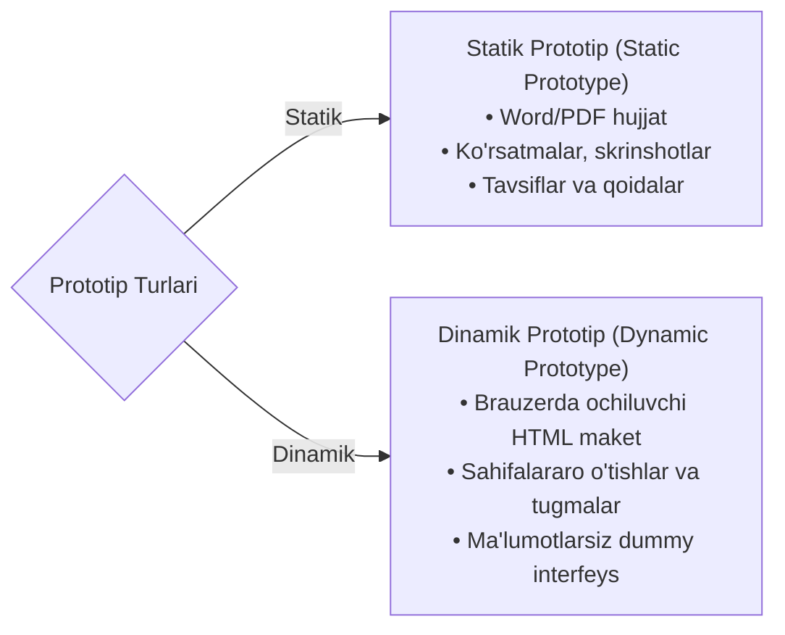

import { Callout } from 'nextra/components'

# Dasturiy Sinovda Prototip Modeli (Prototype Model in Software Testing)

**Prototip modeli (Prototype Model)** — dasturiy ta'minotni ishlab chiqish hayotiy davrining (SDLC) maxsus modeli bo'lib, unda yakuniy mahsulotni to'liq dasturlashdan oldin foydalanuvchilarning fikr-mulohazalarini to'plash maqsadida dasturiy ta'minotning dastlabki ishchi namunasi (prototipi) yaratiladi.

Bu yondashuv tizim talablarini aniqlashtirishga, tushunmovchiliklarni yo'qotishga va loyihaning keyingi bosqichlarida talablarning o'zgarishi natijasida yuzaga keladigan ortiqcha xarajatlar va xatarlarni keskin qisqartirishga yordam beradi.

---

## Prototip Modeli Nima? (What is the Prototype Model?)

**Prototip modeli** — boshlang'ich talablar asosida mahsulotning ishchi prototipi (namunaviy yoki maket versiyasi) ishlab chiqiladigan va haqiqiy dasturlash boshlanishidan oldin mijozga baholash hamda fikr-mulohaza (feedback) bildirish uchun taqdim etiladigan yondashuvdir.

Buyurtmachining bildirgan takliflari asosida prototip talablar to'liq tushunarli va qoniqarli bo'lguniga qadar takroriy ravishda takomillashtiriladi. Barcha talablar uzil-kesil tasdiqlangandan so'ngгина ishlab chiquvchilar jamoasi haqiqiy dasturiy mahsulotni qurishga kirishadi.

Prototip modeli ayniqsa loyiha talablari eng boshida to'liq aniqlanmagan yoki buyurtmachi bilan tez-tez fikr almashish talab etiladigan loyihalarda juda foydalidir. U mijozlar va dasturchilar o'rtasidagi anglashilmovchiliklarni kamaytiradi hamda dasturlash jarayonida talablar bilan bog'liq o'zgarishlar xavfini minimallashtiradi.

---

## Prototip Modeli Qachon Qo'llaniladi?

Odatda ushbu model quyidagi sabablarga ko'ra tanlanadi:
1. **Mijoz IT sohasida yangi bo'lganda:** Buyurtmachi dasturiy ta'minot sohasida tajribaga ega bo'lmaganda yoki kompaniyaga o'z talablarini qanday qilib to'g'ri taqdim etishni bilmaganda.
2. **Dasturchilar ushbu sohaga (domain) yangi bo'lganda:** Ishlab chiquvchilar jamoasi loyiha sohasining nozik jihatlari va biznes mantig'ini chuqur bilmagan holatlarda.

<Callout type="info">
**Oddiy Sinov (Testing) va Prototip Sinovi (Prototype Testing) O'rtasidagi Farq:**
- **Oddiy Sinov (Testing):** Ilovaning to'liq funksionalligi ustida ishlaydi, ya'ni tizimga qandaydir kiruvchi ma'lumotlar (**input**) kiritiladi va kutilgan chiquvchi natijalar (**output**) tekshiriladi.
- **Prototip Sinovi (Prototype Testing):** Faqat tashqi ko'rinish va qulaylikni (**Look and Feel**), ya'ni foydalanuvchi interfeysi (UI) va frontend qismining vizual to'g'riligini tekshiradi.
</Callout>

---

## Prototip Modelining 9 Asosiy Bosqichi

### 1. Talablar Tahlili (Requirement Analysis)
Model mijozdan loyiha talablarini to'plashdan boshlanadi. Loyihaning ushbu talablari juda batafsil bo'lishi shart. Talablar quyidagi mutaxassislar tomonidan qabul qilinadi:
- **Biznes tahlilchi (Business Analyst — BA):** Xizmat ko'rsatishga yo'naltirilgan (service-based) dasturiy ta'minot kompaniyalarida mijoz talablarini o'rganadi.
- **Mahsulot tahlilchisi (Product Analyst — PA):** Mahsulotga yo'naltirilgan (product-based) kompaniyalarda bozor ehtiyojlarini tahlil qiladi.

### 2. Texnik-Iqtisodiy Asoslash (Feasibility Study)
Navbatdagi bosqichda kompaniyaning yetakchi bo'lim rahbarlari (**BA, HR, Arxitektura va Moliya guruhi**) birgalikda yig'ilib:
- Mahsulotning umumiy tannarxi va byudjeti;
- Qanday insoniy va apparat resurslari zarurligi;
- Mahsulotni ishlab chiqish uchun qaysi texnologiyalar qo'llanilishi;
- Mahsulotni to'liq yakunlash va yetkazib berish uchun qancha vaqt kerakligini muhokama qiladilar.

### 3. Prototip Yaratish (Create a Prototype)
Texnik-iqtisodiy asoslash tugallangach, mijozdan to'plangan ma'lumotlar asosida prototip (namunaviy yoki qoralama maket) yaratiladi. Veb-dasturchi yoki dizayner ushbu prototipni loyihalashtiradi.

Prototipning 2 ta asosiy turi mavjud:

1. **Statik Prototip (Static Prototype):**
   - Talablarning butun prototipi Word yoki PDF hujjatida saqlanadi.
   - Unda dasturni qanday qurish kerakligi, yakuniy mahsulot qanday ko'rinishga ega bo'lishi va qanday ishlashi haqidagi barcha yo'riqnomalar, chizmalar va skrinshotlar aks etadi.
2. **Dinamik Prototip (Dynamic Prototype):**
   - Brauzerda ochiladigan interaktiv maket. Biroq bunda haqiqiy ma'lumotlar bazasi mavjud bo'lmaydi, faqat ma'lumotlarsiz funksional ko'rinish bo'ladi.
   - Bu mahsulotning imkoniyatlarini ifodalovchi teglarga, havolalarga va tugmalarga ega bo'lgan HTML/CSS dummy sahifalar to'plamidir.

### 4. Prototip Sinovi (Prototype Testing)
Prototip qurilgach, biznes tahlilchi (BA) uni bir raund prototip sinovidan o'tkazadi. Unda faqat tizimning tashqi ko'rinishi va qulayligi (Look and Feel, UI/frontend) tekshiriladi.

### 5. Mijoz Ko'rib Chiqishi va Tasdiqlashi (Customer Review and Approval)
Prototip sinovi yakunlangach, u mijozga ko'rib chiqish va tasdiqlash uchun topshiriladi:
- Agar mijoz taqdim etilgan namunadan qoniqmasa, uning taklif va mulohazalari asosida prototipga tuzatish kiritiladi.
- Ushbu jarayon mijoz prototipdan to'liq qoniqquncha va uni tasdiqlaguncha davom etadi. Bu biroz vaqt talab qiluvchi jarayon, chunki prototipga qayta-qayta o'zgartirish kiritiladi.

### 6. Loyihalash va Dizayn (Design)
Mijoz tomonidan tasdiqlangan prototip olingach, yakuniy mahsulot uchun Yuqori Darajali (HLD) va Quyi Darajali (LLD) dizaynni ishlab chiqish boshlanadi hamda yakuniy prototip paytida mijoz bildirgan barcha takliflar inobatga olinadi.

### 7. Kodlash (Coding)
Dizayn bosqichi muvaffaqiyatli yakunlangach, dasturlash bosqichiga o'tiladi. Tegishli dasturchi o'z dasturlash bilimlari asosida mahsulot kodini yozishga kirishadi.

### 8. Sinov (Testing)
Dasturlash yakunlangach, tizim test muhandisiga topshiriladi. Test muhandisi ilovaning barcha funksionalligini hamda kiritiluvchi va chiquvchi barcha ma'lumotlarni (inputs & outputs) to'liq sinovdan o'tkazadi.

### 9. O'rnatish va Texnik Xizmat Ko'rsatish (Installation and Maintenance)
Yakuniy mahsulot prototipga muvofiq ishlab chiqilib, to'liq sinovdan o'tgach, u ishchi muhitga (production) o'rnatiladi. Mahsulot jiddiy nosozliklarning oldini olish va uzilishlarni kamaytirish uchun doimiy texnik nazoratdan o'tib boradi.

---

## Amaliy Xususiyatlar va Zamonaviy Yondashuv

<Callout type="info">
**Muhim Jihatlar:**
1. **Talablar to'plashdan Mijoz tasdig'igacha** bo'lgan jarayon hujjat shaklidan prototip shakliga o'tkaziladi, chunki bu kengaytirilgan talablar yig'ish bosqichi hisoblanadi. Asosiy haqiqiy loyihalash esa bevosita Dizayn bosqichidan boshlanadi.
2. **Tarixiy va zamonaviy amaliyot:** Ilgari prototipni yaratish bevosita dasturchilar tomonidan bajarilgan bo'lsa, hozirgi kunda bu vazifa maxsus kontent tuzuvchilar, UI/UX dizaynerlar va veb-dizaynerlar tomonidan zamonaviy vizual vositalar yordamida amalga oshiriladi.
3. **Xarajatlarning tejalishi:** Mijoz eng boshidanoq talablarga o'zgartirish kiritish imkoniyatiga ega bo'ladi, chunki haqiqiy dasturga qaraganda prototipga o'zgartirish kiritish ancha oson va arzon. Natijada xarajatlar keskin kamayadi va mijoz kutgan natijaga to'liq erishiladi.
</Callout>

---

## Prototip Modelining Afzalliklari va Kamchiliklari

| Afzalliklari (Advantage) | Kamchiliklari (Disadvantage) |
| :--- | :--- |
| **Yetishmayotgan funksiyalarni oson aniqlash:** Tizimda unutilgan yoki qolib ketgan funksionallikni loyiha boshidayoq aniqlash juda oson. | **Ko'p vaqt sarfi:** Bu ko'p vaqt oladigan jarayon, chunki mijoz prototipga qayta-qayta o'zgartirish kiritsa, soxta maket ustidagi ishlar cho'zilib, haqiqiy loyihaning boshlanishi kechikadi. |
| **Mijoz va jamoa o'rtasidagi shaffof muloqot:** Dasturlash jamoasi va mijoz o'rtasida talablar hamda yakuniy mahsulot natijasi bo'yicha juda aniq va ravshan muloqot bo'ladi. | **Talablar ko'rib chiqilmasligi:** Jarayonda rasmiy talablarni ko'rib chiqish (requirement review) mavjud emas, faqat prototipni ko'rib chiqish o'tkaziladi. |
| **Mijozning yuqori qoniqishi:** Mijoz mahsulotni eng boshidanoq ko'rib tasdiqlagani sababli, unda to'liq qoniqish mavjud bo'ladi. | **Parallel yetkazib berishning yo'qligi:** Ikki jamoa bir vaqtda parallel ishlay olmaydi (prototip tasdiqlanmaguncha kodlash boshlanmaydi). |
| **Prototipdan qayta foydalanish:** Yaratilgan prototipni dizayn bosqichida va keyingi shunga o'xshash ilovalarda qayta ishlatish mumkin. | **Qisman tizim xatari:** Ba'zida tizimning chala yoki qisman ko'rsatilishi dasturiy ta'minotni to'liq loyihalashtirilgan tizim kabi ishlatilmasligiga sabab bo'lishi mumkin. |
| **Mijoz tomonidan rad etishning kamligi:** Boshqa SDLC modellariga qaraganda buyurtmachi tomonidan mahsulotning rad etilishi ehtimoli ancha past bo'ladi. | **Muammoning to'liq bo'lmagan tahlili:** Muammoning yetarli emas yoki chala tahlil qilinishi (insufficient or partial problem analysis) xavfi mavjud. |
| **Muammolarni erta aniqlash:** Kamchiliklar va xatolarni dastlabki bosqichlardayoq barvaqt aniqlash imkoni mavjud. | **Mijoz e'tiborini yo'qotish:** Agar mijoz dastlabki prototipdan yoki yakuniy natijadan qoniqmasa, uning e'tibori va qiziqishi yo'qolishi mumkin. |
