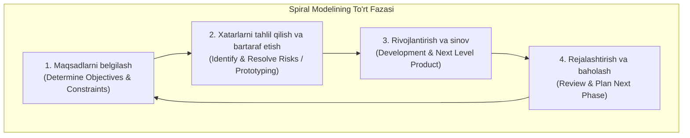

import { Callout } from 'nextra/components'

# Spiral (Girdob) Modeli

**Spiral modeli** — dasturiy ta'minotni bosqichma-bosqich ishlab chiqishda xatarlarni (Risk Analysis) birinchi o'ringa qo'yuvchi siklik SDLC modelidir. U 1986 yilda Barri Boem (Barry Boehm) tomonidan taklif qilingan bo'lib, Waterfall modelining tizimliligi va Prototip modelining iterativ moslashuvchanligini o'zida birlashtiradi.

---

## Spiral Modelining 4 ta Asosiy Kvadranti

Spiralning har bir aylanmasi (sikl) quyidagi 4 ta fazadan iborat:

1. **Maqsadlarni belgilash (Determine Objectives):**
   - Joriy siklning maqsadlari, cheklovlari va muqobil yechimlari aniqlanadi.
2. **Xatarlarni tahlil qilish va bartaraf etish (Risk Analysis & Resolution):**
   - Moliyaviy, texnik va xavfsizlikka oid xavflar tahlil qilinadi.
   - Xatarlarni amalda tekshirish uchun prototiplar ishlab chiqiladi.
3. **Rivojlantirish va sinov (Engineering & Testing):**
   - Dasturiy kod yoziladi va sinovdan o'tkaziladi.
4. **Baholash va keyingi bosqichni rejalashtirish (Evaluation & Planning):**
   - Buyurtmachi erishilgan natijani baholaydi va spiralning keyingi aylanmasi uchun reja tasdiqlanadi.

---

## Afzalliklari va Kamchiliklari

| Afzalliklari | Kamchiliklari |
| :--- | :--- |
| **Xatarlarni mukammal boshqarish:** Eng xavfli texnik muammolar eng birinchi sikllardayoq aniqlanadi | Juda qimmat va mutaxassislardan yuqori risk-menejment tajribasini talab qiladi |
| Yangi talablar va o'zgarishlar har bir siklda oson qabul qilinadi | Kichik va o'rtacha loyihalar uchun iqtisodiy jihatdan foydasiz |
| Mahsulot doimiy ravishda mijoz ko'z o'ngida rivojlanadi | Jarayon muddati cho'zilib ketishi mumkin |

<Callout type="info">
  **QA ahamiyati:** Spiral modelida har bir sikl yakunida qat'iy sinov va audit o'tkaziladi. Bu esa loyihaning har bir bosqichida mahsulot sifatini real tahlil qilish imkonini beradi.
</Callout>
