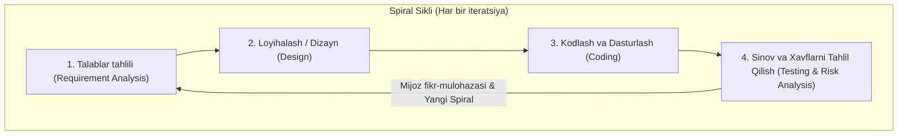
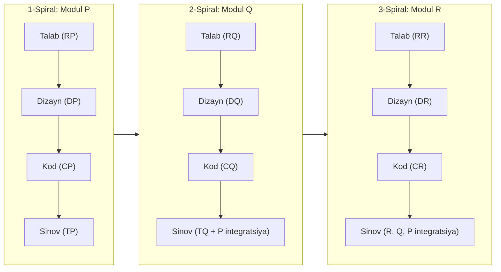
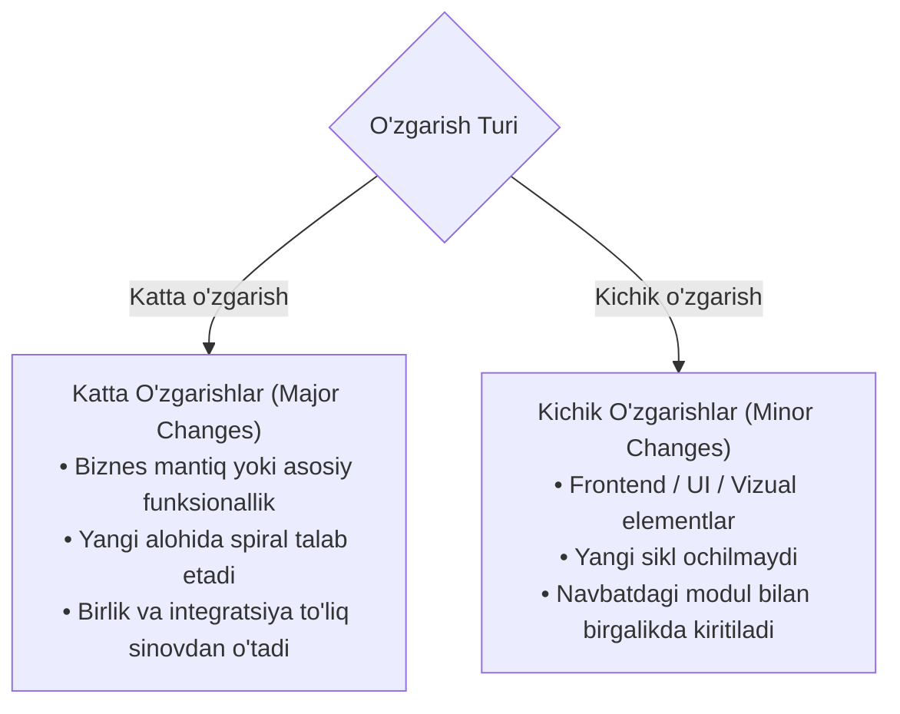

import { Callout } from 'nextra/components'

# Spiral Modeli (Spiral Model)

**Spiral modeli (Spiral Model)** — dasturiy ta'minotni ishlab chiqish hayotiy davrining (SDLC) iterativ modellari sirasiga kiradi. U iterativ rivojlanish konsepsiyasini tizimli xavflarni tahlil qilish (systematic risk analysis) tamoyillari bilan birlashtiradi. Mazkur modelda dasturiy ta'minot ketma-ket takrorlanuvchi sikllar — spirallar (spirals) orqali bosqichma-bosqich takomillashtirib boriladi.

Ushbu bo'limda siz Spiral modeli, uning 4 asosiy bosqichi, ish oqimi, modulli o'zgarishlar mexanizmi, afzalliklari va cheklovlarini batafsil o'rganasiz.

---

## Spiral Modeli Nima? (What is the Spiral Model?)

**Spiral modeli** — bu dasturiy ta'minot bir nechta takrorlanuvchi iteratsiyalar (spirallar) orqali quriladigan SDLC modelidir. Har bir spiral talablarni aniqlash, loyihalash, dasturlash, sinov va eng muhimi xavf-xatarlarni tahlil qilish bosqichlarini o'z ichiga oladi. Har bir sikl yakunida dasturiy ta'minotning yanada takomillashgan va boyitilgan yangi versiyasi (build) yuzaga keladi.

Sharshara modelidan farqli o'laroq, Spiral modelida loyiha davomida talablarning bosqichma-bosqich o'zgarishi va rivojlanishiga ruxsat beriladi. Har bir iteratsiyada texnik va moliyaviy xavflarni o'z vaqtida aniqlash va bartaraf etishga birlamchi e'tibor qaratilganligi sababli, bu model yirik va murakkab loyihalar uchun eng ma'qul yechim hisoblanadi.

---

## Spiral Modelining 4 Asosiy Bosqichi

Har bir spiral (iteratsiya) qat'iy ravishda quyidagi to'rtta asosiy bosqichdan tashkil topadi:

### 1. Talablar Tahlili (Requirement Analysis)
Spiral modeli jarayoni biznes ehtiyojlarini to'plashdan boshlanadi. Har bir yangi spiralda tizim talablari, quyi tizim talablari va alohida modullarning hujjatlari to'ldirib boriladi.
- Biznes tahlilchi (Business Analyst) va buyurtmachi doimiy aloqada bo'ladi, bu esa tizim talablarini to'liq va xatosiz anglashga xizmat qiladi.
- Barcha talablar aniqlangach va sikl to'liq yakunlangach, tegishli funksionallik ishlab chiqarishga (market/production) topshiriladi.

### 2. Loyihalash va Dizayn (Design)
Ikkinchi bosqichda tizimning arxitekturasi va mantiqiy loyihasi tuziladi:
- Mantiqiy dizayn (logical design) va arxitektura dizayni (architectural design).
- Ma'lumotlar oqimi sxemalari (flow charts) va qaror daraxtlari (decision trees).
- Modullarning o'zaro integratsiyalashuv sxemalari.

### 3. Kodlash va Qurish (Coding)
Dizayn tayyor bo'lgach, dasturchilar mijoz talablariga muvofiq dasturiy kodni yozishga kirishadilar:
- Bu bosqich har bir siklda haqiqiy ishlaydigan ilovaning yangi qismini qurishni anglatadi.
- Talablari va dizayn tafsilotlari aniq belgilangan har bir oraliq natija maxsus versiya raqami berilgan yig'ilma (**build**, masalan v1.0, v1.1) deb ataladi.
- Ushbu yig'ilmalar mijozga ko'rib chiqish va mulohaza bildirish uchun taqdim etiladi.

### 4. Sinov va Xavflarni Tahlil Qilish (Testing and Risk Analysis)
Dasturlash bosqichi muvaffaqiyatli yakunlangach, yig'ilma har bir sikl oxirida keng qamrovli sinovdan o'tkaziladi:
- Dasturiy ta'minot turli jihatlar bo'yicha tahlil qilinadi: texnik imkoniyatlar (technical feasibility), xavflarni boshqarish va nosozliklarni barvaqt aniqlash.
- Shundan so'ng mijoz ilovani sinab ko'radi va keyingi spiral uchun o'z taklif va tuzatishlarini kiritadi.

---

## Spiral Modeliga Amaliy Misol (MS Excel Misolida)

Spiral modelida dasturiy ta'minot kichik modullar ko'rinishida bosqichma-bosqich ishlab chiqiladi. Faraz qilaylik, bizda **A ilovasi** mavjud bo'lib, u ketma-ket **P**, **Q**, **R** modullari yordamida yaratilishi kerak:

- **P Moduli**: Talab tahlili (RP) $\rightarrow$ Dizayn (DP) $\rightarrow$ Kodlash (CP) $\rightarrow$ Sinov (TP).
- **Q Moduli**: P moduli to'liq tayyor bo'lgach boshlanadi: (RQ $\rightarrow$ DQ $\rightarrow$ CQ $\rightarrow$ TQ).
- **R Moduli**: P va Q modullari to'liq bitgach boshlanadi: (RR $\rightarrow$ DR $\rightarrow$ CR $\rightarrow$ TR).

### Sinov Shartlari va Ketma-ketlik:
1. **Modul Q ni sinashda:**
   - Q modulining o'zi alohida tekshiriladi (Unit test).
   - Q modulining P moduli bilan integratsiyasi tekshiriladi (Integration test).
   - P moduli ta'sirlanmaganligini tasdiqlash uchun qayta tekshiriladi (Regression/Re-test).
2. **Modul R ni sinashda:**
   - R, Q va P modullarining har biri alohida tekshiriladi.
   - Modullar integratsiyasi zanjir bo'yicha to'liq tekshiriladi: $R \rightarrow Q$, $R \rightarrow P$, va $(P + Q) \rightarrow R$.

<Callout type="info">
**Real Hayotiy Misol — Microsoft Excel:**
MS Excel ilovasi spiral modeliga eng yorqin misoldir. Excel elektron jadvali bir nechta katakchalardan (cells) iborat:
1. **P Moduli:** Avvalo katakchalar to'ri (grid of cells) yaratiladi.
2. **Q Moduli:** Katakchalar tayyor bo'lgach, ular ustida operatsiyalar bajarish — katakchalarni bo'lish (split cells) yoki birlashtirish (merge cells) funksiyasi qo'shiladi.
3. **R Moduli:** Jadval ma'lumotlari asosida grafiklar va diagrammalar (charts/graphs) chizish imkoniyati qo'shiladi.
</Callout>

---

## O'zgarishlar Turlari (Major vs Minor Changes)

Spiral modelida mijoz tomonidan bildirilgan talab o'zgarishlari ikki toifaga bo'linadi:

### 1. Katta O'zgarishlar (Major Changes)
Buyurtmachi ma'lum bir modul bo'yicha asosiy funksionallik yoki biznes mantig'iga jiddiy o'zgartirish kiritishni talab qilganda yuz beradi:
- Bunday o'zgarish mavjud boshqa modullarga ham ta'sir qilishi mumkin.
- Shuning uchun har doim **yangi alohida sikl (iteratsiya)** ochiladi.
- Ushbu modul uchun ham birlik (unit), ham barcha bog'liq modullar bilan integratsiya sinovlari qaytadan to'liq amalga oshiriladi.

### 2. Kichik O'zgarishlar (Minor Changes)
Ilovaning tashqi ko'rinishi yoki ikkinchi darajali elementlari (masalan, foydalanuvchi interfeysi (UI), ranglar, shriftlar, matnlar) bo'yicha kichik o'zgarishlar so'ralganda:
- Bu o'zgarishlar mavjud biznes funksionallikka salbiy ta'sir ko'rsatmaydi.
- Shuning uchun **yangi sikl yoki iteratsiya boshlanmaydi**, chunki bu ortiqcha vaqt va resurs sarfiga olib keladi.
- Kichik o'zgarish ishlab chiqilayotgan navbatdagi yangi modul bilan bir vaqtda, bitta sikl ichida amalga oshiriladi.

---

## Spiral Modelining Afzalliklari va Kamchiliklari

| Afzalliklari (Advantages) | Kamchiliklari (Disadvantages) |
| :--- | :--- |
| **Moslashuvchanlik:** Ishlab chiqish jarayonining istalgan bosqichida o'zgarishlar kiritishga ruxsat beriladi. | **Kichik loyihalar uchun qimmat:** Kichik va xavf darajasi past loyihalar uchun iqtisodiy jihatdan samarasiz va qimmatga tushadi. |
| **Kichik qismlarga bo'linish:** Katta tizimlar boshqarish oson bo'lgan kichik modullar ko'rinishida barpo etiladi. | **Murakkab boshqaruv:** Ko'p sonli spirallar va versiyalarni boshqarish maxsus tajriba va yuqori malakali menejmentni talab qiladi. |
| **Erta foydalanish:** Buyurtmachi dastlabki spirallardanoq dasturning ishlaydigan prototipidan foydalanishi mumkin. | **Ortiqcha hujjatbozlik:** Har bir oraliq bosqich uchun ko'plab hisobotlar va hujjatlar talab etiladi. |
| **Risk tahlili:** Xavflar va muammolar har bir spiralda oldindan baholanib, o'z vaqtida zararsizlantiriladi. | **Klassik yondashuv cheklovi:** Tarixiy jihatdan ko'pincha dasturchilarning o'zlari sinov ishlarini bajarganligi sababli xolislik susayishi mumkin. |
| **Mijoz qoniqishi:** Har bir iteratsiya yakunida mijoz fikri inobatga olingani uchun yakuniy noroziliklar deyarli bo'lmaydi. | **Parallel yetkazib berish yo'qligi:** Oldingi modul to'liq tayyor bo'lmaguncha, keyingisi boshlanmasligi mumkin. |

---

## Spiral Modeli Qachon Qo'llaniladi?

- Loyiha hajmi katta, murakkab va uzoq muddatli bo'lganda.
- Texnik, moliyaviy yoki operatsion xavflarni muntazam tahlil qilish zarur bo'lganda.
- Loyiha talablari boshida to'liq aniq bo'lmaganda yoki ular bozor talabi bilan tez-tez o'zgarib turganda.
- Buyurtmachi dasturning dastlabki funksional yig'ilmalarini erta ko'rishni va doimiy fikr bildirishni istaganda.
