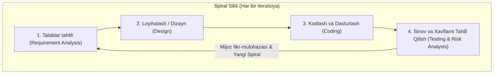
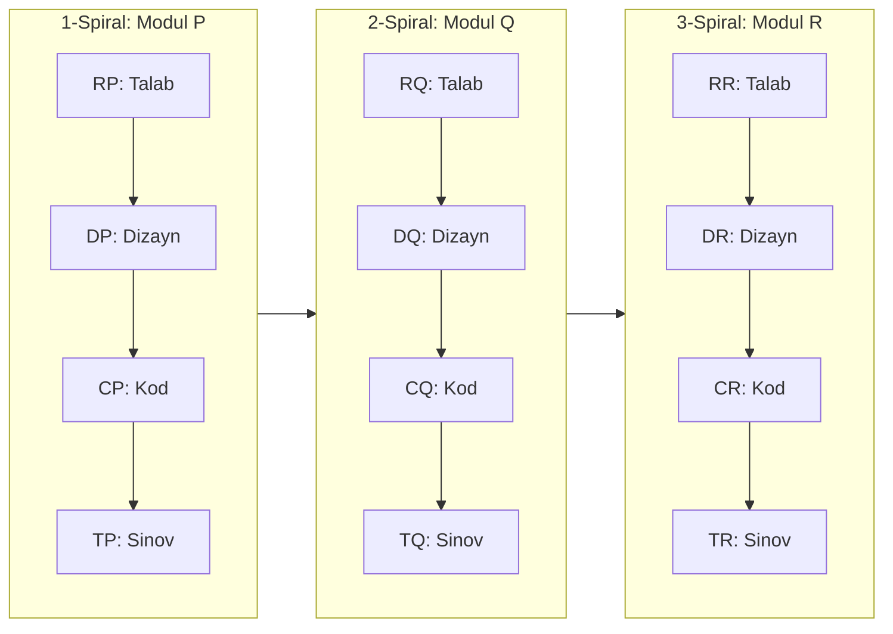
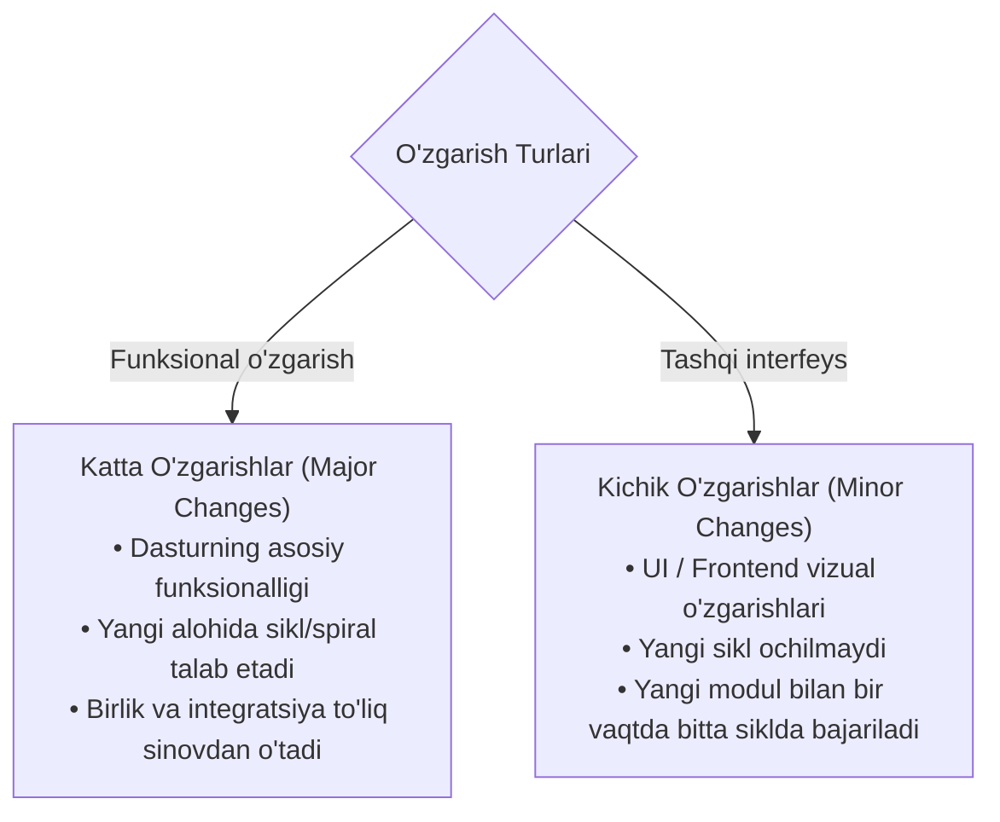

import { Callout } from 'nextra/components'

# Dasturiy Sinovda Spiral Modeli (Spiral Model in Software Testing)

**Spiral modeli (Spiral Model)** — dasturiy ta'minotni ishlab chiqish hayotiy davrining (SDLC) iterativ modellaridan biri bo'lib, u takrorlanuvchi rivojlanishni tizimli xavflarni tahlil qilish (systematic risk analysis) tamoyillari bilan birlashtiradi. Ushbu modelda dasturiy ta'minot ketma-ket takrorlanuvchi sikllar — spirallar (spirals) orqali bosqichma-bosqich ishlab chiqiladi.

Ushbu bo'limda siz Spiral modeli, uning 4 ta asosiy bosqichi, ish oqimi, modullararo sinov shartlari, MS Excel misoli, o'zgarishlar turlari hamda afzalliklari va kamchiliklarini batafsil o'rganasiz.

---

## Spiral Modeli Nima? (What is the Spiral Model?)

**Spiral modeli** — bu dasturiy ta'minot bir nechta takrorlanuvchi iteratsiyalar (spirallar) orqali ishlab chiqiladigan SDLC modelidir. Har bir spiral o'z ichiga rejalashtirish, loyihalash, ishlab chiqish, sinov va xavflarni tahlil qilish bosqichlarini qamrab oladi. Har bir yangi spiral natijasida dasturiy ta'minotning tobora takomillashgan va boyitilgan versiyasi yuzaga keladi.

Sharshara modelidan farqli o'laroq, Spiral modelida loyiha jarayonida talablarning bosqichma-bosqich shakllanishi va o'zgarishiga ruxsat beriladi. Shuningdek, har bir iteratsiyada xatarlarni aniqlash va ularni bartaraf etishga birlamchi urg'u beriladi, bu esa uni yirik va murakkab loyihalar uchun eng mos modelga aylantiradi.

Spiral modeli buyurtmachilarga har bir iteratsiyadan so'ng dasturiy ta'minotni ko'rib chiqish va fikr-mulohazalar (feedback) bildirish imkonini beradi. Ushbu fikrlar navbatdagi rivojlanish sikllariga to'liq kiritiladi.

---

## Spiral Modelining 4 Asosiy Bosqichi

Spiral modelining har bir iteratsiyasi qat'iy ravishda quyidagi to'rtta bosqichdan iborat bo'ladi:

### 1. Talablar Tahlili (Requirement Analysis)
Spiral modeli jarayoni mijozning biznes ehtiyojlarini to'plashdan boshlanadi:
- Keyingi spirallarda tizim talablari (system requirements), birlik talablari (unit requirements) va quyi tizim ehtiyojlari (subsystem needs) hujjatlashtirib boriladi.
- Biznes tahlilchi (Business Analyst) va buyurtmachi doimiy muloqotda bo'lganligi sababli tizim talablarini to'liq tushunish oson kechadi.
- Sikl to'liq yakunlangach, dastur bozorga yoki mijoz muhitiga (production) joylashtiriladi.

### 2. Loyihalash va Dizayn (Design)
Spiral modelining ikkinchi bosqichi dizayn hisoblanadi:
- Unda mantiqiy dizayn (logical design) va arxitektura dizayni (architectural design) rejalashtiriladi.
- Ma'lumotlar oqimi sxemalari (flow charts), qaror daraxtlari (decision trees) va tizim bloklari ishlab chiqiladi.

### 3. Kodlash va Dasturlash (Coding)
Dizayn bosqichi yakunlangach, kodlash bosqichiga o'tiladi:
- Dasturchilar mijozning talablari va oldingi fikr-mulohazalari asosida mahsulotni ishlab chiqadilar.
- Ushbu bosqich har bir siklda haqiqiy ishchi dasturiy ilovani qurishni anglatadi.
- Talablari va dizayn tafsilotlari aniq belgilangan har bir oraliq dasturiy natija versiya raqamiga ega bo'lgan **yig'ilma (build)** deb ataladi. Shundan so'ng ushbu yig'ilmalar mijozga ko'rib chiqish va javob olish uchun yuboriladi.

### 4. Sinov va Xavflarni Tahlil Qilish (Testing and Risk Analysis)
Dasturlash muvaffaqiyatli yakunlangach, birinchi sikl oxirida yig'ilma sinovdan o'tkaziladi:
- Dasturiy ta'minot turli jihatlar, xususan xavflarni boshqarish, nosozliklarni barvaqt aniqlash va texnik imkoniyatlarni (technical feasibility) kuzatish bo'yicha tahlil qilinadi.
- Shundan so'ng buyurtmachi ilovani sinab ko'radi va keyingi qadamlar uchun o'z mulohazalarini bildiradi.

---

## Spiral Modeliga Amaliy Misol (Modulli Rivojlanish)

Spiral modelida dasturiy ta'minot kichik modullar ko'rinishida bosqichma-bosqich ishlab chiqiladi. Faraz qilaylik, bizda **A ilovasi** mavjud bo'lib, u ketma-ket **P**, **Q**, **R** modullari yordamida yaratilishi lozim:

Yuqoridagi belgilashlar quyidagilarni anglatadi:
- **RP, RQ, RR:** Tegishlicha P, Q, R modullarining talablar tahlili (Requirement Analysis).
- **DP, DQ, DR:** Tegishlicha P, Q, R modullarining dizayni (Design).
- **CP, CQ, CR:** Tegishlicha P, Q, R modullarini kodlash (Coding).
- **TP, TQ, TR:** Tegishlicha P, Q, R modullarini sinash (Testing).

### Jarayon va Sinov Shartlari:
1. **P Modulida:** Avval talab olinadi, so'ng modul loyihalanadi va xatolar sinovdan o'tkazilgach kodlash yakunlanadi.
2. **Q Modulida:** Q moduli faqat P moduli to'liq qurib bo'lingandan so'ng yaratiladi. Q modulini sinashda quyidagi 3 ta shart qat'iy tekshiriladi:
   - Q modulining o'zini sinash (Unit testing).
   - Q modulining P moduli bilan integratsiyasini sinash (Integration testing).
   - P modulining o'zini qayta sinash (Regression / Re-testing).
3. **R Modulida:** P va Q modullari yaratilgach, R moduliga o'tiladi va quyidagi shartlar tekshiriladi:
   - Avvalo har bir modulni tekshirish: R, Q va P.
     - So'ngra modullar integratsiyasini quyidagi tartibda tekshirish: `R → Q`, `(R va P) → (P va Q)`

<Callout type="warning">
**Muhim Qoida:**
Sikl bir nechta modullar uchun davom etganda, Q moduli faqat P moduli to'g'ri va to'liq qurilgandan keyingina boshlanishi mumkin. Xuddi shuningdek, R moduli ham P va Q to'liq tayyor bo'lgach boshlanadi.
</Callout>

### Real Hayotiy Misol: Microsoft Excel
Spiral modeliga eng mos tushadigan amaliy misol — **MS-Excel** dasturidir:
- Excel elektron jadvali bir nechta katakchalardan (cells) tashkil topgan.
- **P Moduli:** Dastlab katakchalar to'ri yaratiladi.
- **Q Moduli:** Katakchalar tayyor bo'lgach, ular ustida amallar bajarish — katakchalarni ikkiga bo'lish (split cells) va birlashtirish (merge cells) imkoniyati qo'shiladi.
- **R Moduli:** Katakchalar va ulardagi ma'lumotlar asosida jadvalda grafiklar va diagrammalar (draw graphs/charts) chizish moduli quriladi.

---

## Spiral Modelida O'zgarishlar Turlari (Major vs Minor Changes)

Spiral modelida talablarga kiritiladigan o'zgarishlar ikki turga bo'linadi:

### 1. Katta O'zgarishlar (Major Changes)
Buyurtmachi ma'lum bir modul uchun talablarga jiddiy o'zgartirish kiritishni so'raganda yuz beradi:
- Faqat o'sha modul o'zgartiriladi hamda birlik (unit) va integratsion sinovlar to'liq qayta o'tkaziladi.
- Bunday o'zgarish uchun **har doim bitta yangi sikl (iteratsiya)** ochiladi, chunki u mavjud boshqa modullarga ta'sir ko'rsatishi mumkin.
- Katta o'zgarishlar odatda dasturning biznes funksionalligi bilan bog'liq bo'ladi.

### 2. Kichik O'zgarishlar (Minor Changes)
Mijoz dasturda kichik o'zgarish kiritishni so'raganda:
- Dasturlash jamoasi ushbu kichik o'zgarishlarni navbatdagi yangi modul bilan birgalikda, bitta sikl ichida amalga oshiradi.
- Bu holatda **hech qachon yangi sikl yoki iteratsiya ochilmaydi**, chunki kichik o'zgarish mavjud funksionallikka salbiy ta'sir ko'rsatmaydi va yangi sikl ochish ortiqcha vaqt hamda resurs talab qiladi.
- Kichik o'zgarishlar odatda foydalanuvchi interfeysi (UI / frontend) tuzatishlari bo'ladi.

---

## Spiral Modelining Afzalliklari va Kamchiliklari

| Afzalliklari (Advantage) | Kamchiliklari (Disadvantage) |
| :--- | :--- |
| **Moslashuvchan o'zgarishlar:** Spiral modelida loyiha davomida moslashuvchan o'zgartirishlar kiritishga ruxsat beriladi. | **Kichik loyihalar uchun mos emas:** Kichik va xavf darajasi past bo'lgan mahsulotlar uchun to'g'ri kelmaydi, chunki bu kichik loyiha uchun juda qimmatga tushishi mumkin. |
| **Kichik qismlarga taqsimlash:** Ishlab chiqish jarayonini boshqarish oson bo'lgan kichik qismlarga (modullarga) bo'lish mumkin. | **An'anaviy sinov cheklovi:** Bu klassik model bo'lib, unda sinov vazifalarini ham asosan dasturchilarning o'zlari bajargan. |
| **Erta foydalanish:** Buyurtmachi dastlabki bosqichlardanoq ilovadan foydalanishi va baholashi mumkin. | **Ko'rib chiqish va parallel ish yo'qligi:** Unda maxsus ko'rib chiqish (review) jarayoni talab qilinmaydi va parallel yetkazib berishga ruxsat etilmaydi. |
| **Mutaxassislar uchun ravshanlik:** Dasturchilar va test muhandislari uchun loyiha maqsadlari juda aniq va ravshan bo'ladi. | **Murakkab boshqaruv:** Spiral modelida loyihani boshqarish biroz qiyin, shu sababli u ancha kompleks jarayon hisoblanadi. |
| **Prototiplardan keng foydalanish:** Tizim talablarini tushunish uchun prototiplardan keng foydalanish imkoniyatini yaratadi. | **Keraksiz qog'ozbozlik:** Ko'p sonli oraliq bosqichlar mavjudligi ortiqcha va keraksiz hujjatbozlikni talab etadi. |
