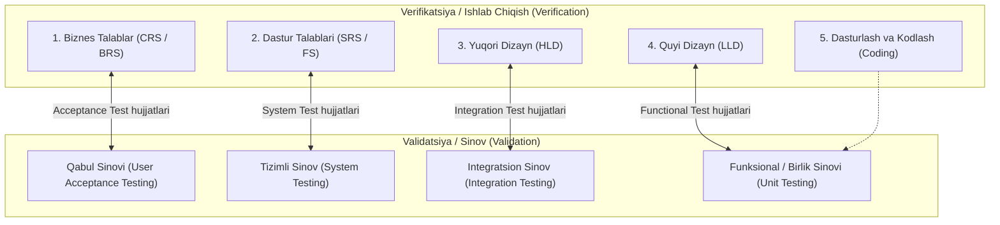
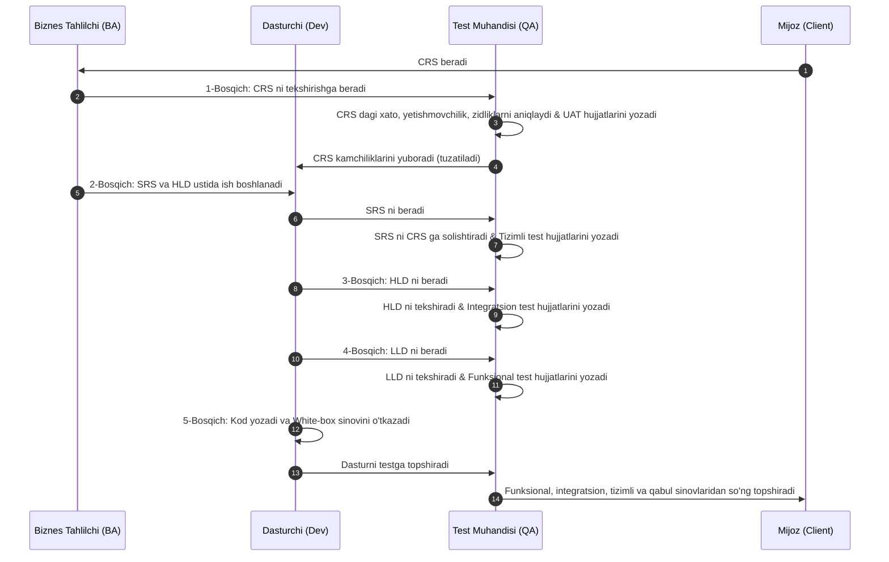

import { Callout } from 'nextra/components'

# Dasturiy Sinovda V-Model (V-Model in Software Testing)

**V-Model (Verification and Validation Model — Tekshirish va Tasdiqlash Modeli)** — dasturiy ta'minotni ishlab chiqish hayotiy davrining (SDLC) eng ishonchli modellaridan biri bo'lib, unda har bir ishlab chiqish (development) bosqichiga parallel ravishda unga to'g'ridan-to'g'ri mos keluvchi sinov (testing) bosqichi rejalashtiriladi.

U klassik Sharshara modelining (Waterfall Model) sifat kafolatiga yo'naltirilgan kengaytmasi bo'lib, ishlab chiqish va sinov o'rtasidagi to'g'ridan-to'g'ri bog'liqlikni lotincha **"V"** harfi shaklidagi tizimda aks ettiradi.

Ushbu bo'limda siz V-Model, uning tuzilishi, CRS va SRS farqlari, 5 bosqichli ish jarayoni, talablar o'zgarishini boshqarish hamda afzalliklari va cheklovlarini to'liq o'rganasiz.

---

## V-Model Nima? (What is the V-Model?)

**V-Model** — dasturiy ta'minot ishlab chiqishning har bir bosqichiga sinov faoliyatini integratsiya qiluvchi SDLC modelidir:
- **"V" ning chap tomoni:** Ishlab chiqish bosqichlari bo'ylab yuqoridan pastga harakatlanadi va unda **Verifikatsiya (Verification — Tekshirish)**, ya'ni statik ko'rib chiqishlar (review) amalga oshiriladi.
- **"V" ning o'ng tomoni:** Sinov bosqichlari bo'ylab pastdan yuqoriga ko'tariladi va unda **Validatsiya (Validation — Tasdiqlash)**, ya'ni dinamik sinovlar o'tkaziladi.

Sinov faoliyati eng birinchi — talablar bosqichidanoq rejalashtiriladi. Bu esa nuqsonlarni ishlab chiqish hayotiy davrining eng barvaqt bosqichlarida aniqlashga imkon beradi hamda talablar, dizayn, kod va testlar o'rtasidagi o'zaro bog'liqlikni (traceability) ta'minlaydi.

---

## V-Model Qachon Qo'llaniladi?

V-Model quyidagi asosiy sabablarga ko'ra tanlanadi:
1. **Yirik va murakkab ilovalar uchun:** 
   - *Yirik (large)* degani — tizimda ko'plab ($n$ ta) mustaqil modullar mavjudligini bildiradi.
   - *Murakkab (complex)* degani — modullar o'rtasida ko'p sonli o'zaro bog'liqliklar (dependencies) borligini anglatadi.
2. **Uzoq muddatli loyihalar uchun (Long term projects):** Xavfsizlik va barqarorlik birlamchi o'rinda bo'lgan yirik tizimlarda.

---

## Talablar Tushunchasi: CRS/BRS va SRS/FS Farqi

V-Model jarayonini tushunish uchun mijozdan olinadigan talablar hujjatlarining farqini bilish zarur:

| Hujjat | To'liq Nomi | Tavsifi va Vazifasi |
| :--- | :--- | :--- |
| **CRS / BRS** | Customer Requirement Specification / Business Requirement Specification | Biznes tahlilchi (BA) tomonidan oddiy biznes tilida yoziladi. Dasturchilar va test muhandislari uni to'g'ridan-to'g'ri texnik jihatdan tushunishi qiyin. |
| **SRS / FS** | Software Requirement Specification / Functional Specification | CRS asosida ishlab chiqiladigan batafsil texnik hujjat. Dasturchilar va test muhandislari uchun tushunarli texnik spetsifikatsiyalarga ega. |

### Gmail Ilovasi Misolida Taqqoslash:

#### 1. Buyurtmachi Talablari Spetsifikatsiyasi (CRS Namunasi):
1. Mijozning xavfsiz tizimga kirishi (Customer secured entry)
2. Xatlar yozish imkoniyati (Optional creates mails)
3. Xatlarni ko'ra olish (Able to see mails)
4. Keraksiz xatlarni o'chirish (Unwanted content delete)
...
15. Ilovani muvaffaqiyatli yopish (Successfully close the application)

#### 2. Dasturiy Ta'minot Talablari Spetsifikatsiyasi (SRS Namunasi):
1. **Kirish (Login) moduli:**
   - **1.1 Foydalanuvchi nomi:** Matn kiritish maydoni (Text box).
     - *1.1.1:* Faqat 5 ta harfdan iborat belgilarni qabul qiladi.
   - **1.2 Parol:** Maxfiy kiritish maydoni (Password text box).
     - *1.2.1:* Kamida 8 ta belgidan iborat bo'lishi, unda kamida bitta katta harf va bitta maxsus belgi (`@`, `$`, `%`, `&`) bo'lishi shart.
   - **1.3 Kirish (OK) tugmasi:**
     - *1.3.1:* Faqat maydonlar to'g'ri to'ldirilganda faollashishi (enabled) kerak.
2. **Xat yaratish (Compose) moduli:**
   - **2.1 Kimga (To):** Matn maydoni.
3. **Kiruvchi xatlar (Inbox) moduli**
4. **Chiqish (Logout) tugmasi**

### Funksional Talabning Asosiy Xususiyatlari:
- **Batafsil (In-Details):** Modullar, komponentlar va funksional spetsifikatsiyalar haqida to'liq ma'lumotga ega bo'lishi kerak.
- **To'g'ri ketma-ketlik (Proper Flow):** Barcha talablar mantiqiy ketma-ketlikda (sequence order) joylashishi lozim.
- **Sodda va ravon til:** Hamma uchun tushunarli tilda ifodalanishi lozim.
- **O'lchanadigan va hisoblanadigan (Measurable / Countable):** Har bir talab sinovdan o'tkazilishi (testable) mumkin bo'lishi shart.

---

## V-Modelning 5 Bosqichli Jarayoni

<Callout type="info">
**Muhim Eslatma:**
V-Modelda barcha bosqichlarda tuziladigan **Sinov hujjatlari (Test Documents)** o'z ichiga **Test Rejalari (Test Plans)** va batafsil **Test Ssenariylari (Test Cases)**ni qamrab oladi.
</Callout>

Butun V-Model ikki yo'nalishda bajariladi: to'liq ko'rib chiqish jarayoni (**review process**) verifikatsiya bosqichida, butun sinov jarayoni (**testing process**) esa validatsiya bosqichida amalga oshiriladi.

### 1-Bosqich (Stage 1)
- Jarayon biznes tahlilchi tomonidan mijozdan **CRS (Customer Requirement Specification)** hujjatini to'plashdan boshlanadi.
- Test muhandisi CRS hujjatini quyidagi mezonlar bo'yicha ko'rib chiqadi (review qiladi):
  - **Noto'g'ri talablar (Incorrect requirements)**
  - **Yetishmayotgan / Chala talablar (Missing requirements)**
  - **Zid va qarama-qarshi talablar (Conflicts in the requirements)**
- Test muhandisi ushbu bosqichda **Qabul Sinovi Hujjatlarini (Acceptance Test Documents)** yozadi.
- Test muhandislari jamoasi CRS ni ko'rib chiqib, xatoliklar yoki nuqsonlarni aniqlasa, ularni tuzatish uchun dasturlash jamoasiga yuboradi. Nuqsonlar tuzatilgach, dasturchilar CRS ni yangilaydilar va bir vaqtning o'zida texnik SRS hujjatini ishlab chiqishga kirishadilar.

### 2-Bosqich (Stage 2)
- CRS yakunlangach, SRS hujjati ko'rib chiqish uchun test jamoasiga yuboriladi va dasturchilar ilova uchun yuqori darajali dizayn (**HLD — High-Level Design**) yaratishni boshlaydilar.
- Test jamoasi SRS ni quyidagi ssenariylar bo'yicha tekshiradi:
  - **SRS ni CRS ga solishtirib tekshirish (Review the SRS against CRS)**
  - **Har bir CRS talabi SRS ga to'liq ko'chganligini tekshirish (Each CRS is transferred to SRS)**
  - **CRS talablari SRS ga noto'g'ri ko'chirilmaganligini tekshirish (CRS is not transformed properly to SRS)**
- Test muhandisi **Tizimli Sinov Hujjatlarini (System Test Documents)** yozadi.
- Test jamoasi SRS ning har bir tafsilotini ko'rib chiqib, barcha talablar to'g'ri ko'chirilganligini tasdiqlagach, navbatdagi bosqichga o'tiladi.

### 3-Bosqich (Stage 3)
- HLD tugallangach, dasturchilar ilova uchun quyi darajali dizayn (**LLD — Low-Level Design**) ustida ish boshlaydilar.
- Shu vaqtning o'zida test muhandisi HLD ustida quyidagi ishlarni bajaradi:
  - HLD hujjatini ko'rib chiqadi (Review HLD).
  - Integratsion sinov hujjatlarini yozadi (**Integration Test Documents**).

### 4-Bosqich (Stage 4)
- Test jamoasi HLD ni ko'rib chiqishni yakunlagach, dasturchilar dastur kodini yozishga (Coding) kirishadilar.
- Test jamoasi esa parallel ravishda quyidagi vazifalarni amalga oshiradi:
  - LLD hujjatini ko'rib chiqadi (Review LLD).
  - Funksional sinov hujjatlarini yozadi (**Functional Test Documents**).

### 5-Bosqich (Stage 5)
- Kodlash qismi tugallangach, dasturchilar kodning har bir qatorini tekshirish va to'g'riligiga ishonch hosil qilish uchun bir raund **Oq quti / Birlik sinovini (Unit Testing / White Box Testing)** o'tkazadilar.
- Birlik sinovidan so'ng ilova test jamoasiga topshiriladi. Test muhandislari oldingi bosqichlarda tayyorlab qo'yilgan hujjatlar asosida bir nechta sinovlarni o'tkazadilar:
  1. **Funksional sinov (Functional Testing)**
  2. **Integratsion sinov (Integration Testing)**
  3. **Tizimli sinov (System Testing)**
  4. **Qabul sinovi (Acceptance Testing)**
- Sinov qismi to'liq va muvaffaqiyatli yakunlangach, dasturiy ta'minot yakuniy foydalanish uchun mijozga yetkazib beriladi.

---

## V-Modelda Talablar O'zgarishi Qanday Boshqariladi?

Har gal talablarda biron-bir o'zgarish yuz bersa, xuddi shu 5 bosqichli protsedura boshidan davom ettiriladi va barcha tegishli hujjatlar (CRS, SRS, HLD, LLD, test rejalari va test keyslari) yangilanadi.

---

## V-Modelning Afzalliklari va Kamchiliklari (Pros and Cons)

| Afzalliklari (Advantage) | Kamchiliklari (Disadvantage) |
| :--- | :--- |
| **Har bir bosqichda ko'rib chiqish (Review):** Barcha bosqichlarda ko'rib chiqish jarayoni mavjud, shu sababli dasturda xatolar (bugs) soni minimal darajada bo'ladi. | **Qimmat jarayon:** Dastlabki sarmoya yuqori, chunki sinov jamoasi loyihaning eng birinchi kunidanoq talab etiladi. |
| **Parallel ish olib borish (Parallel deliverable):** Dasturchilar va test muhandislari bir vaqtning o'zida parallel ishlay oladilar. | **Ko'p vaqt sarfi:** Agar talablar o'zgarsa, barcha matnli hujjatlar va test keyslarini qayta o'zgartirish talab etiladi. |
| **Barqaror va mustahkam mahsulot:** Tizimli verifikatsiya hisobiga mustahkam va ishonchli (robust/stable) mahsulot yetkazib beriladi. | **Katta hajmdagi hujjatlashtirish:** Test rejalari, test ssenariylari va boshqa hujjatlar juda ko'p qog'ozbozlikni talab qiladi. |
| **Test muhandislarining chuqur bilimi:** Test mutaxassisi mahsulot yaratilishining har bir bosqichida qatnashgani uchun tizimni mukammal darajada biladi. | **Obyektga yo'naltirilgan loyihalar uchun mos emas:** Obyektga yo'naltirilgan (object-oriented) loyihalar uchun to'g'ri kelmaydi. |
| **Hujjatlardan qayta foydalanish:** Yozilgan barcha test hujjatlarini keyinchalik o'xshash loyihalarda va regressiya sinovlarida qayta ishlatish mumkin. | **Orqaga qaytib o'zgartirish imkonsiz:** Ilova dinamik sinov bosqichiga yetganda funksionallikni ortga qaytarish yoki tubdan almashtirish mumkin emas. |
