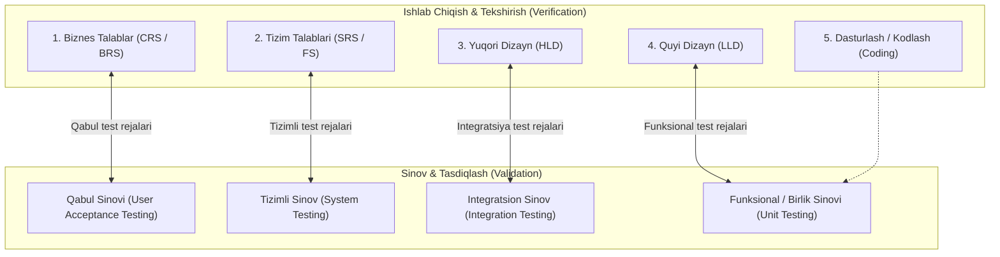

import { Callout } from 'nextra/components'

# V-Model (Verification & Validation)

**V-Model (Tekshirish va Tasdiqlash Modeli — Verification and Validation Model)** — dasturiy ta'minotni ishlab chiqish hayotiy davrining (SDLC) eng ishonchli modellaridan biri bo'lib, unda ishlab chiqishning har bir bosqichiga parallel ravishda unga mos keluvchi sinov bosqichi rejalashtiriladi.

U klassik Sharshara modelining takomillashtirilgan va sifatga yo'naltirilgan shakli bo'lib, jarayonlar vizual ravishda lotincha **"V"** harfi shaklida ifodalanadi.

---

## V-Model Nima? (What is the V-Model?)

V-Modelda ishlab chiqish jarayoni chap tomondagi bosqichlar bo'ylab pastga qarab harakatlanadi (**Verification / Tekshirish**), sinov jarayoni esa pastdan o'ng tomonga qarab yuqoriga ko'tariladi (**Validation / Tasdiqlash**):

- **Verifikatsiya (Verification — "Dasturni to'g'ri quryapmizmi?"):** Kod hali ishga tushirilmasdan oldin talablar, arxitektura va dizayn hujjatlarini ko'rib chiqish (statik tahlil / reviews).
- **Validatsiya (Validation — "To'g'ri dastur qurdikmi?"):** Tayyor kodni ishga tushirgan holda uning haqiqiy ishlashini va foydalanuvchi talablariga mosligini amalda tekshirish (dinamik sinov).

---

## V-Model Qachon Tanlanadi?

1. **Katta va murakkab tizimlarda:** Loyihada ko'plab modullar bo'lib, ular bir-biriga qattiq bog'langan bo'lsa.
2. **Uzoq muddatli va xatolarga toqatsiz loyihalarda:** Tibbiyot uskunalari, aviasiya, bank-moliya tizimlari kabi xavfsizlik o'ta muhim bo'lgan sohalarda.
3. **Talablari barqaror bo'lgan loyihalarda:** Talablar boshidanoq aniq ifodalangan bo'lsa.

---

## Talablar Hujjatlari: CRS va SRS Farqi

V-Modelda ishlashdan oldin talab hujjatlarining farqini chuqur tushunish muhim:

| Hujjat Turi | To'liq Nomi | Tavsifi va Kim Uchun Mo'ljallangan? |
| :--- | :--- | :--- |
| **CRS / BRS** | Customer / Business Requirement Specification | Mijoz va biznes tahlilchi tomonidan yoziladi. Oddiy kundalik biznes tilida bo'lib, dasturchi yoki tester uchun yetarli texnik tafsilotlarga ega emas. |
| **SRS / FS** | Software Requirement Specification / Functional Specification | Biznes tahlilchi tomonidan CRS asosida tuziladi. Dasturchilar va test muhandislari tushunadigan aniq texnik talablar va qoidalarni o'z ichiga oladi. |

### Gmail Ilovasi Misolida Solishtirish:

#### Mijoz Talabi (CRS Namunasi):
1. Mijozning xavfsiz tizimga kirishi (Customer secured entry).
2. Xat yozish imkoniyati (Optional creates mails).
3. Xatlarni ko'rish (Able to see mails).
4. Keraksiz xatlarni o'chirish (Unwanted content delete).
...
15. Ilovani muvaffaqiyatli yopish (Successfully close the application).

#### Dasturiy Texnik Talab (SRS Namunasi):
1. **Kirish (Login) moduli:**
   - **1.1 Foydalanuvchi nomi (Username):** Matn kiritish maydoni (Text box).
     - *1.1.1:* Faqat 5 ta harfdan iborat lotin belgilarini qabul qiladi.
   - **1.2 Parol (Password):** Yashirin kiritish maydoni (Password text box).
     - *1.2.1:* Kamida 8 ta belgi bo'lishi, unda kamida bitta bosh harf va bitta maxsus belgi (`@`, `$`, `%`, `&`) bo'lishi shart.
   - **1.3 Kirish (OK / Submit) tugmasi:** 
     - *1.3.1:* Faqat ma'lumotlar to'g'ri kiritilgandagina faollashishi (enabled) kerak.
2. **Xat yaratish (Compose) moduli**
3. **Kiruvchi xatlar (Inbox) moduli**
4. **Chiqish (Logout) tugmasi**

---

## V-Modelning 5 Bosqichli Tafsilotli Jarayoni

<Callout type="info">
**Eslatma:** Har bir bosqichda tuziladigan **Sinov hujjatlari (Test Documents)** o'z ichiga **Test Rejalari (Test Plans)** va batafsil **Test Ssenariylari (Test Cases)**ni qamrab oladi.
</Callout>

### 1-Bosqich: CRS va Qabul Sinovlari Hujjatlari
- Biznes tahlilchi mijozdan biznes talablarini (**CRS**) to'playdi.
- Test muhandisi CRS hujjatini quyidagi mezonlar bo'yicha ko'rib chiqadi (review qiladi):
  - *Noto'g'ri talablar (Incorrect requirements)*
  - *Yetishmayotgan / Chala talablar (Missing requirements)*
  - *Zid va qarama-qarshi talablar (Conflicts in requirements)*
- Test muhandisi ushbu bosqichda **Qabul Sinovi Hujjatlarini (Acceptance Test Documents)** yozadi.
- Topilgan nuqsonlar tuzatilgach, CRS yangilanadi va SRS bosqichiga o'tiladi.

### 2-Bosqich: SRS va Tizimli Sinov Hujjatlari
- Biznes tahlilchi CRS asosida texnik **SRS** hujjatini ishlab chiqadi.
- Dasturchilar arxitektura (**HLD**) ustida ish boshlaydilar.
- Test muhandisi SRS hujjatini CRS bilan solishtirib ko'rib chiqadi:
  - Har bir CRS talabi SRS ga to'liq ko'chdimi?
  - Talablar noto'g'ri yoki buzib talqin qilinmadimi?
- Test muhandisi **Tizimli Sinov Hujjatlarini (System Test Documents)** tayyorlaydi.

### 3-Bosqich: Yuqori Darajali Dizayn (HLD) va Integratsiya Sinovi Hujjatlari
- Dasturiy arxitektorlar tizimning **HLD (High-Level Design)** hujjatini yaratadilar (ma'lumotlar bazasi, tizim oqimi, tashqi servislar).
- Dasturchilar har bir modulning quyi dizayni (**LLD**) ustida ishlay boshlaydilar.
- Test muhandisi HLD ni o'rganib chiqadi va modullarning o'zaro hamkorligini tekshiruvchi **Integratsion Sinov Hujjatlarini (Integration Test Documents)** yozadi.

### 4-Bosqich: Quyi Darajali Dizayn (LLD) va Funksional Sinov Hujjatlari
- Yetakchi dasturchilar komponentlar va funksiyalar darajasidagi **LLD (Low-Level Design)** hujjatini tuzadilar.
- Dasturchilar to'g'ridan-to'g'ri manba kodini yozishga (Coding) kirishadilar.
- Test muhandisi LLD ni o'rganib chiqadi va ichki biznes mantiqni tekshiruvchi **Funksional Sinov Hujjatlarini (Functional Test Documents)** ishlab chiqadi.

### 5-Bosqich: Kodlash va Keng Qamrovli Dinamik Sinov
- Dasturchilar kod yozib bo'lgach, kodning har bir qatorini tekshirish uchun dastlabki **Oq quti / Birlik sinovini (Unit Testing / White-Box)** o'tkazadilar.
- Kod barqaror bo'lgach, u test muhandislariga topshiriladi. Test muhandislari oldingi bosqichlarda tayyorlab qo'yilgan hujjatlar bo'yicha dinamik sinovlarni ketma-ketlikda bajaradilar:
  1. **Funksional sinov (Functional Testing):** LLD bo'yicha har bir funksiya tekshiriladi.
  2. **Integratsion sinov (Integration Testing):** HLD bo'yicha modullar aro ma'lumotlar oqimi tekshiriladi.
  3. **Tizimli sinov (System Testing):** SRS bo'yicha butun dastur yaxlit holda sinovdan o'tkaziladi.
  4. **Qabul sinovi (Acceptance Testing):** CRS bo'yicha mahsulot mijoz talablariga mosligi tasdiqlanadi va topshiriladi.

---

## Talablar O'zgarganda Qanday Yo'l Tutiladi?

Agar jarayon davomida mijoz talablarni o'zgartirsa:
1. Yangi talab CRS/SRS darajasida qabul qilinadi.
2. Xuddi shu zanjir bo'yicha arxitektura va dizayn hujjatlari yangilanadi.
3. Yangilangan hujjatlarga asosan test rejalari va test keyslari to'liq qayta ko'rib chiqiladi va moslashtiriladi.

---

## V-Modelning Afzalliklari va Kamchiliklari

| Afzalliklari (Advantages) | Kamchiliklari (Disadvantages) |
| :--- | :--- |
| **Har bir bosqichda ko'rib chiqish (Review):** Barcha bosqichlarda verifikatsiya borligi sababli dasturda kamroq nuqsonlar (bugs) uchraydi. | **Yuqori dastlabki xarajat:** Test jamoasi eng birinchi kundan boshlab jalb qilinishi sababli loyihaning boshlang'ich byudjeti yuqori bo'ladi. |
| **Parallel ish olib borish (Parallel deliverables):** Dasturlash va sinov jamoalari bir vaqtning o'zida parallel faoliyat yuritadi. | **O'zgarishlar kiritishning murakkabligi:** Talablar o'zgarganda barcha ko'p sonli test hujjatlarini qayta yangilash katta vaqt talab qiladi. |
| **O'ta barqaror va mustahkam mahsulot:** Tizimli yondashuv natijasida barqaror va nosozliklarsiz dasturiy ta'minot yaratiladi. | **Katta hajmdagi hujjatlashtirish:** Test rejalari, test ssenariylari va tahlil hisobotlari juda ko'p yozma mehnatni talab etadi. |
| **Test muhandislarining chuqur bilimi:** Test mutaxassisi loyihaning boshidanoq qatnashgani uchun mahsulotni dasturchilar darajasida biladi. | **Obyektga yo'naltirilgan loyihalar uchun kam qo'llanilishi:** Dinamik va tez o'zgaruvchan loyihalarga moslashtirish qiyin. |
| **Hujjatlarning qayta ishlatilishi:** Yaratilgan test hujjatlari kelgusidagi yangi versiyalar va regressiya sinovlarida qayta qo'llaniladi. | **Kechki orqaga qaytishning qiyinligi:** Ilova dinamik sinov bosqichiga yetganda asosiy funksionallikni tubdan o'zgartirish juda qimmatga tushadi. |
