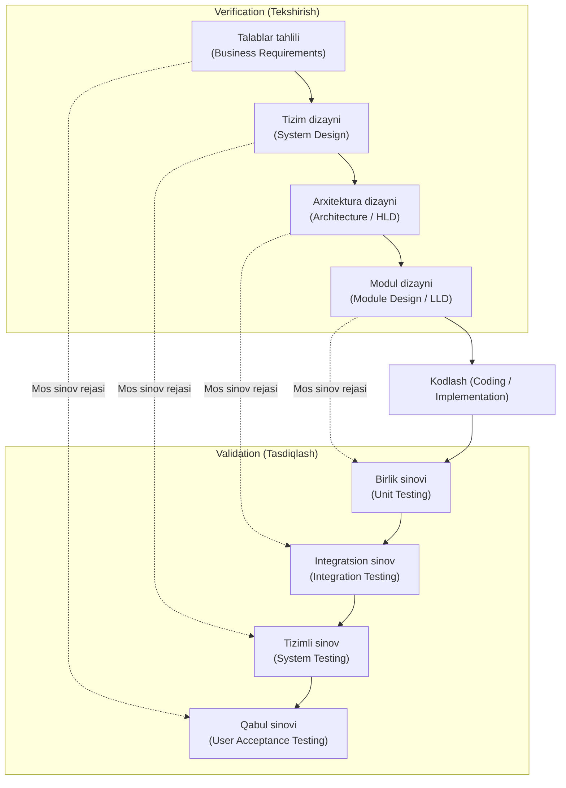

import { Callout } from 'nextra/components'

# V-Model: Verification va Validation Modeli

**V-Model (Verification and Validation Model)** — Waterfall modelining takomillashtirilgan ko'rinishi bo'lib, unda ishlab chiqishning har bir bosqichiga mos keluvchi sinov bosqichi parallel ravishda rejalashtiriladi.

Jarayon "V" harfi ko'rinishida tasvirlanadi: chap qanot tekshirish (Verification — hujjatlar va dizayn tahlili), o'ng qanot esa tasdiqlash (Validation — amaliy sinovlar) bosqichlaridan iborat.

---

## V-Model Arxitekturasi

---

## Bosqichlarning O'zaro Bog'liqligi

1. **Talablar tahlili hamda Qabul sinovi (UAT):**
   - Talablar yozilayotganda QA jamoasi yakuniy foydalanuvchi qabul mezonlarini (Acceptance Criteria) va UAT test-keyslarini tayyorlaydi.
2. **Tizim dizayni hamda Tizimli sinov (System Testing):**
   - Tizim spetsifikatsiyalari yaratilayotganda butun tizimning funksional va nofunksional test rejalari tuziladi.
3. **Arxitekturaviy dizayn hamda Integratsion sinov (Integration Testing):**
   - Modullararo interfeyslar va API ulanishlari loyihalanayotganda integratsion test-keyslar yoziladi.
4. **Modul dizayni hamda Birlik sinovi (Unit Testing):**
   - Har bir alohida funksiya va sinflar loyihalanganda ularni sinash uchun Unit testlar loyihalashtiriladi.

---

## Afzalliklari va Kamchiliklari

| Afzalliklari | Kamchiliklari |
| :--- | :--- |
| **Erta sinash:** Sinov rejalari kod yozilishidan ancha oldin tuziladi | Moslashuvchanlik past, talablar o'zgarsa qayta ishlash qiyin |
| Nuqsonlar erta bosqichlarda aniqlanadi va xarajatlar tejaladi | Dasturiy kod jarayonning o'rtasidagina paydo bo'ladi |
| Yuqori intizom va har bir bosqichning qat'iy nazorati | Kichik va o'zgaruvchan startap loyihalari uchun noqulay |

<Callout type="info">
  **Tizim ishonchliligi:** V-model tibbiyot asboblari, samolyot boshqaruvi, avtomobil xavfsizlik tizimlari kabi xatolikka yo'l qo'yilmaydigan sohalarda oltin standart hisoblanadi.
</Callout>
