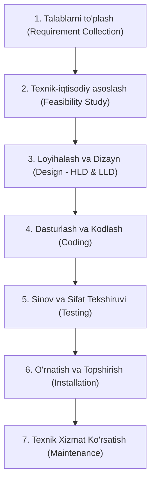
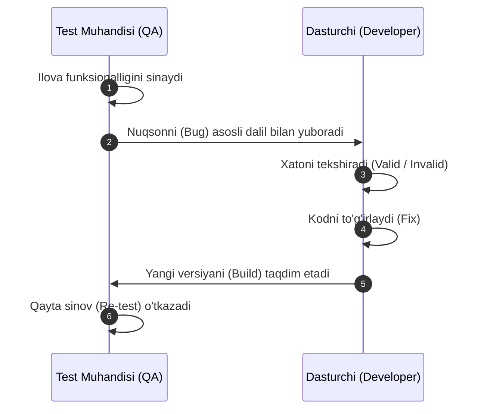

import { Callout } from 'nextra/components'

# Dasturiy Sinovda Sharshara Modeli (Waterfall Model in Software Testing)

**Sharshara modeli (Waterfall Model)** — dasturiy ta'minotni ishlab chiqish hayotiy davrining (SDLC) eng dastlabki va eng mashhur modellaridan biridir. U chiziqli va ketma-ket (linear-sequential) yondashuvga amal qiladi, unda har bir bosqich keyingi bosqich boshlanishidan oldin to'liq yakunlanishi shart.

Ushbu bo'limda siz Sharshara modeli, uning bosqichlari, ish oqimi, afzalliklari, kamchiliklari va amaliy qo'llanilishini o'rganasiz.

---

## Sharshara Modeli Nima? (What is the Waterfall Model?)

**Sharshara modeli** — bu ketma-ket dasturiy ta'minotni ishlab chiqish modeli bo'lib, unda bir bosqichning chiqish natijasi (output) keyingi bosqich uchun kirish ma'lumotiga (input) aylanadi. Ishlab chiqish jarayoni qat'iy belgilangan bosqichlar ketma-ketligi bo'ylab xuddi sharshara kabi yuqoridan pastga oqib o'tganligi sababli, u **Chiziqli Ketma-ket Hayotiy Sikl Modeli (Linear Sequential Life Cycle Model)** deb ham yuritiladi.

Sharshara modelida keyingi bosqichga o'tishdan oldin joriy bosqich to'liq tugallanishi lozim. Bu yondashuv bosqichlar orasidagi bir-birini qoplashni (overlap) minimallashtiradi va keyingi rivojlanishga o'tishdan oldin har bir oraliq natija (deliverable) to'liq tekshirilib, tasdiqlanishini kafolatlaydi.

Sharshara modeli odatda talablari oldindan juda aniq belgilangan va o'zgarmas bo'lgan loyihalarda, xususan, xavfsizlik o'ta muhim bo'lgan (safety-critical) yoki davlat ahamiyatiga molik (mission-critical) yirik tizimlarda qo'llaniladi.

---

## Sharshara Modelining 7 Asosiy Bosqichi

Sharshara modeli qat'iy ravishda quyidagi yetti bosqichdan iborat:

### 1. Talablarni To'plash (Requirement Collection)
Talablarni yig'ish Sharshara modelining birinchi va eng poydevor bosqichidir. Unda **biznes tahlilchi (Business Analyst — BA)** mijozning barcha ma'lumotlari va biznes ehtiyojlarini talablar hujjati ko'rinishida to'playdi. Ushbu hujjat o'ta aniq, tushunarli bo'lishi va barcha talablar to'g'ri ro'yxatga olinishi shart.

Ushbu bosqichda quyidagi asosiy hujjatlar shakllanadi:
- **BRS (Business Requirement Specification):** Biznes talablar spetsifikatsiyasi.
- **CRS (Customer Requirement Specification):** Buyurtmachi talablari spetsifikatsiyasi.
- **SRS (Software Requirement Specification):** Dasturiy ta'minot talablari spetsifikatsiyasi — ishlab chiqilishi va loyihalashtirilishi kerak bo'lgan butun tizimni to'liq qamrab oladi.

**Funksional talabning asosiy xususiyatlari:**
- Oson tushunilishi uchun sodda va ravon tilda yozilishi kerak.
- Spetsifikatsiyalar to'g'ri va mantiqiy ketma-ketlikda (proper flow) joylashishi lozim.
- Talablar aniq o'lchanadigan va hisoblanadigan (countable/measurable) bo'lishi shart.

---

### 2. Texnik-Iqtisodiy Asoslash (Feasibility Study)
Texnik-iqtisodiy asoslash loyiha ehtiyojlariga asoslanadi. Unda bir nechta soha mutaxassislari (inson resurslari/HR, biznes tahlilchi, dasturiy arxitektor) to'planib, loyihani amalga oshirish mumkin yoki yo'qligini tahlil qiladilar.

Mijoz talablari asosida quyidagi 5 ta asosiy jihat baholanadi:

| Jihati (Aspects) | Tavsifi va Mazmuni (Description) |
| :--- | :--- |
| **Qonuniy (Legal)** | Kompaniya ushbu loyihani amaldagi kiberqonunchilik va xavfsizlik monitoringi shartnomalari doirasida boshqara oladimi? |
| **Texnik (Technical)** | Mavjud kompyuterlar, serverlar va texnik infratuzilma mazkur dasturiy ta'minotni qo'llab-quvvatlaydimi? |
| **Operatsion Asoslilik (Operation Feasibility)** | Kompaniya mijoz tomonidan talab etilgan barcha operatsiyalarni to'liq amalga oshirishga qodirmi? |
| **Iqtisodiy (Economic)** | Kompaniya mahsulotni buyurtmachi ajratgan byudjet doirasida muvaffaqiyatli yakunlay oladimi? |
| **Muddat / Grafik (Schedule)** | Loyiha belgilangan vaqt grafigi va topshirish muddatlari ichida bitkaziladimi? |

---

### 3. Loyihalash va Dizayn (Design)
Texnik-iqtisodiy asoslash muvaffaqiyatli o'tgach, dizayn bosqichiga kirishiladi. Unda apparat va dasturiy ta'minot kombinatsiyasi, turli dasturlash tillari (PHP, Java, .NET va h.k.) hamda ma'lumotlar bazalari (MySQL, Oracle) yordamida mahsulot arxitekturasi ishlab chiqiladi.

Dizayn ikki xil darajaga bo'linadi:
1. **Yuqori Darajali Dizayn (High-Level Design — HLD):**
   - Tizim arxitektori tomonidan ishlab chiqiladi.
   - Unda tizim modellari, qaror daraxtlari (decision trees), oqim diagrammalari (flow diagrams), qaror jadvallari (decision tables), blok-sxemalar (flow charts) va ma'lumotlar lug'ati (data dictionary) yaratiladi.
2. **Quyi Darajali Dizayn (Low-Level Design — LLD):**
   - Dasturchilar rahbari (Lead Developer / Developer Manager) tomonidan tuziladi.
   - Unda alohida dasturiy komponentlar, funksiyalar va foydalanuvchi interfeysi (UI) detallari loyihalashtiriladi.

---

### 4. Dasturlash va Kodlash (Coding)
Dizayn bosqichi yakunlangach, bevosita dastur ishlab chiqish jarayoni boshlanadi. Dasturchilar o'zlarining dasturlash ko'nikmalariga asosan (Python, C, Java, C#, C++ va boshqalar) manba kodini yozadilar:
- **Back-end dasturchilar:** Talab qilingan barcha amallar va biznes logikasiga muvofiq ichki tizim kodini yozadilar.
- **Front-end dasturchilar:** Foydalanuvchi uchun qulay va jozibador grafik interfeysni (GUI) ishlab chiqadilar.

---

### 5. Sinov (Testing)
Kod yozib bo'lingach, dastur tegishli **test muhandisiga (Test Engineer / QA)** topshiriladi. Test muhandisi dasturning funksionalligini mijozning dastlabki talablariga nisbatan har tomonlama sinovdan o'tkazadi.

Sinov jarayonida yuzaga keladigan nosozliklar va nuqsonlar (mijoz talabiga mos kelmaydigan holatlar) dasturchilarga aniq asoslar (skrinshot, loglar, test qadamlari) bilan jo'natiladi. Dasturchi nuqsonning haqiqiyligini tekshirib, xatoni to'g'rilaydi va yangi yig'ilmani qaytaradi. Test muhandisi esa xato to'liq bartaraf etilganligini tasdiqlash uchun qayta sinov (**re-test**) o'tkazadi.

---

### 6. O'rnatish va Topshirish (Installation)
Ilova to'liq sinovdan o'tkazilib, xatolardan xoli, barqaror holatga kelguncha va barcha mijoz talablarini bajarguncha jarayon davom etadi. Dastur barqarorlashgach, u mijozning ishchi muhitiga o'rnatiladi.

Dastur o'rnatilgach:
1. Buyurtmachi o'z qoniqishi uchun **bir raund qabul sinovini** o'tkazadi.
2. Agar biron-bir kamchilik sezilsa, dasturchilar jamoasiga murojaat qilinadi va muammo bartaraf etiladi.
3. Barcha muammolar hal bo'lgach, dastur yakuniy foydalanuvchilar (end-users) uchun to'liq ishga tushiriladi.

---

### 7. Texnik Xizmat Ko'rsatish (Maintenance)
Dastur foydalanuvchilarga topshirilgandan so'ng uning hayotiy davri yakuniga qadar davom etuvchi oxirgi bosqich. Real foydalanish paytida yuzaga keladigan yangi muammolar tekshiriladi va bartaraf etib boriladi.

Mahsulotga muntazam texnik xizmat ko'rsatish o'z ichiga quyidagilarni oladi:
- Operatsion samaradorlikni saqlab qolish va unumdorlikni oshirish.
- Apparat ta'minoti va operatsion tizimlardagi o'zgarishlarga moslashtirish.

---

## Sharshara Modeliga Amaliy Misol (Applications)

Dastlabki yillarda Sharshara modeli quyidagi yirik tizimlarni ishlab chiqishda keng qo'llanilgan:
- **HRM (Human Resource Management):** Inson resurslarini boshqarish tizimlari.
- **Ta'minot zanjiri tizimlari (Supply Chain Management Systems).**
- **CRM (Customer Relationship Management):** Mijozlar bilan munosabatlarni boshqarish tizimlari.
- **Chakana savdo tarmoqlari (Retail Chains) tizimlari.**

<Callout type="info">
**Zamonaviy Holat:**
Bugungi kunda talablari tez o'zgaruvchan loyihalarda Sharshara modeli asosan **Iterativ modellar** hamda **Agile metodologiyalari (Scrum, Kanban)** bilan almashtirilgan. Biroq talablari oldindan qat'iy belgilangan davlat, harbiy va tibbiy tizimlarda hamon o'z o'rniga ega.
</Callout>

---

## Sharshara Modelining Afzalliklari va Kamchiliklari (Pros and Cons)

| Afzalliklari (Pros) | Kamchiliklari (Cons) |
| :--- | :--- |
| **Talablar aniqligi:** Loyiha boshidanoq barcha talablar aniq va qat'iy belgilangan bo'lishi talab etiladi. | **Parallel yetkazib berish yo'qligi:** Ikki jamoa bir vaqtda parallel ishlay olmaydi (dasturchi kodni tugatmaguncha test jamoasi kuta turadi). |
| **Kichik loyihalarga moslik:** Talablari chuqur tushunilgan kichik va o'rta loyihalar uchun juda samarali. | **Talablarni o'zgartirish imkonsizligi:** Loyiha davomida talablarni o'zgartirish yoki qayta ko'rib chiqish taqiqlanadi. |
| **Foydalanish qulayligi:** Modelni tushunish, o'rganish va amaliyotda qo'llash juda oson. | **Tarixiy sinov cheklovi:** Model ilk kashf etilgan paytda mustaqil sinov konsepsiyasi bo'lmagan, shu sababli dasturchilarning o'zlari sinovni bajargan. |
| **Samarali rejalashtirish:** Har bir bosqichning muddatini va vazifalarini oldindan oson rejalashtirish imkonini beradi. | **Oraliq o'zgarishlarga yo'l qo'yilmaydi:** Har bir bosqich bevosita avvalgisiga qat'iy bog'liq bo'lganligi sababli jarayon davomida o'zgarish kiritib bo'lmaydi. |
| **Reliz darajasidagi o'zgarishlar:** Har bir alohida chiqarilish (release) darajasidagi yangilanishlarga ruxsat beriladi. | **Orqaga qaytishning imkonsizligi (Backward tracking):** Oldingi bosqichlarga qaytib tuzatish kiritish arxitekturaviy jihatdan imkonsiz. |
| **Mukammal hujjatlashtirish:** Jarayon va olingan natijalarning barchasi batafsil rasmiy hujjatlarda qayd etiladi. | **Vaqt sarfining kattaligi (Time-consuming):** Har bir bosqich to'liq tugashini kutish umumiy loyiha vaqtini uzaytiradi. |
