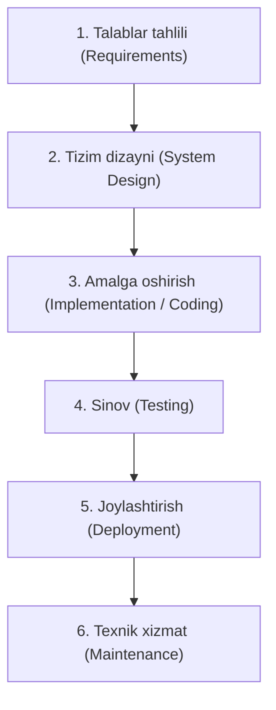

import { Callout } from 'nextra/components'

# Waterfall (Sharshara) Modeli

**Waterfall modeli** — dasturiy muhandislik tarixidagi birinchi va eng mashhur chiziqli-ketma-ket (Linear-Sequential) modeldir. Unda har bir bosqich sharshara suvi kabi faqat oldingi bosqich to'liq tugallangandan keyingina boshlanadi va orqaga qaytish nazarda tutilmaydi.

---

## Waterfall Bosqichlari Ketma-Ketligi

---

## Bosqichlarning Asosiy Mazmuni

1. **Talablar tahlili (Requirement Gathering & Analysis):**
   - Barcha tizim talablari loyihaning eng boshida to'liq va o'zgarmas shaklda yoziladi.
   - Hujjat: SRS (Software Requirements Specification).
2. **Tizim dizayni (System Design):**
   - Dasturiy arxitektura, ma'lumotlar bazasi va apparat ta'minot talablari ishlab chiqiladi.
3. **Amalga oshirish (Implementation):**
   - Loyiha kodi alohida modullarda yoziladi va dasturchilar tomonidan birlik sinovlaridan o'tkaziladi.
4. **Sinov (Testing):**
   - Barcha modullar birlashtirilib, butun tizim sifatida QA jamoasi tomonidan sinovdan o'tkaziladi.
5. **Joylashtirish (Deployment):**
   - Mahsulot sinovdan muvaffaqiyatli o'tgach, buyurtmachiga topshiriladi yoki ishlab chiqarish (production) serverlariga chiqariladi.
6. **Texnik xizmat (Maintenance):**
   - Foydalanish davomida kelib chiqqan nosozliklar tuzatiladi.

---

## Afzalliklari va Kamchiliklari

| Afzalliklari | Kamchiliklari |
| :--- | :--- |
| Tushunish va boshqarish juda oddiy va oson | Talablarga o'zgartirish kiritish deyarli imkonsiz |
| Har bir bosqichda qat'iy hujjatlar va aniq natijalar mavjud | Sinov jarayoni juda kech (loyiha oxirida) boshlanadi |
| Kichik va talablari oldindan 100% aniq bo'lgan loyihalarda mukammal natija beradi | Mahsulot faqat eng oxirgi bosqichda ko'rinadi (yuqori risk) |
| Loyiha byudjeti va muddatlari oldindan aniq baholanadi | Katta va uzoq muddatli loyihalar uchun yaroqsiz |

<Callout type="warning">
  **QA nuqtai nazaridan xavf:** Waterfall modelida QA mutaxassislari loyihaga juda kech jalb qilinadi. Agar talablar bosqichida xatolik ketgan bo'lsa, uni sinov bosqichida tuzatish loyihaning narxini 10 dan 100 baravargacha oshirib yuborishi mumkin.
</Callout>

---

## Qachon Waterfall Modelini Tanlash Kerak?

- Talablar mutlaqo aniq, qat'iy va loyiha davomida o'zgarmasligi kafolatlangan bo'lsa.
- Texnologik stek va asboblar jamoaga 100% tanish bo'lsa.
- Loyiha qisqa muddatli bo'lsa.
- Qat'iy davlat yoki harbiy standartlarga asoslangan, har bir qadami hujjatlashtirilishi shart bo'lgan sohalarda (masalan, aviatsiya yoki tibbiy dasturlar).
