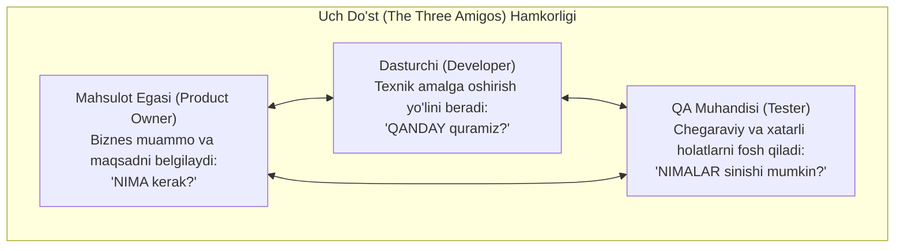
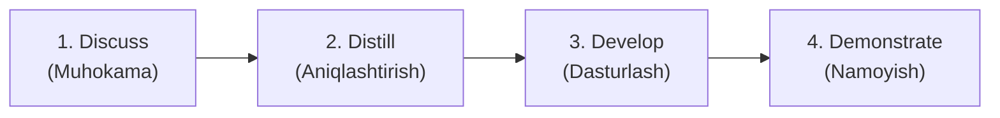

import { Callout } from 'nextra/components'

# Acceptance Test Driven Development (ATDD): Qabul Sinovlariga Asoslangan Ishlab Chiqish

An'anaviy dasturiy ta'minot jarayonlarida talablarni noto'g'ri tushunish oqibatida dasturchilar mijoz istamagan narsani kodlab qo'yadilar, QA esa buni sinov oxirida aniqlaydi. Natijada katta vaqt va mablag' behuda ketadi.

**Acceptance Test Driven Development (ATDD)** — bu kod yozish boshlanishidan oldin, mijoz, dasturchi va tester birgalikda tizimning qabul mezonlarini (Acceptance Criteria) va qabul test-keyslarini ishlab chiqadigan hamkorlikka asoslangan zamonaviy yondashuvdir.

---

## "Uch Do'st" (The Three Amigos) Hamkorligi

ATDD ning markazida uch asosiy rolning doimiy va ochiq muloqoti yotadi:

---

## ATDD ning 4D Sikli

ATDD jarayoni quyidagi 4 bosqichda amalga oshiriladi:

1. **Discuss (Muhokama qilish):** Sprint boshlanishida uchlik (Biznes, Dev, QA) yangi foydalanuvchi hikoyasini (User Story) real hayotiy misollar orqali birgalikda muhokama qiladi.
2. **Distill (Aniqlashtirish va qoliplash):** Ushbu real misollar aniq, bir ma'noli qabul test-keyslariga yoki Gherkin formatidagi (`Given-When-Then`) avtomatlashtirilgan ssenariylarga aylantiriladi.
3. **Develop (Kod yozish):** Dasturchilar ushbu qabul testlaridan muvaffaqiyatli o'tuvchi dasturiy kodni yozadilar (TDD bilan birgalikda).
4. **Demonstrate (Namoyish qilish va Qabul):** Ishlab chiqilgan tayyor funksionallik tasdiqlangan qabul testlari orqali buyurtmachiga namoyish qilinadi va qabul qilinadi.

---

## TDD, BDD va ATDD O'rtasidagi Farqlar

| Mezon | TDD (Test Driven Dev) | BDD (Behavior Driven Dev) | ATDD (Acceptance Test Driven Dev) |
| :--- | :--- | :--- | :--- |
| **Bosh yo'nalish** | Kod birliklari (Unit darajasi) | Tizimning xatti-harakati (Behavior) | Biznes talablarining qabul qilinishi |
| **Kim yozadi?** | Dasturchi | Dev + QA | Biznes + Dev + QA |
| **Tili** | Dasturlash tili (Java, Py, JS) | Tabiiy til (Gherkin syntax) | Biznes misollari va qabul mezonlari |
| **Maqsadi** | Kodni to'g'ri qurish | To'g'ri xatti-harakatni qurish | To'g'ri mahsulotni qurish |

<Callout type="info">
  **Asosiy foydasi:** ATDD tufayli loyihalarda "Biz buni boshqacha tushungan edik" degan bahslarga butunlay barham beriladi, chunki barcha tomonlar kod yozilishidan oldinroq natija aynan qanday bo'lishini birgalikda kelishib olgan bo'ladilar.
</Callout>
