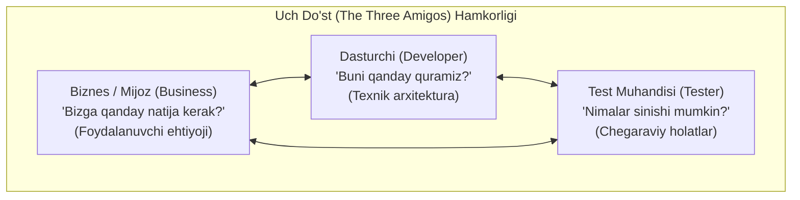
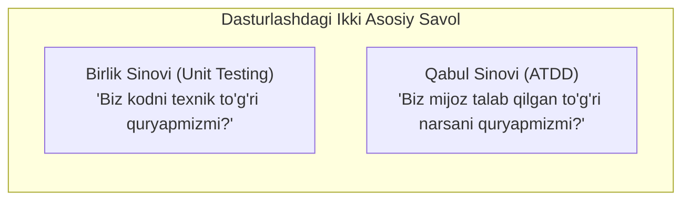
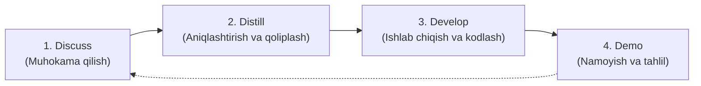
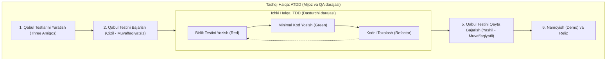

import { Callout } from 'nextra/components'

# Qabul Sinovlariga Asoslangan Ishlab Chiqish (ATDD)

**Qabul sinovlariga asoslangan ishlab chiqish (Acceptance Test-Driven Development — ATDD)** — bu dasturiy ta'minotni ishlab chiqish yondashuvi bo'lib, unda tegishli funksionallikni amalda kodlashdan oldin qabul sinovlari (acceptance tests) yaratiladi. U biznes vakillari (mijozlar), dasturchilar va test muhandislari o'rtasida aniq qabul mezonlarini (acceptance criteria) belgilash uchun hamkorlikni rag'batlantiradi.

ATDD uchta asosiy nuqtai nazar o'rtasidagi hamkorlikka tayanadi: **biznes (mijoz)**, **ishlab chiqish (dasturchi)** va **sinov (tester)**. Ushbu o'zaro hamkorlikdagi muhokamalar odatda **"Uch Do'st" (The Three Amigos)** deb ataladi va unda ishtirokchilar dasturlash boshlanishidan oldinroq qabul mezonlarini birgalikda belgilab oladilar.

Ushbu muhokamalar davomida yaratilgan qabul testlari tizimning kutilayotgan xatti-harakatini tavsiflovchi **bajariluvchi spetsifikatsiyalar (executable specifications)** vazifasini o'taydi. Funksionallik kodlab bo'lingach, dastur kelishilgan talablarga javob berayotganligini tekshirish uchun ushbu testlar ishga tushiriladi. Ko'plab loyihalarda qabul testlari sinov jarayonining bir qismi sifatida to'liq avtomatlashtiriladi.

ATDD testlarga asoslangan ishlab chiqish (TDD — Test-Driven Development) bilan chambarchas bog'liq bo'lib, xatti-harakatga asoslangan ishlab chiqish (BDD — Behavior-Driven Development) hamda misollar orqali spetsifikatsiya qilish (SBE — Specification by Example) kabi yondashuvlarni to'ldiradi. Ushbu yondashuvlarning barchasi dasturni amalga oshirishdan oldin uning kutilayotgan harakatlarini aniq belgilashni talab qiladi.

---

## ATDD O'zi Nima? (What is ATDD?)

Dastlab ATDD nima emasligini tushunib olaylik: nomida "test" so'zi bo'lishiga qaramay, bu shunchaki **sinov usuli emas**. Aksincha, qabul sinovlariga asoslangan ishlab chiqish bu — **dasturlash metodologiyasidir**. ATDD o'zining "qarindoshi" bo'lmish TDD kabi testlarni avtomatlashtirishga katta ustuvorlik beradi. U joriy etilganda, jamoalar ishlab chiqarish kodini (production code) yozishda yo'naltiruvchi mayoq sifatida avtomatlashtirilgan test holatlaridan foydalanadilar.

Odatda sof muhandislik texnikasi sifatida qaraladigan TDD dan farqli o'laroq, ATDD butun dasturiy ta'minotni ishlab chiqish jarayonida testerlar, dasturchilar va biznes vakillarini birlashtiruvchi jamoaviy hamkorlikdir. Ushbu hamkorlikning natijasi — barcha tushunishi mumkin bo'lgan formatda ifodalangan talablar bo'lib, ular keyinchalik avtomatlashtirilgan qabul testlariga aylantiriladi.

---

## ATDD ning Asosiy Maqsadi Nima?

ATDD ning asosiy maqsadi — oddiy va tushunarli tilda ifodalangan tizim talablari bo'yicha jamoada yagona va mushtarak tushunchani shakllantiruvchi hamkorlik muhitini yaratishdir. Shundan so'ng ushbu spetsifikatsiyalar avtomatlashtirilgan qabul test-keyslariga aylantiriladi.

Buning qanday ustunliklari bor?

Avvalo, nima uchun bu foydali ekanligini anglash uchun birlik sinovlarini (unit testing) ko'rib chiqaylik. Birlik sinovlari tabiatan dasturchiga yo'naltirilgan bo'ladi. U dasturchilarga o'z taxminlarini bajariluvchi kod formatida hujjatlashtirish imkonini beradi. Birlik sinovi quyidagi savolga javob beradi:
> *"Biz mahsulotni to'g'ri quryapmizmi?" (Are we building the thing correctly?)*

Biroq, birlik sinovlari boshqa bir muhim savolga javob bera olmaydi:
> *"Biz to'g'ri mahsulotning o'zini quryapmizmi?" (Are we building the right thing?)*

Aynan buning uchun soha mutaxassisi (mijoz) bilan muloqot orqali aniqlangan qabul mezonlariga nisbatan ilovaning ishlashini baholovchi qabul sinovlari talab etiladi.

Qabul sinovlariga asoslangan ishlab chiqish dasturchilar guruhi tomonidan mijozning ehtiyojlariga javob bermaydigan funksiyalarni yaratib qo'yish muammosini tubdan hal qiladi.

Avtomatlashtirish ATDD ning muhim tarkibiy qismidir: muhokamalar davomida ishlab chiqilgan spetsifikatsiyalar bajariluvchi testlarga aylanadi va bu dasturiy muhandislarning funksiyalarni aynan talablarga mos ravishda amalga oshirishini kafolatlaydi.

---

## Qisqacha Tarixi

Kent Bek (Kent Beck) 2000-yilda ilk bor chop etilgan o'zining mashhur "Test-Driven Development: By Example" kitobida ATDD haqida (uni *Application Test-Driven Development* deb atagan) qisqacha to'xtalib o'tgan, ammo o'sha paytda bu g'oyani chetga surgan edi.

Shunga qaramay, bu uslub keyinchalik **Fit** va **FitNesse** kabi ochiq kodli ilovalarning muvaffaqiyati tufayli keng ommalashdi.

Den Nort (Dan North) 2006-yilda xatti-harakatga asoslangan ishlab chiqish (BDD) konsepsiyasini yaratdi, u dastlab TDD lug'atining ba'zi qismlarini almashtirish uchun mo'ljallangan edi, ammo vaqt o'tishi bilan talablar tahliliga aylandi. BDD va ATDD o'rtasida juda ko'p o'xshashliklar mavjud bo'lib, BDD ning ko'plab atamalari, asboblari va texnikalari ATDD tomonidan qabul qilingan.

---

## U Qanday Ishlaydi? (Tamoyillar va Amaliyotlar)

### ATDD ning Umumiy Sharhi

Qabul sinovlariga asoslangan ishlab chiqish TDD ga o'xshash ish jarayoniga amal qiladi: unda ham testlar amaliy koddan (production code) oldin yoziladi. Biroq, TDD testlari birlik testlari (unit tests) bo'lsa, ATDD testlari **qabul testlaridir (acceptance tests)**.

Testerlar, dasturchilar va mijozlar (yoki biznes vakillari) o'zaro muloqot o'tkazadilar, bu muloqot talablarni yuzaga keltiradi, talablar esa o'z navbatida testlar uchun poydevor bo'lib xizmat qiladi.

Testlar yaratilgandan so'ng, dasturchilar ushbu testlarning muvaffaqiyatli o'tishini ta'minlash uchun belgilangan funksionallikni amalga oshiruvchi kodni yozadilar.

Shu tariqa, siz nafaqat dasturlash mahoratidan qat'i nazar hamma tushunishi va hissa qo'shishi mumkin bo'lgan batafsil spetsifikatsiyalarga ega bo'lasiz, balki dasturchilar aynan mijozga kerak bo'lgan narsani qurishini kafolatlaysiz.

---

## ATDD Tsikli: 4D Modeli

Qabul sinovlariga asoslangan ishlab chiqish tsikli quyidagi 4 ta asosiy jarayondan iborat:

### 1. Discuss (Muhokama qilish)
Barcha agile metodologiyalarida bo'lgani kabi, rejalashtirish uchrashuvida testerlar va dasturchilar keyingi sprint yoki iteratsiyada amalga oshirish uchun tanlangan vazifalar va foydalanuvchi hikoyalarini (user stories) muhokama qilish orqali manfaatdor tomonlar, mahsulot egalari va mijozlardan imkon qadar ko'proq ma'lumot to'playdilar.

Muhokama davomida jamoa talablarga oid har qanday noaniqliklarni oydinlashtirib oladi. Bu jamoaga dasturning keyingi bosqichlarida xatoliklarni qidirish, tashxis qo'yish va tuzatishdan xalos bo'lishga yordam beradi hamda katta mablag' va vaqtni tejaydi.

Bundan tashqari, "muhokama" bosqichida jamoa dastlab oddiy ko'ringan foydalanuvchi hikoyasi aslida ancha murakkab ekanligini aniqlashi mumkin. Bunday vaziyatda jamoa va biznes vakili hikoyani ikki yoki undan ortiq kichik hikoyalarga bo'lishga qaror qilishi mumkin.

Ushbu bosqichning natijasi — barcha jamoa a'zolari uchun tushunarli bo'lgan jadvallar yoki oddiy tildagi jumlalar ko'rinishidagi dastlabki qabul testlaridir.

### 2. Distill (Aniqlashtirish va Qoliplash)
Ushbu ikkinchi bosqichda oldingi qadamda yaratilgan testlar jamoa foydalanayotgan qabul sinov vositasiga (masalan: Cucumber, FitNesse, Robot Framework) mos keladigan formatga keltiriladi. Ushbu formatlar qo'llanilayotgan asbobga qarab farqlanadi:
- Jadvallar
- Viki-sahifalar
- DSL (Domain-Specific Language — Masalan, Gherkin `Given-When-Then`)

Shunday qilib, rasmiy qabul testlari ushbu bosqichning natijasidir. Biroq, ular hali bevosita bajarilishga to'liq tayyor emas (skelet holatida bo'ladi).

### 3. Develop (Ishlab Chiqish va Kodlash)
Oldingi bosqichda yaratilgan testlar hozircha tizimni to'g'ridan-to'g'ri sinay olmaydi. Bu bosqichda ular shunchaki qoliplardir — ularni haqiqiy dastur kodini ishga tushiruvchi test kodi bilan bog'lash (wiring) kerak.

Bog'lash amalga oshirilgach, dastlab testlar qizil rangda bo'ladi (chunki ular sinovdan o'tkazayotgan funksionallik hali kodda mavjud emas).

So'ngra dasturchilar "Discuss" bosqichida olingan va "Distill" bosqichida testlarga aylantirilgan talablarga to'liq muvofiq ravishda dasturiy kodni yozadilar va barcha testlar yashil rangga kirguncha kodlashni davom ettiradilar.

### 4. Demo (Namoyish Qilish)
Funksionallik to'liq amalga oshirilgach, dasturchilar uni manfaatdor tomonlarga (stakeholders) namoyish etadilar. Ko'pgina chaqqon (agile) yondashuvlar har bir tsikl oxirida jamoa mahsulotni va jarayonni qanday yaxshilashni ko'rib chiqadigan uchrashuv o'tkazish amaliyotini o'z ichiga oladi. Bu ATDD ning demo bosqichiga to'liq mos keladi.

Dasturlash yakunlangach, test muhandislari qo'lda tadqiqiy sinovlarni (exploratory testing) ham o'tkazishlari mumkin. Bu sinovlar qo'shimcha kamchiliklarni hamda tizimni yaxshilash imkoniyatlarini aniqlashi mumkin, bu esa yangi foydalanuvchi hikoyalarini yaratishga turtki beradi.

---

## ATDD va TDD O'rtasidagi O'zaro Aloqa (ATDD vs TDD)

Testlarga asoslangan ishlab chiqish (TDD) bilan qabul testlariga asoslangan ishlab chiqishni (ATDD) taqqoslash odatiy holdir. Ular bir-biri bilan uzviy bog'liq, ammo ular o'rtasida aniq chegaralar mavjud:

- **TDD metodologiyasida:** Dasturchilar muvaffaqiyatsiz bo'ladigan birlik testini (unit test) yozadilar, so'ngra testdan o'tish uchun zarur bo'lgan minimal ishlab chiqarish kodini yaratadilar va uni qayta ishlaydilar (refactoring). TDD ning maqsadi — toza, o'zaro kuchsiz bog'langan modullardan iborat kod yaratishdir. Ammo TDD birlik testlariga tayanadigan dasturchiga yo'naltirilgan uslubdir. Yuqorida ko'rganimizdek, bu noto'g'ri funksiyani texnik jihatdan juda mukammal qilib kodlab qo'yish muammosiga olib kelishi mumkin.
- **ATDD esa:** Faqat dasturchiga e'tibor qaratish o'rniga, dasturchilar va jamoaning boshqa a'zolari — hatto dasturchi bo'lmagan biznes vakillari o'rtasidagi hamkorlikni ilgari suradi.

TDD va ATDD birgalikda ishlatilishi mumkin va kerak:

Har bir iteratsiya boshida soha mutaxassisining ko'rsatmalari asosida avtomatlashtirilgan qabul testlarini yarating (ATDD tashqi halqasi). So'ngra haqiqiy kodni yaratish paytida ichki halqa sifatida TDD dan foydalaning. Boshqacha qilib aytganda, TDD umumiy ATDD bosqichlari ichidagi "ichki" tsikl sifatida xizmat qiladi.
