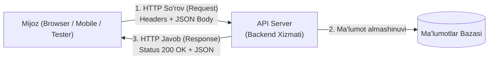

import { Callout } from 'nextra/components'

# API Testing Tutorial: API Sinovi Asoslari

Zamonaviy dasturiy ilovalar (veb-saytlar, mobil dasturlar va mikroservislar) o'zaro ma'lumot almashish uchun **API (Application Programming Interface — Dasturiy Interfeys)** dan foydalanadi.

**API Testing** — dasturning foydalanuvchi interfeysi (UI) tayyor bo'lishini kutmasdan, to'g'ridan-to'g'ri biznes mantiqi, xizmatlararo aloqa, ma'lumotlar yaxlitligi va xavfsizligini tekshiruvchi o'ta muhim sinov turidir.

---

## API ning Ishlash Mexanizmi

---

## 1. Asosiy HTTP Metodlari (CRUD Muvofiqligi)

| HTTP Metodi | Maqsadi | CRUD Muqobili | Misol |
| :--- | :--- | :--- | :--- |
| **GET** | Ma'lumotlarni serverdan o'qib olish | **Read** | `GET /api/v1/users` (Barcha foydalanuvchilar ro'yxati) |
| **POST** | Yangi ma'lumot yoki resurs yaratish | **Create** | `POST /api/v1/users` (Yangi foydalanuvchi qo'shish) |
| **PUT** | Mavjud resursni to'liq yangilash | **Update** | `PUT /api/v1/users/42` (ID=42 ma'lumotlarini to'liq almashtirish) |
| **PATCH** | Mavjud resursning ma'lum bir qismini yangilash | **Partial Update** | `PATCH /api/v1/users/42` (Faqat telefon raqamini o'zgartirish) |
| **DELETE** | Resursni o'chirib tashlash | **Delete** | `DELETE /api/v1/users/42` (ID=42 foydalanuvchini o'chirish) |

---

## 2. HTTP Status Kodlari Guruhlari

Har bir API javobi 3 xonali status kodi bilan qaytadi:

- **1xx (Axborot — Informational):** So'rov qabul qilindi, jarayon davom etmoqda.
- **2xx (Muvaffaqiyat — Success):**
  - `200 OK`: So'rov muvaffaqiyatli bajarildi.
  - `201 Created`: Yangi resurs muvaffaqiyatli yaratildi.
  - `204 No Content`: Amal bajarildi, ammo qaytariladigan tana (body) yo'q.
- **3xx (Yo'naltirish — Redirection):**
  - `301 Moved Permanently`: Manzil butunlay o'zgargan.
- **4xx (Mijoz xatosi — Client Error):**
  - `400 Bad Request`: So'rov sintaksisi xato yoki noto'g'ri JSON yuborilgan.
  - `401 Unauthorized`: Autentifikatsiya qilinmagan (token yo'q yoki muddati o'tgan).
  - `403 Forbidden`: Huquq yetarli emas (oddiy foydalanuvchi admin panelga murojaat qilganda).
  - `404 Not Found`: So'ralgan manzil yoki resurs topilmadi.
- **5xx (Server xatosi — Server Error):**
  - `500 Internal Server Error`: Server kodi quladi (Unhandled exception).
  - `502 Bad Gateway`: Oraliq serverdan xato javob keldi.
  - `504 Gateway Timeout`: Server javob berishga ulgurmadi (vaqt tugadi).

---

## 3. API Sinovida Tekshiriladigan Asosiy Mezonlar

QA muhandisi har bir API so'rovi bo'yicha quyidagilarni tekshiradi:
1. **Status kodi to'g'riligi:** Kutilgan 200 yoki 201 o'rniga 500 chiqmasligi.
2. **Javob berish vaqti (Response Time):** API so'roviga javob belgilangan vaqtda (masalan: 500 ms ichida) kelishi.
3. **JSON Sxema Validatsiyasi (Schema Validation):** Maydonlar turi (string, integer, boolean) talabnomaga to'liq mos bo'lishi.
4. **Xavfsizlik va Avtorizatsiya:** Maxfiy API lar yaroqsiz token bilan ochilmasligi.
5. **Chegaraviy va Salbiy holatlar:** Noto'g'ri parametrlar yuborilganda server chiroyli va tushunarli xatolik qaytarishi.

<Callout type="info">
  **Ommabop asboblar:** API sinovlarini manual va avtomatlashtirilgan tarzda o'tkazish uchun **Postman**, **Newman**, **Swagger / OpenAPI** va Java dagi **Rest-Assured** kutubxonalari qo'llaniladi.
</Callout>
