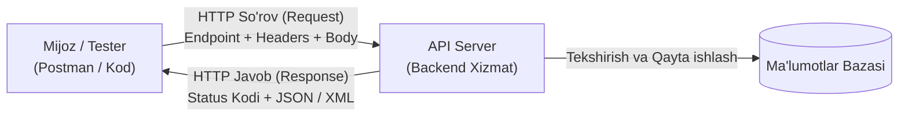

import { Callout } from 'nextra/components'

# API Sinovlari Bo'yicha Qo'llanma (API Testing Tutorial)

**API sinovi (API Testing)** — dasturiy interfeyslarning (API — Application Programming Interface) to'g'ri, ishonchli, xavfsiz va samarali ishlashini tekshirish uchun qo'llaniladigan dasturiy ta'minotni sinash texnikasidir. U dasturiy ilovalar o'rtasidagi o'zaro aloqa va ma'lumotlar almashinuvini tasdiqlashga qaratilgan.

Ushbu API sinovlari bo'yicha qo'llanmada siz API sinovi nima ekanligi, u qanday ishlashi, uning turlari, afzalliklari, eng yaxshi amaliyotlari hamda API sinovida qo'llaniladigan vositalarni o'rganasiz.

---

## API Sinovi Nima? (What is API Testing?)

**API sinovi** — bu ilovaning dasturiy interfeysi (API) funksionalligi, ishonchliligi, unumdorligi va xavfsizligini tekshiruvchi dasturiy ta'minot sinovi turidir. U API mijoz so'rovlarini to'g'ri qayta ishlashi va kutilgan javoblarni qaytarishini tasdiqlaydi.

API sinovi dasturiy ta'minotni sinash hayotiy tsiklining (STLC) turli bosqichlarida, jumladan, birlik sinovi (unit testing), integratsion sinov (integration testing) va tizimli sinov (system testing) davomida keng amalga oshiriladi. U qo'lda (manually) yoki maxsus API sinov vositalari va freymvorklari yordamida avtomatlashtirilgan tarzda bajarilishi mumkin.

API sinovi davomida API ning oxirgi nuqtasiga (endpoint) so'rovlar (requests) yuboriladi va olingan javoblar (responses) kutilgan natijalar bilan solishtiriladi. Bu jarayon API ning o'z funksional va nofunksional talablariga to'liq javob berishini hamda boshqa ilovalar va xizmatlar bilan to'g'ri aloqa o'rnatishini ta'minlaydi.

---

## API Test Avtomatlashtirish Muhitini Sozlash

API testlarini avtomatlashtirish muhitini yaratish uchun quyidagi bosqichlarni bajarish lozim:

1. **Dasturlash tili va test freymvorkini tanlash:** Dastlab API sinovida qaysi dasturlash tili va freymvorkdan foydalanishni aniqlab olish zarur. Mashhur tanlovlar: Java (JUnit/TestNG bilan), Python (pytest/unittest bilan) yoki JavaScript (Mocha/Chai bilan).
2. **IDE (ishlab chiqish muhiti)ni o'rnatish:** Tanlangan dasturlash tili uchun mos IDE o'rnatiladi, masalan: Java uchun Eclipse yoki IntelliJ IDEA, Python uchun PyCharm, JavaScript/TypeScript uchun Visual Studio Code.
3. **API sinov vositalarini o'rnatish:** So'rovlar yuborish va javoblarni tekshirish uchun qulay interfeys beruvchi Postman, SoapUI yoki Rest-Assured kabi API sinov vositalari o'rnatiladi.
4. **Test muhitini sozlash:** Ishlab chiqarish (production) muhitiga imkon qadar yaqin bo'lgan test muhiti yaratiladi. Bu barcha zarur dasturiy, apparat va tarmoq parametrlarini to'g'rilashni o'z ichiga oladi.
5. **Test ma'lumotlarini (Test Data) tayyorlash:** API duch kelishi mumkin bo'lgan barcha holatlarni, jumladan ijobiy (positive) va salbiy (negative) test holatlarini qamrab oluvchi ma'lumotlar to'plami yaratiladi.
6. **Test skriptlarini yozish:** Tanlangan til va freymvork yordamida barcha test-keyslarni bajaruvchi va API qaytargan javoblarni tasdiqlovchi test skriptlari yoziladi.
7. **Test skriptlarini ishga tushirish:** Yozilgan skriptlar ijro etiladi va olingan natijalar solishtiriladi. Har qanday xatolik va nosozliklar tizimga qayd etiladi.
8. **Uzluksiz Integratsiya (CI) tizimiga ulash:** API kodiga o'zgarish kiritilganda testlar avtomatik ravishda ishga tushishi uchun API testlari Jenkins, GitHub Actions yoki CircleCI kabi CI tizimlariga integratsiya qilinadi.

---

## API Chiqish Ma'lumotlarining Turlari (Types of Output)

API o'z vazifasiga qarab turli xil formatdagi chiqish ma'lumotlarini qaytarishi mumkin:

- **JSON (JavaScript Object Notation):** Veb-xizmatlar o'rtasida ma'lumot almashish uchun eng keng tarqalgan, yengil va inson hamda mashina tomonidan o'qilishi oson format. Ko'pchilik zamonaviy RESTful API lar asosiy format sifatida JSON dan foydalanadi.
- **XML (Extensible Markup Language):** Veb-servislar o'rtasida ma'lumot uzatish uchun qo'llaniladigan qat'iy sintaksisga ega yana bir ma'lumotlar formati (asosan SOAP xizmatlarida).
- **HTML:** Ba'zi API lar ma'lumotlarni to'g'ridan-to'g'ri veb-sahifalarda ko'rsatish uchun HTML formatida javob qaytaradi.
- **Ikkilik ma'lumotlar (Binary Data):** Rasmlar, audio va video fayllar, PDF hujjatlar ko'rinishidagi chiqishlar.
- **Matn (Plain Text):** Tizim jurnallari (logs), hisobotlar va oddiy matnli xabarlar.
- **Xatolik xabarlari (Error Messages):** So'rov jarayonida biror muammo yuz berganda qaytariladigan xatolik xabarlari (odatda HTTP status kodlari va JSON xatolik tavsifi bilan birga).

---

## API Sinovidagi Test-Keyslar Namunalari

API sinovida qo'llaniladigan asosiy test-keys yo'nalishlari:

- **Funksional sinov (Functional testing):** To'g'ri parametrlar kiritilganda kutilgan ma'lumotlar qaytayotganligi, noto'g'ri ma'lumotda esa xatolik xabari chiqishi, autentifikatsiyaning ishlashi va status kodlarining to'g'riligi tekshiriladi.
- **Unumdorlik sinovi (Performance testing):** API ning javob qaytarish vaqti (response time), o'tkazuvchanligi va ko'p sonli bir vaqtdagi so'rovlarni (concurrency) ko'tara olishi baholanadi.
- **Yuklama sinovi (Load testing):** Yuqori trafik va og'ir yuklama ostida API ning barqaror ishlashi, sekinlashmasligi yoki qulab tushmasligi tekshiriladi.
- **Xavfsizlik sinovi (Security testing):** SQL injection, XSS (Cross-Site Scripting) va CSRF (Cross-Site Request Forgery) kabi zaifliklar tekshiriladi.
- **Qulaylik sinovi (Usability testing):** API hujjatlarining (Swagger/OpenAPI) aniqligi, tushunarliligi hamda qaytayotgan xatolik xabarlarining foydali va informativ ekanligi sinovdan o'tkaziladi.
- **Moslashuvchanlik sinovi (Compatibility testing):** API ning turli brauzerlar, qurilmalar va operatsion platformalar bilan to'g'ri ishlashi tekshiriladi.
- **Integratsion sinov (Integration testing):** API ning tashqi ma'lumotlar bazalari yoki uchinchi tomon tizimlari bilan to'g'ri bog'lanishi tasdiqlanadi.

---

## API Sinoviga Yondashuv Bosqichlari (API Testing Approach)

API sinovini muvaffaqiyatli olib borish uchun quyidagi 10 ta asosiy yondashuv qadamiga amal qilinadi:

1. **API funksionalligini tushunish:** Sinovni boshlashdan oldin API ning maqsadi, uning oxirgi nuqtalari (endpoints) va kutilayotgan harakatlarini to'liq tushunib olish lozim.
2. **Sinov ssenariylarini aniqlash:** Foydalanish holatlari, kirish va chiqish ma'lumotlari hamda yuzaga kelishi mumkin bo'lgan xatolik holatlarini qamrab oluvchi ssenariylar tuziladi.
3. **Sinov yondashuvini rejalashtirish:** Sinov qo'lda, avtomatlashtirilgan yoki aralash tarzda olib borilishini belgilash va kerakli asboblarni tanlash.
4. **Test ma'lumotlarini belgilash:** API turli xil ma'lumotlarga qanday munosabat bildirishini tekshirish uchun ijobiy va salbiy test ma'lumotlari shakllantiriladi.
5. **API testlarini avtomatlashtirish:** Katta hajmdagi testlarni tezkor va uzluksiz bajarish uchun sinovlarni avtomatlashtirishga o'tkazish.
6. **Xavfsizlikni tasdiqlash:** Xavfsizlik protokollari va ruxsat berish mexanizmlarining to'g'ri o'rnatilganligini tekshirish.
7. **Regressiya sinovini bajarish:** API kodiga kiritilgan har qanday o'zgartirish ilgari ishlab turgan imkoniyatlarni buzmaganligiga ishonch hosil qilish.
8. **Integratsiyani tasdiqlash:** API ning ma'lumotlar bazasi va boshqa tashqi xizmatlar bilan aloqasi to'g'ri ekanligini sinash.
9. **Unumdorlikni tasdiqlash:** API ning yuqori so'rovlar hajmiga bardoshliligi va tez javob qaytarishini sinash.
10. **API sinovini bajarish va hisobot berish:** Test-keyslarni ishga tushirish, javoblarni solishtirish va aniqlangan barcha xatoliklarni qayd etish.

---

## API Sinovi va Birlik Sinovi (Unit Testing) O'rtasidagi Farq

| Taqqoslash Mezoni | API Sinovi (API Testing) | Birlik Sinovi (Unit Testing) |
| :--- | :--- | :--- |
| **Sinov Qamrovi** | API so'nggi nuqtalariga (endpoints) so'rov yuborish va javoblarni tahlil qilish. | Kodning alohida birliklari yoki kichik komponentlarini tekshirish. |
| **Fokus Markazi** | Turli komponentlarning o'zaro integratsiyasi va ularning aloqasini tekshirish. | Alohida funksiya yoki metodning yakkalangan (izolyatsiya qilingan) holatdagi harakati. |
| **Bajarilish Joyi** | API tomonidan taqdim etilgan ochiq oxirgi nuqtalarda (endpoints). | Dasturiy kodning ichki metodlari yoki funksiyalarida. |
| **Talab Qilinadigan Bilim** | API xatti-harakati, kutilayotgan kiruvchi va chiquvchi ma'lumotlarni bilish. | Sinovdan o'tkazilayotgan muayyan kod birligining ichki mantiqiy tuzilishini bilish. |
| **Kim Tomonidan Bajariladi?** | Sifatni ta'minlash (QA) jamoasi yoki avtomatlashtirish muhandislari. | Bevosita dasturchilar (Developers). |
| **Avtomatlashtirish Vositalari** | Postman, REST-Assured, SoapUI, Newman. | JUnit, TestNG, NUnit, pytest, Jest. |
| **Amaliy Misollar** | Valid/invalid so'rovlarda to'g'ri status kodi va JSON qaytishini, avtorizatsiya ishlashini tekshirish. | Alohida matematik funksiya kiritilgan raqamlar uchun to'g'ri hisob-kitob qaytarayotganini tekshirish. |

---

## API Qanday Sinovdan O'tkaziladi? (How to Test API)

API ni sifatli sinash uchun quyidagi 8 ta asosiy qadam bajariladi:

1. **API hujjatlarini (Documentation) o'rganish:** Endpoint manzillari, parametrlar, so'rov sarlavhalari (headers) va javob formatlarini to'liq tushunish.
2. **Test muhitini sozlash:** Serverlar, ma'lumotlar bazasi va tarmoq parametrlarini to'g'rilash.
3. **Test ssenariylarini aniqlash:** Ijobiy, salbiy va chegaraviy holatlarni belgilash.
4. **Test ma'lumotlarini tayyorlash:** Kerakli barcha kirish ma'lumotlarini shakllantirish.
5. **Test skriptlarini yozish:** Tanlangan vositada testlarni kodlashtirish.
6. **Test skriptlarini bajarish:** So'rovlarni jo'natish va haqiqiy javobni kutilgan javob bilan solishtirish.
7. **Natijalarni tahlil qilish:** Xatolik yuz berganda muammoning sababini topish va dasturchilarga yetkazish.
8. **Sinovni takrorlash:** Tuzatilgan versiyani qayta sinash (re-testing) va regressiya sinovlarini o'tkazish.

---

## API Sinovining Eng Yaxshi Amaliyotlari (Best Practices)

- **Barcha mumkin bo'lgan ssenariylarni sinang:** Faqat muvaffaqiyatli holatlarni emas, balki xatolik yuz berishi mumkin bo'lgan salbiy va chegaraviy holatlarni ham sinab ko'ring.
- **Avtomatlashtirishdan keng foydalaning:** Qo'lda bajariladigan takroriy ishlarni kamaytirish va regressiya testlarini tezlashtirish uchun skriptlar yozing.
- **Haqiqiy ma'lumotlar bilan sinang:** Ishlab chiqarish muhitiga o'xshash real ma'lumotlar to'plamidan foydalaning.
- **Versiyalarni nazorat qiling:** API ning barcha versiyalari (v1, v2) sinovdan o'tkazilayotganini va o'zgarishlar eskilarini buzmasligini ta'minlang.
- **Javoblarni qat'iy tasdiqlang (Validate responses):** Faqatgina status kodi 200 ekanligi bilan cheklanmasdan, javob tanasidagi ma'lumotlar va JSON sxemasini to'liq tekshiring.
- **Unumdorlikni nazorat qiling:** API ning javob qaytarish tezligi va yuklamaga bardoshini monitoring qiling.
- **Dasturchilar bilan yaqindan hamkorlik qiling:** Muammolarni erta bosqichda aniqlash va tezda bartaraf etish uchun dasturchilar bilan doimiy aloqada bo'ling.

---

## API Sinovi Aniqlaydigan Nuqson Turlari

API sinovlari yordamida quyidagi jiddiy nuqsonlarni fosh etish mumkin:

- **Xavfsizlik zaifliklari:** Autentifikatsiya va avtorizatsiya xatolari, SQL injection va ma'lumotlar sizib chiqishi.
- **Unumdorlik muammolari:** So'rovga juda sekin javob qaytishi, past o'tkazuvchanlik va server resurslarining haddan tashqari band bo'lishi.
- **Foydalanuvchi ma'lumotlarini tekshirish (Validation) xatolari:** Noto'g'ri parametrlarni qabul qilib yuborish yoki to'g'ri ma'lumotni asossiz rad etish.
- **Ma'lumotlar formati xatolari:** Maydon turlarining mos kelmasligi (masalan, string o'rniga integer), tushib qolgan ma'lumotlar.
- **Integratsiya muammolari:** API va ma'lumotlar bazasi yoki uchinchi tomon xizmatlari o'rtasidagi ma'lumot uzatish nosozliklari.
- **Versiyalararo nomutanosiblik:** Yangi versiyadagi o'zgarishlar tufayli eski mijoz dasturlari ishlamay qolishi.
- **Xatoliklarni qayta ishlash kamchiliklari:** Server xato berganda tushunarsiz 500 xatoliklarini chiqarish yoki noaniq xatolik xabarlari qaytishi.

---

## API Testlarini Avtomatlashtirish Vositalari

### 1. ReadyAPI
ReadyAPI — bu veb-xizmatlar va RESTful API larni avtomatlashtirilgan sinovdan o'tkazish uchun mo'ljallangan keng qamrovli platformadir. U SoapUI Pro, LoadUI Pro va Secure Pro vositalarini o'z ichiga oladi:
- **Testlarni yaratish va boshqarish:** Funksional va yuklama testlarini bitta platformada boshqarish imkonini beruvchi qulay interfeys.
- **Hisobotlar:** Ijro holati, javob vaqti va xatoliklar jurnali aks etgan batafsil tahliliy hisobotlar.
- **Xavfsizlik sinovlari:** SQL injection va XSS kabi keng tarqalgan zaifliklarni tezkor tekshirish imkoniyati.

### 2. Postman
Postman — butun dunyoda eng mashhur API sinov va ishlab chiqish vositasi:
- **So'rovlarni yaratish va yuborish:** RESTful API lar uchun GET, POST, PUT, DELETE so'rovlarini qulay tarzda shakllantirish va yuborish.
- **Avtomatlashtirish va Test skriptlari:** JavaScript tilida test skriptlarini yozish va ularni Newman yordamida CI/CD quvurlarida avtomatik ishga tushirish.
- **Mock Serverlar:** Haqiqiy backend tayyor bo'lmasdan turib API javoblarini simulyatsiya qilish imkoniyati.
- **Muhitlarni boshqarish (Environment Management):** Local, Staging va Production muhitlari o'rtasida oson o'tish imkonini beruvchi o'zgaruvchilar tizimi.

---

## API Sinovining Asosiy Qiyinchiliklari (Challenges)

API sinovini amalga oshirishda test muhandislari duch keladigan asosiy to'siqlar:

1. **Hujjatlarning yetarli emasligi yoki yo'qligi:** API ning qanday ishlashi va qanday ma'lumotlarni kutishi haqida to'liq hujjat bo'lmaganda sinovni rejalashtirish qiyinlashadi.
2. **Ma'lumotlar bog'liqligi (Data Dependency):** Ko'plab API lar boshqa tizimlar va ma'lumotlar bazasiga bog'liq bo'ladi, bu esa ularni alohida izolyatsiyada sinashni murakkablashtiradi.
3. **Tez-tez yuz beradigan o'zgarishlar:** API doimiy ravishda yangilanib turganda test to'plamini (test suite) mos ravishda yangilab borish katta mehnat talab qiladi.
4. **Test muhitini sozlash:** Ishlab chiqarish muhitiga to'liq mos keladigan sinov muhitini yaratish murakkab infratuzilma talab qiladi.
5. **Xavfsizlik sinovlarining murakkabligi:** Maxfiy ma'lumotlarni himoya qilish uchun barcha ehtimoliy xakerlik xatarlarini sinovdan o'tkazish chuqur bilim talab etadi.
