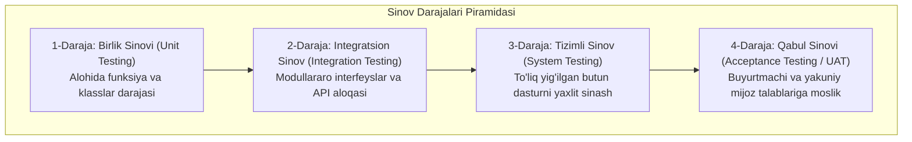

import { Callout } from 'nextra/components'

# Levels of Testing: Sinov Darajalari Ierarxiyasi

Dasturiy ta'minotni ishlab chiqish jarayonida tizim bir butun qilib birdaniga sinovdan o'tkazilmaydi. Dasturiy muhandislikda sinov eng kichik kod bo'laklaridan boshlanib, to butun biznes tizimini qabul qilishgacha bo'lgan **4 ta qat'iy ierarxik darajada (Levels of Testing)** bosqichma-bosqich amalga oshiriladi.

---

## Sinov Piramidasi (Test Pyramid)

---

## 1. Unit Testing (Birlik / Modul Sinovi)

- **Ta'rif:** Dasturiy ta'minotning eng kichik mustaqil qismini (funksiya, metod, klass) tashqi bog'liqliklardan ajratilgan (izolyatsiyalangan) holda tekshirish.
- **Bajaruvchi:** Bevosita dasturchilar (Developers).
- **Asboblar:** JUnit, TestNG (Java), PyTest (Python), Jest, Vitest (JS/TS).
- **Muhim tushunchalar:** Mock va Stub lar yordamida tashqi ma'lumotlar bazasi yoki tarmoq ulanishlarini taqlid qilish.

---

## 2. Integration Testing (Integratsion Sinov)

- **Ta'rif:** Alohida sinovdan o'tgan modullar o'zaro birlashtirilganda, ularning o'zaro ma'lumot almashinuvi va aloqa protokollari to'g'ri ishlashini tekshirish.
- **Integratsiya usullari:**
  - *Big Bang:* Barcha modullar birdaniga ulanadi (kichik loyihalar uchun).
  - *Top-Down:* Yuqoridan pastga qarab ulanadi, quyi modullar o'rniga **Stub** qo'yiladi.
  - *Bottom-Up:* Pastdan yuqoriga qarab ulanadi, yuqori modullar o'rniga **Driver** yoziladi.
- **Bajaruvchi:** Dasturchilar va QA muhandislari.

---

## 3. System Testing (Tizimli Sinov)

- **Ta'rif:** To'liq yig'ilgan, barcha integratsiyalari yakunlangan yaxlit dasturiy tizimning boshlang'ich texnik talablarga (SRS) to'liq mosligini sinovdan o'tkazish.
- **Xususiyati:** Tizim Staging muhitida, foydalanuvchi ko'zi bilan boshidan oxirigacha (End-to-End) tekshiriladi.
- **Bajaruvchi:** Mustaqil professional QA jamoasi.

---

## 4. Acceptance Testing (Qabul Sinovi — UAT)

- **Ta'rif:** Tizim ishlab chiqarishga (Production) chiqishdan oldin mijoz va haqiqiy foydalanuvchilar tomonidan biznes talablariga javob berishini tasdiqlash uchun o'tkaziladigan yakuniy sinov.
- **Asosiy turlari:**
  - **Alpha Testing:** Ishlab chiquvchi kompaniya hududida, ichki xodimlar va biznes vakillari ishtirokida o'tkaziladi.
  - **Beta Testing:** Haqiqiy yakuniy foydalanuvchilar tomonidan, ularning o'z muhitida keng ommaviy sinovdan o'tkaziladi.

---

## To'rt Sinov Darajasining Qiyosiy Matrisasi

| Xususiyat | Unit Testing | Integration Testing | System Testing | Acceptance Testing |
| :--- | :--- | :--- | :--- | :--- |
| **Qamrovi** | Alohida funksiya | Modullararo ulanish | Butun tizim yaxlit | Butun biznes jarayoni |
| **Uslub** | White Box | White / Grey Box | Asosan Black Box | Black Box |
| **Kim bajaradi?** | Dasturchi | Dasturchi & QA | QA Muhandislari | Mijoz & Foydalanuvchi |
| **Fokus** | Kod to'g'riligi | Interfeyslar aloqasi | Texnik talablar (SRS) | Biznes ehtiyojlari |
