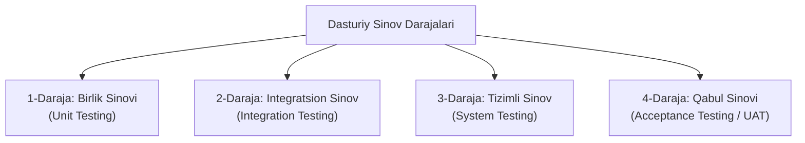

import { Callout } from 'nextra/components'

# Dasturiy Ta'minotni Sinash Darajalari (Levels of Testing)

Ushbu bo'limda biz dasturiy ta'minotni sinashning turli xil darajalarini o'rganamiz.

Dasturiy ta'minotni sinash qo'llanmasining oldingi qismlarida o'rganganimizdek, har qanday ilova yoki dasturni sinashda test muhandisi bir qator sinov texnikalariga amal qilishi lozim. Dasturiy xatoliklarni aniqlash uchun biz dasturiy ta'minotni sinash jarayonini amalga oshiramiz; buning natijasida barcha xatolar bartaraf etilib, ancha yuqori sifatli mahsulotga erishiladi.

---

## Dasturiy Ta'minotni Sinash Darajalari Nima?

Sinov darajalari — dasturiy ta'minotni ishlab chiqish hayotiy davri bosqichlari o'rtasida e'tibordan chetda qolgan (yo'qolgan) sohalarni topish hamda bir-birini takrorlash va ortiqcha ishlarning oldini olishga qaratilgan tizimli jarayondir.

Biz allaqachon SDLC (Dasturiy ta'minotni ishlab chiqish hayotiy davri) ning talablarni to'plash, loyihalash, dasturlash, sinash, joylashtirish va texnik xizmat ko'rsatish kabi turli bosqichlarini ko'rib chiqdik. Har qanday ilovani sinash uchun biz SDLC ning yuqoridagi barcha bosqichlaridan o'tishimiz shart. SDLC ga o'xshab, bizda dasturiy ta'minot sifatini saqlashga yordam beradigan bir nechta sinov darajalari mavjud.

---

## Sinovning To'rt Asosiy Darajasi

Dasturiy ta'minotni sinash jarayonida qo'llanilishi mumkin bo'lgan turli metodologiyalarni qamrab oluvchi 4 ta asosiy sinov darajasi mavjud:

Ushbu sinov darajalarining har biri dasturiy ta'minotni ishlab chiqish hayotiy tsikliga o'ziga xos qiymat qo'shadigan aniq maqsadga ega.

---

## 1-Daraja: Birlik Sinovi (Unit Testing)

Birlik sinovi (Unit Testing) dasturiy ta'minot sinovining birinchi darajasi bo'lib, dasturiy modullar belgilangan talablarga javob berayotganligini tekshirish uchun xizmat qiladi. Sinovning birinchi darajasi dasturiy ilovaning har bir birligini yoki alohida komponentini tahlil qilishni o'z ichiga oladi.

Birlik sinovi, shuningdek, funksional sinovning ham birinchi darajasidir. Birlik sinovini o'tkazishning asosiy maqsadi — alohida komponentlarning ishlashini ularning unumdorligi bilan birga tasdiqlashdir.

Birlik komponenti — bu ilovaning alohida funksiyasi yoki qoidasi bo'lib, uni dasturiy ta'minotning sinovdan o'tkazilishi mumkin bo'lgan eng kichik qismi deyish mumkin. Birlik sinovini bajarishdan ko'zlangan asosiy maqsad — alohida olingan kodning to'g'riligini tekshirishdir.

Birlik sinovi test muhandisi va dasturchilarga kodning poydevorini yaxshiroq tushunishga yordam beradi, bu esa ularga nuqson keltirib chiqarayotgan kodni tezda o'zgartirish imkonini beradi. Birlik sinovini bevosita **ishlab chiquvchilar (dasturchilar)** amalga oshiradilar.

---

## 2-Daraja: Integratsion Sinov (Integration Testing)

Dasturiy ta'minot sinovining ikkinchi darajasi — integratsion sinovdir (Integration Testing). Integratsion sinov jarayoni birlik sinovidan so'ng amalga oshiriladi. U asosan bir modul yoki komponentdan boshqa modullarga ma'lumotlar oqimining (data flow) to'g'ri o'tishini tekshirish uchun qo'llaniladi.

Integratsion sinovda test muhandisi dasturning alohida komponentlari yoki modullarini guruhlangan holda birgalikda sinovdan o'tkazadi.

Integratsion sinovni o'tkazishning birlamchi maqsadi — birlashtirilgan komponentlar yoki birliklar o'rtasidagi o'zaro aloqa (interfeys) paytida yuzaga keladigan nuqsonlarni aniqlashdir.

Har bir komponent yoki modul alohida ishlaganda, biz bir-biriga bog'liq bo'lgan modullar o'rtasidagi ma'lumotlar oqimini tekshirishimiz kerak bo'ladi va bu jarayon integratsion sinov deb ataladi. Biz integratsion sinovga faqat ilovaning har bir modulida funksional sinov muvaffaqiyatli yakunlangandagina o'tamiz.

Oddiy so'z bilan aytganda, integratsion sinovning maqsadi barcha modullar o'rtasidagi o'zaro aloqaning aniqligi va to'g'riligini baholashdan iborat.

---

## 3-Daraja: Tizimli Sinov (System Testing)

Dasturiy ta'minot sinovining uchinchi darajasi — tizimli sinovdir (System Testing). U dasturiy ta'minotning ham funksional, ham nofunksional talablarini to'liq tekshirish uchun ishlatiladi. Bu sinov muhiti ishlab chiqarish (production) muhitiga to'liq parallel bo'lgan boshidan oxirigacha (end-to-end) sinovdir.

Sinovning ushbu uchinchi darajasida biz ilovani yaxlit bir butun tizim sifatida sinovdan o'tkazamiz. Ilova yoki dasturning boshidan oxirigacha bo'lgan barcha jarayonlarini oddiy foydalanuvchi nigohi bilan tekshirish Tizimli sinov deb ataladi.

Tizimli sinovda biz ilovaning barcha zaruriy modullarini birma-bir ko'rib chiqamiz, yakuniy funksiyalar va biznes jarayonlari to'g'ri ishlayotganligini sinaymiz hamda mahsulotni to'liq tizim sifatida baholaymiz.

Qisqacha qilib aytganda, Tizimli sinov — bu integratsiyalashgan kompyuter dasturiy tizimining talablarga nisbatan butun ish faoliyatini amalga oshirish va tekshirishga qaratilgan turli xil sinovlarning izchil ketma-ketligidir.

---

## 4-Daraja: Qabul Sinovi (Acceptance Testing)

Dasturiy ta'minot sinovining eng so'nggi va to'rtinchi darajasi — qabul sinovidir (Acceptance Testing). U yetkazib berilgan dasturiy ta'minot spetsifikatsiyalarga va mijoz talablariga mos kelishini baholash uchun qo'llaniladi.

Dastur dastlabki uchta sinov darajasidan (Birlik sinovi, Integratsion sinov, Tizimli sinov) muvaffaqiyatli o'tib bo'lgan bo'lsa ham, yakuniy foydalanuvchi tizimni real hayotiy ssenariylarda ishlatganda ba'zi kichik xatoliklar hali ham aniqlanishi mumkin.

Oddiy qilib aytganda, Qabul sinovi — bu ilgari bajarilgan barcha sinov jarayonlarining umumiy xulosasi va yakuniy bosqichidir.

Qabul sinovi, shuningdek, **Foydalanuvchi qabul sinovi (User Acceptance Testing — UAT)** deb ham ataladi va u yakuniy mahsulot qabul qilinishidan oldin buyurtmachi (mijoz) tomonidan amalga oshiriladi. Odatda UAT soha mutaxassisi (mijoz) tomonidan o'z qoniqishi uchun o'tkaziladi hamda ilovaning belgilangan biznes ssenariylari va real vaqt rejimidagi vaziyatlarga muvofiq ishlayotganligini tekshiradi.

---

## Sinov Darajalarining Qiyosiy Jadvali

| Sinov Darajasi | Asosiy Maqsadi | Kim Tomonidan Bajariladi? | Sinov Qamrovi |
| :--- | :--- | :--- | :--- |
| **Birlik Sinovi (Unit Testing)** | Alohida funksiya va modullarning to'g'riligini tekshirish | Dasturchilar (Developers) | Eng kichik sinov birliklari (kod darajasi) |
| **Integratsion Sinov (Integration Testing)** | Modullararo ma'lumot oqimi va aloqani tekshirish | Dasturchilar va QA muhandislari | Birlashtirilgan modullar guruhi |
| **Tizimli Sinov (System Testing)** | Yaxlit tizimning funksional va nofunksional talablarga mosligini tekshirish | Mustaqil QA jamoasi | To'liq dasturiy tizim (End-to-End) |
| **Qabul Sinovi (Acceptance Testing / UAT)** | Tizimning biznes talablariga muvofiqligi va foydalanishga tayyorligini tasdiqlash | Buyurtmachi, mijoz, soha mutaxassislari | Real biznes jarayonlari va ssenariylari |
