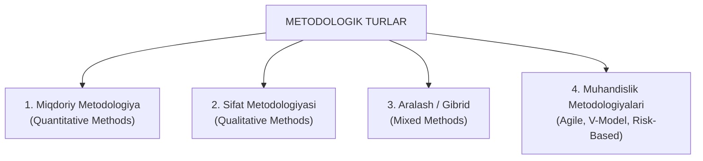

import { Callout } from 'nextra/components'

# Methodological Types: Sinov va Tadqiqot Metodologiyalari Turlari

Dasturiy ta'minotni sinash va sifatini baholash jarayonida jamoa qanday metodologik asosga tayanishi loyihaning yakuniy muvaffaqiyatini belgilab beradi.

**Metodologiya (Methodology)** — bu ma'lumotlarni to'plash, tahlil qilish, muammolarni aniqlash va xulosalar chiqarish uchun qo'llaniladigan ilmiy, tizimli prinsiplar, strategiyalar va texnikalar majmuidir.

TpointTech dasturida tadqiqot va sinov faoliyatining metodologik turlari hamda ularning dasturiy muhandislikdagi amaliy qo'llanilishi quyidagicha o'rganiladi.

---

## Asosiy Metodologik Yo'nalishlar

---

## 1. Miqdoriy Metodologiya (Quantitative Methods)

- **Mazmuni:** Raqamli, o'lchanadigan va statistik ko'rsatkichlarga tayanuvchi yondashuv.
- **Dasturiy sinovda qo'llanilishi:**
  - Kod qamrovi foizi (Code Coverage: 85%).
  - Bir soniyada bajarilgan so'rovlar soni (Throughput / RPS: 2500 req/sec).
  - Server javob berish vaqti (Response Time: 120 ms).
  - Aniqlangan nuqsonlar soni va defekt zichligi (Defect Density).
- **Afzalligi:** Aniq, xolisona, matematik jihatdan isbotlanadigan natijalar beradi.
- **Kamchiligi:** Foydalanuvchining hissiy qoniqishini yoki interfeysning qulaylik darajasini raqamlar orqali to'liq ifodalab bo'lmaydi.

---

## 2. Sifat Metodologiyasi (Qualitative Methods)

- **Mazmuni:** Raqamsiz ma'lumotlar, insoniy xatti-harakatlar, fikr-mulohazalar, kuzatuvlar va tushunchalarni o'rganuvchi yondashuv.
- **Dasturiy sinovda qo'llanilishi:**
  - Usability testing (Foydalanish qulayligi sinovi): foydalanuvchining dastur bilan muloqot paytidagi qiyinchiliklarini kuzatish.
  - Beta testerlarning erkin yozma taassurotlari va sharhlari (Reviews).
  - Ekspert baholashi va dizayn auditi.
- **Afzalligi:** Foydalanuvchi muammolarining tub sabablarini (Root Causes) chuqur tushunish imkonini beradi.
- **Kamchiligi:** Natijalar ko'pincha subyektiv bo'lib, statistik umumlashtirish qiyin.

---

## 3. Aralash / Gibrid Metodologiya (Mixed Methods)

- **Mazmuni:** Miqdoriy va sifat usullarini yagona jarayonda birlashtirish.
- **Amaliy misol:** QA jamoasi ham dasturning yuklama tezligini (raqamli — Quantitative), ham uning interfeysining real foydalanuvchilarga qulayligini (sifat — Qualitative) bir vaqtda tahlil qiladi.

---

## 4. Dasturiy Muhandislik Sinov Metodologiyalari

| Metodologiya Turi | Asosiy Xususiyati | Qachon Tanlanadi? |
| :--- | :--- | :--- |
| **Agile Testing** | Iterativ, 1-2 haftalik sprintlar, doimiy muloqot va moslashuvchanlik | Talablar tez o'zgaruvchan zamonaviy loyihalarda |
| **Waterfall Testing** | Qat'iy ketma-ket, har bir bosqich hujjatlashtirilgan chiziqli jarayon | Talablar 100% qat'iy va o'zgarmas bo'lgan loyihalarda |
| **V-Model Testing** | Ishlab chiqish va sinov bosqichlarining parallel muvofiqligi | Yuqori ishonchlilik talab etiladigan sohalarda (tibbiyot, aviatsiya) |
| **Risk-Based Testing** | Xavflar darajasi yuqori bo'lgan modullarga birinchi navbatda e'tibor qaratish | Vaqt va resurslar o'ta cheklangan vaziyatlarda |
| **Exploratory Testing** | Qat'iy ssenariylarsiz, sinovchining mahorati va erkin tadqiqotiga tayanadi | Yangi funksionallikni tezkor o'rganish va chuqur kamchiliklarni topishda |

<Callout type="info">
  **Metodologiya tanlash mezoni:** To'g'ri metodologiyani tanlash loyihaning byudjeti, xatarlilik darajasi, jamoaning tajribasi va yakuniy mijoz talablaridan kelib chiqqan holda amalga oshiriladi.
</Callout>
