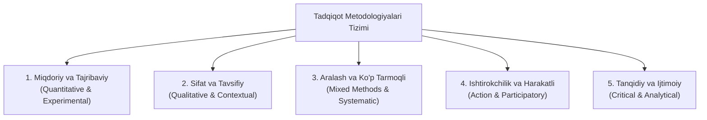
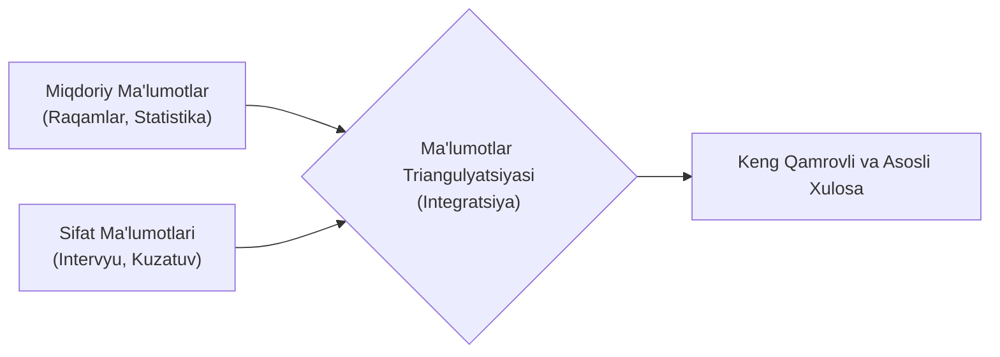
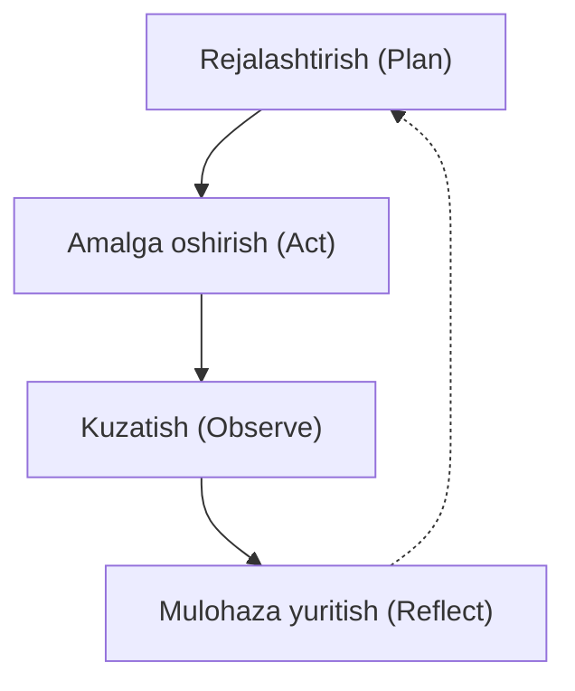

import { Callout } from 'nextra/components'

# Metodologik Turlar (Methodological Types)

**Metodologik turlar (Methodological Types)** — ma'lumotlarni to'plash, tahlil qilish va talqin qilish uchun qo'llaniladigan turli tadqiqot yondashuvlarini anglatadi. Metodologiyani to'g'ri tanlash tadqiqot maqsadlariga, ma'lumotlar turiga va o'rganilayotgan muammoning xususiyatiga bevosita bog'liqdir.

Mazkur bo'limda siz turli xil metodologik turlar, ularning asosiy xususiyatlari, afzalliklari, cheklovlari hamda amaliyotda qo'llanilishini o'rganasiz.

---

## Metodologiya Nima? (What is a Methodology?)

**Metodologiya** — bu tadqiqot yoki ilmiy izlanishlarni olib borish uchun qo'llaniladigan, ma'lumotlarni to'plash, tahlil qilish va talqin qilish jarayonini boshqaradigan standartlar, strategiyalar va texnikalarning tizimli asosidir. U tadqiqot savollari yoki maqsadlarini qat'iy va izchil hal qilish uchun qo'llaniladigan nazariy asoslar, tadqiqot dizayni va usullarini qamrab oladi.

Metodologiya tadqiqotchilar va mutaxassislar uchun yo'l xaritasi (roadmap) vazifasini o'taydi, bu esa ularning izlanishlari ishonchliligi, yaroqliligi (validity) va axloqiy yaxlitligini ta'minlaydi hamda sohada yangi bilimlarni shakllantirishga xizmat qiladi.

---

## 20 Asosiy Metodologik Tur

Quyida har bir metodologik turning batafsil tavsifi, afzalliklari va kamchiliklari keltirilgan:

### 1. Miqdoriy Usullar (Quantitative Methods)
**Tavsifi:** Miqdoriy usullar qonuniyatlar, korrelyatsiyalar va sabab-oqibat bog'liqliklarini o'rnatish uchun raqamli ma'lumotlarni to'plash va tahlil qilishni o'z ichiga oladi. Ushbu usullar xulosalar chiqarish uchun statistik va matematik usullarni qo'llaydi.

- **Afzalliklari:**
  - Aniq, o'lchanadigan va qat'iy natijalarni taqdim etadi.
  - Xulosalarni kengroq auditoriya va umumiy populyatsiyaga umumlashtirish (generalization) imkonini beradi.
  - Gipotezalarni tekshirish, takrorlash (replikatsiya) va modellashtirishni osonlashtiradi.
- **Kamchiliklari:**
  - Murakkab insoniy yoki tizimli hodisalarni haddan tashqari soddalashtirib yuborishi mumkin.
  - Nozik jihatlar va chuqur tushunchalarni e'tibordan chetda qoldirishi mumkin.
  - Barcha tegishli omillarni qamrab ololmasligi mumkin bo'lgan standartlashtirilgan vositalarga haddan tashqari tayanadi.

---

### 2. Sifat Usullari (Qualitative Methods)
**Tavsifi:** Sifat usullari suhbatlar (intervyular), bevosita kuzatuvlar va matn tahlili kabi raqamsiz ma'lumotlar orqali odamlarning tajribalari, xatti-harakatlari va ma'nolarini tushunishga qaratilgan. Ular vaziyatning murakkabligi va kontekstini o'rganishni maqsad qiladi.

- **Afzalliklari:**
  - Insonlarning shaxsiy qarashlari va tajribalari bo'yicha boy, chuqur va batafsil tushunchalar beradi.
  - Murakkab, noaniq hodisalarni erkin o'rganish imkonini yaratadi.
  - Ijtimoiy, tashkiliy va madaniy kontekstlarni yaxlit anglashga ko'maklashadi.
- **Kamchiliklari:**
  - Natijalar ko'pincha subyektiv bo'lib, ularni umumlashtirish ancha qiyin.
  - Jarayon ko'p vaqt va katta mehnat talab qiladi.
  - Ma'lumotlarni tahlil qilish tadqiqotchining shaxsiy fikri (bias) ta'siriga tushishi mumkin.

---

### 3. Aralash Usullar (Mixed Methods)
**Tavsifi:** Aralash usullar bitta tadqiqot doirasida miqdoriy va sifat usullarini birgalikda qo'llaydi. Bu orqali ikki yondashuvning bir-birini to'ldiruvchi kuchli tomonlari birlashtirilib, tadqiqot natijalarining chuqurligi va qamrovi oshiriladi.

- **Afzalliklari:**
  - Tadqiqot savollari bo'yicha har tomonlama to'liq va mukammal tushuncha beradi.
  - Ma'lumotlar triangulyatsiyasi orqali natijalarning haqiqiyligi va ishonchliligini oshiradi.
  - Metodologik plyuralizm orqali xulosalarning mustahkamligini kuchaytiradi.
- **Kamchiliklari:**
  - Tadqiqotchidan ham miqdoriy, ham sifat metodologiyalarini chuqur bilishni talab qiladi.
  - Katta resurs va ko'p vaqt sarfini talab qilishi mumkin.
  - Turlicha ma'lumotlarni bir-biriga moslashtirish va integratsiya qilish jiddiy qiyinchiliklar tug'dirishi mumkin.

---

### 4. Eksperimental Dizayn (Experimental Design)
**Tavsifi:** Eksperimental dizayn o'zgaruvchilarning natijaga ta'sirini ko'rish uchun ularni manipulyatsiya qilishni (o'zgartirishni) o'z ichiga oladi. Sabab-oqibat bog'liqligini aniqlash uchun ushbu tajribalar qat'iy nazorat ostidagi sharoitlarda amalga oshiriladi.

- **Afzalliklari:**
  - O'zgaruvchilar ustidan qat'iy va aniq nazorat o'rnatish imkonini beradi.
  - Aniq sabab-oqibat munosabatlarini isbotlashni osonlashtiradi.
  - Yuqori ichki ishonchlilikka (internal validity) ega.
- **Kamchiliklari:**
  - Olingan xulosalar sun'iy laboratoriya muhitidan tashqarida (haqiqiy hayotda) ekologik jihatdan to'liq ishlamasligi mumkin.
  - Ishtirokchilarga ta'sir o'tkazish bilan bog'liq axloqiy (etik) masalalar kelib chiqishi mumkin.
  - Amaliy cheklovlar tajribalarning miqyosini cheklashi mumkin.

---

### 5. So'rovnoma Tadqiqoti (Survey Research)
**Tavsifi:** So'rovnoma tadqiqotlari ishtirokchilar guruhiga anketalar yoki intervyular berish orqali ularning munosabatlari, xatti-harakatlari yoki xususiyatlarini o'lchash maqsadida ma'lumot to'playdi.

- **Afzalliklari:**
  - Katta hajmdagi auditoriya va namunalardan ma'lumotlarni tez va samarali yig'ish imkoniyati.
  - Standartlashtirilgan ma'lumotlar bazasini shakllantirish imkonini beradi.
  - Turli guruhlar va populyatsiyalarni o'zaro taqqoslashni osonlashtiradi.
- **Kamchiliklari:**
  - Ishtirokchilarning o'z-o'zini baholashiga tayanadi, bu esa noaniq yoki tarafkash javoblarga sabab bo'lishi mumkin.
  - Sifat usullariga qaraganda muammoni tushunish chuqurligi cheklangan bo'ladi.
  - Javoblarning kam qaytishi (low response rate) tadqiqotning aniqligiga salbiy ta'sir ko'rsatishi mumkin.

---

### 6. Keys-Stadi / Amaliy Vaziyat Tahlili (Case Study)
**Tavsifi:** Keys-stadi alohida shaxslar, tashkilotlar, loyihalar yoki noyob hodisalarni bir nechta ma'lumot manbalari (intervyular, bevosita kuzatuvlar, rasmiy hujjatlar) yordamida chuqur va har tomonlama o'rganishni o'z ichiga oladi.

- **Afzalliklari:**
  - Murakkab jarayonlar va tizimlar bo'yicha boy, batafsil va amaliy xulosalar taqdim etadi.
  - Kamdan-kam uchraydigan yoki o'ziga xos noyob holatlarni o'rganish imkonini beradi.
  - Yangi gipotezalarni shakllantirish va nazariy rivojlanishga zamin yaratadi.
- **Kamchiliklari:**
  - Topilmalarni boshqa keng tizimlar uchun to'g'ridan-to'g'ri umumlashtirib bo'lmasligi mumkin.
  - Tadqiqotchining shaxsiy yondashuviga bog'liq bo'lib qolish xavfi mavjud.
  - Jarayon ko'p vaqt va katta resurs talab etadi.

---

### 7. Etnografiya (Ethnography)
**Tavsifi:** Etnografiya tadqiqotchining muayyan madaniy, ijtimoiy yoki tashkiliy muhitga bevosita chuqur kirib borishini (immersion) hamda ishtirokchilarning xatti-harakatlari, e'tiqodlari va kundalik amaliyotlarini uzoq muddatli kuzatuvlar orqali o'rganishni o'z ichiga oladi.

- **Afzalliklari:**
  - Tashkiliy va madaniy muhit bo'yicha yaxlit va chuqur tushuncha beradi.
  - Jamoa ichidagi ijtimoiy dinamika va o'zaro munosabatlarni aniqlashni osonlashtiradi.
  - Yashirin bilimlar va norasmiy qoidalarni fosh etishga imkon beradi.
- **Kamchiliklari:**
  - Haqiqiy chuqur bilimga ega bo'lish uchun uzoq vaqt davomida jamoa ichida bo'lish talab etiladi.
  - Xulosalar faqat o'sha muayyan muhitga xos bo'lib, boshqa joylarga oson ko'chirilmaydi.
  - Tadqiqotchining ishtirokchilar bilan munosabatlarida axloqiy masalalar tug'ilishi mumkin.

---

### 8. Harakatdagi Tadqiqot (Action Research)
**Tavsifi:** Bu amaliy yondashuv bo'lib, unda tadqiqotchilar va amaliyotchilar amaliy muammolarni aniqlash va hal qilish uchun birgalikda hamkorlik qiladilar. Maqsad — ham yangi bilimlarni shakllantirish, ham muammoga bevosita amaliy yechim topishdir.

- **Afzalliklari:**
  - Barcha manfaatdor tomonlarning faol ishtirokini ta'minlaydi.
  - Real hayotdagi va amaliyotdagi dolzarb muammolarni bevosita joyida hal qiladi.
  - Harakat va mulohaza yuritish tsikllari orqali iterativ rivojlanishni qo'llab-quvvatlaydi.
- **Kamchiliklari:**
  - Natijalar aniq bir kontekstdan tashqariga har doim ham to'g'ri kelmasligi mumkin.
  - Jarayonda xolislik va betaraflikni saqlab qolish qiyin bo'lishi mumkin.
  - Ko'p vaqt talab qiladi va jamoada kuchli muloqot ko'nikmalarini talab etadi.

---

### 9. Asoslangan Nazariya (Grounded Theory)
**Tavsifi:** Asoslangan nazariya — bu empirik ma'lumotlarga tayangan holda nazariyalar yaratishga qaratilgan tizimli sifat tadqiqoti metodologiyasidir. Nazariya ma'lumotlarni yig'ish va tahlil qilishning iterativ tsikllari orqali pastdan yuqoriga qarab shakllantiriladi.

- **Afzalliklari:**
  - Nazariyani poydevordan boshlab noldan yaratish imkonini beradi.
  - Yangi paydo bo'layotgan tushunchalar va bog'liqliklarni o'rganishni rag'batlantiradi.
  - Tadqiqot dizaynini iterativ ravishda moslashtirish uchun yuqori moslashuvchanlik beradi.
- **Kamchiliklari:**
  - Olingan natijalar o'rganilgan doiradan tashqarida har doim ham qo'llanilmasligi mumkin.
  - Kodlash va ma'lumotlarni talqin qilishda nihoyatda yuqori e'tiborni talab qiladi.
  - Nazariy xulosalarga shoshilinch xulosa chiqarib qo'yish xavfi mavjud.

---

### 10. Kontent Tahlili (Content Analysis)
**Tavsifi:** Kontent tahlili matnli, vizual yoki audiovizual ma'lumotlardagi qonuniyatlar, mavzular va ma'nolarni aniqlash uchun ularni tizimli tahlil qilishni o'z ichiga oladi. Odatda hujjatlar, ommaviy axborot vositalari yoki tizimli yozishmalarni o'rganishda qo'llaniladi.

- **Afzalliklari:**
  - Hukmron fikrlar va ma'lumotlar tuzilishi bo'yicha aniq tasavvur beradi.
  - Katta hajmdagi ma'lumotlar to'plamlarini miqdoriy va sifat jihatidan tahlil qilishni osonlashtiradi.
  - Turli xil formatdagi kontentlarni tahlil qilish uchun qulay moslashuvchanlikni taklif etadi.
- **Kamchiliklari:**
  - Tadqiqotchining subyektiv talqiniga tayanadi.
  - Faqat mavjud ochiq ma'lumotlarga bog'liq bo'lib, butun manzarani to'liq ifodalamasligi mumkin.
  - Katta ma'lumotlarni qo'lda kodlash va tasniflash juda ko'p vaqt talab qiladi.

---

### 11. Narativ So'rov (Narrative Inquiry)
**Tavsifi:** Narativ so'rov insonlarning hikoyalari, kechinmalari va shaxsiy hikoyalarini tahlil qilish orqali ularning hayotiy tajribalarini va subyektiv haqiqatlarini tushunishga e'tibor qaratadi.

- **Afzalliklari:**
  - Shaxslarning subyektiv tajribalariga va shaxsiy qarashlariga chuqur e'tibor beradi.
  - Murakkab, ko'p qirrali hodisalarni insoniy nuqtai nazardan o'rganishga yordam beradi.
- **Kamchiliklari:**
  - Natijalar juda tor kontekstga bog'langan bo'lib, ularni keng umumlashtirish qiyin.
  - Hikoyalarni sinchkovlik bilan talqin qilishni talab qiladi.
  - Hikoyalarni tanlashda tadqiqotchi tarafkashligi yuzaga kelishi mumkin.

---

### 12. Fenomenologiya (Phenomenology)
**Tavsifi:** Fenomenologiya insonlar tomonidan boshdan kechirilgan hodisalarning asl mohiyati va ma'nosini ochib berishga, ularning subyektiv idroki va ongiga diqqat qaratishga intiladi.

- **Afzalliklari:**
  - Yashab ko'rilgan tajribalarning eng nozik tafsilotlarigacha aniq tavsif beradi.
  - Inson idroki va subyektiv reallikni o'rganish imkoniyatini taqdim etadi.
  - Hodisalarning asl tub mohiyatini tushunishni osonlashtiradi.
- **Kamchiliklari:**
  - O'zining mavhum tabiati tufayli natijalarni aniq talqin qilish qiyin bo'lishi mumkin.
  - O'rganilgan hodisadan tashqariga umumlashtirish imkoniyati cheklangan.

---

### 13. Tizimli Sharh (Systematic Review)
**Tavsifi:** Tizimli sharhlar muayyan mavzu bo'yicha mavjud barcha ilmiy adabiyotlar va tadqiqotlarni tizimli usullar yordamida qidirish, tanqidiy baholash va sintez qilishni o'z ichiga oladi.

- **Afzalliklari:**
  - Mavjud barcha ilmiy dalillarning keng qamrovli va yaxlit xulosasini beradi.
  - Tizimli qidiruv va tanlash mezonlari orqali tarafkashlikni (bias) minimallashtiradi.
  - Sohadagi yakdillik (konsensus) va kelishmovchiliklarni yaqqol ko'rsatib beradi.
- **Kamchiliklari:**
  - Katta vaqt va yuqori resurs talab qiluvchi jarayondir.
  - Mavjud adabiyotlarning sifati va mavjudligi bilan cheklanib qoladi.

---

### 14. Tarmoq Tahlili (Network Analysis)
**Tavsifi:** Tarmoq tahlili tizim ichidagi ob'ektlar (tugunlar) o'rtasidagi munosabatlar va o'zaro ta'sirlarni o'rganadi. Bog'lanish naqshlarini tahlil qilish uchun matematik va grafik usullardan foydalanadi.

- **Afzalliklari:**
  - Murakkab relyatsion tuzilmalar va aloqalar bo'yicha chuqur tushuncha beradi.
  - Tarmoqlar dinamikasini vizual tarzda ko'rsatishni osonlashtiradi.
  - Tizimdagi eng nufuzli, markaziy tugunlarni va zaif bog'lanishlarni aniqlash imkonini beradi.
- **Kamchiliklari:**
  - Graf nazariyasi va tarmoq tahlili usullari bo'yicha maxsus bilimlarni talab qiladi.
  - Katta tarmoqlar uchun ma'lumotlarni to'plash va qayta ishlash juda murakkab bo'lishi mumkin.

---

### 15. Tarixiy Tadqiqot (Historical Research)
**Tavsifi:** Tarixiy tadqiqot o'tmishdagi hodisalar, kontekstlar va jarayonlarni birlamchi va ikkilamchi manbalardan foydalangan holda qayta tiklash va tahlil qilishni o'z ichiga oladi.

- **Afzalliklari:**
  - O'tmish konteksti va taraqqiyot yo'nalishlari haqida tasavvur beradi.
  - Yillar davomidagi uzluksizlik va o'zgarishlarni tushunishga ko'maklashadi.
  - Uzoq muddatli tendentsiyalar va qonuniyatlarni ko'rish imkonini beradi.
- **Kamchiliklari:**
  - To'liq bo'lmagan yoki tarafkash bo'lishi mumkin bo'lgan tarixiy yozuvlarga tayanadi.
  - Tarixiy manbalarning to'g'riligi va ishonchliligini tekshirish doimo qiyinchilik tug'diradi.

---

### 16. Feminizm Tadqiqotlari (Feminist Research)
**Tavsifi:** Gender, kuch va tengsizlik masalalarini o'rganishga, an'anaviy paradigmalarni qayta ko'rib chiqishga va ijtimoiy adolatni ta'minlashga qaratilgan metodologiya.

- **Afzalliklari:**
  - Chetda qolgan ovozlar va tajribalarni markazga olib chiqadi.
  - Mavjud tengsizlik tuzilmalarini tanqidiy tahlil qilishni osonlashtiradi.
- **Kamchiliklari:**
  - Talqin va baholashda tadqiqotchi nuqtai nazarining ta'siri yuqori bo'lishi mumkin.
  - An'anaviy akademik yo'nalishlar tomonidan qarshilikka uchrashi mumkin.

---

### 17. Ishtirokchilik Harakat Tadqiqoti (Participatory Action Research — PAR)
**Tavsifi:** Ishtirokchilik harakat tadqiqotlari jamiyat yoki guruh a'zolari bilan to'g'ridan-to'g'ri hamkorlikda olib boriladigan izlanish bo'lib, amaliy muammolarni hal qilish va ijtimoiy o'zgarishlarni rag'batlantirishni maqsad qiladi.

- **Afzalliklari:**
  - Ishtirokchilarni shunchaki ob'ekt emas, balki teng huquqli hammuallif va o'zgarish yaratuvchiga aylantiradi.
  - Mahalliy ehtiyojlar va bilimlarga asoslangan amaliy yechimlarni shakllantiradi.
  - Bilim ishlab chiqarish jarayonini demokratlashtiradi.
- **Kamchiliklari:**
  - Chuqur muloqot va hamkorlik uchun juda ko'p vaqt va resurs talab qiladi.
  - Tadqiqot qat'iyligi bilan ishtirokchilik tamoyillari o'rtasida muvozanatni saqlash qiyin.

---

### 18. Vizual Tadqiqot Usullari (Visual Research Methods)
**Tavsifi:** Vizual tadqiqot usullari fotosuratlar, videolar, xaritalar yoki chizmalar kabi vizual vositalardan asosiy ma'lumot manbai sifatida foydalanadi.

- **Afzalliklari:**
  - Oddiy matnli tildan tashqaridagi muqobil ifoda shakllarini taqdim etadi.
  - Vizual savodxonlik va madaniy ma'nolarni o'rganishni osonlashtiradi.
  - Ijodiy va innovatsion tadqiqot jarayonlarini amalga oshirishga imkon beradi.
- **Kamchiliklari:**
  - Vizual ma'lumotlarni talqin qilish juda subyektiv bo'lishi mumkin.
  - Vizual tahlil usullarini standartlashtirish qiyin.
  - Axloqiy rozilik va tasvirlash bilan bog'liq qonuniy masalalar yuzaga keladi.

---

### 19. Tanqidiy Diskurs Tahlili (Critical Discourse Analysis — CDA)
**Tavsifi:** CDA tildan ijtimoiy va siyosiy kontekstlarda qanday foydalanilishini, tilda yashiringan hokimiyat munosabatlari, mafkura va ijtimoiy tuzilmalarni tahlil qiladi.

- **Afzalliklari:**
  - Tildagi yashirin mafkuralar va ta'sir mexanizmlarini fosh etadi.
  - Hukmron axborot oqimlari va vakilliklarni tanqidiy baholash imkonini beradi.
- **Kamchiliklari:**
  - Matnni talqin qilish subyektiv bo'lishi mumkin.
  - Lingvistik tahlil va tanqidiy nazariyalarni chuqur bilishni talab etadi.

---

### 20. Dekolonial Tadqiqot (Decolonial Research)
**Tavsifi:** Mustamlakachilik merosi va an'anaviy g'arbiy epistemologiyalarni qayta ko'rib chiqishga, mahalliy va an'anaviy bilim tizimlarini markazga qo'yishga qaratilgan metodologiya.

- **Afzalliklari:**
  - Mahalliy bilim tizimlari va ovozlarning markaziy o'rnini ta'minlaydi.
  - Dunyoni anglashda ko'p qirrali epistemik xilma-xillikni rivojlantiradi.
  - Ijtimoiy adolat va bilimlarni erkinlashtirishga hissa qo'shadi.
- **Kamchiliklari:**
  - An'anaviy va mahalliy bilim tizimlarini ilmiy jihatdan uyg'unlashtirishdagi murakkabliklar.
  - O'zaro qarama-qarshi ilmiy paradigmalar o'rtasidagi ziddiyatlar xavfi.

---

## Xulosa

Ushbu metodologiyalar tadqiqot savollari va hodisalarni o'rganish uchun xilma-xil yondashuvlarni taqdim etadi. Ularning har biri o'zining kuchli jihatlari, cheklovlari va nazariy asoslariga ega. Mutaxassislar va tadqiqotchilar o'z maqsadlari, mavjud resurslar va ma'lumotlarning tabiatidan kelib chiqqan holda eng mos keladigan metodologiyani tanlaydilar.
