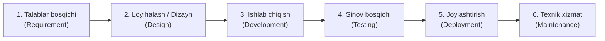
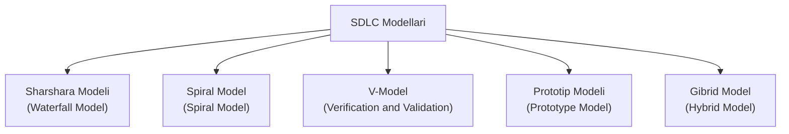

import { Callout } from 'nextra/components'

# Dasturiy Ta'minotni Ishlab Chiqish Hayotiy Davri (SDLC)

**Dasturiy Ta'minotni Ishlab Chiqish Hayotiy Davri (Software Development Life Cycle — SDLC)** — dasturiy ta'minotni ishlab chiqish tizimi va strukturasini yaratuvchi jarayondir. SDLC doirasida turli xil bosqichlar mavjud bo'lib, har bir bosqich o'zining aniq faoliyat yo'nalishlariga ega. Bu jarayon ishlab chiqish jamoasiga yuqori sifatli mahsulotni loyihalashtirish, yaratish va mijozga yetkazib berish imkonini beradi.

SDLC dasturiy ta'minotni yaratishning turli bosqichlarini hamda ushbu bosqichlarning bajarilish ketma-ketligini belgilab beradi. Dasturiy ta'minot ishlab chiqish hayotiy tsiklida har bir bosqich o'zidan oldingi bosqich natijasiga (deliverable) tayanadi. Talablar tizim dizayniga, dizayn ishlab chiqishga (kodlashga), ishlab chiqish esa sinovga uzatiladi; sinovdan so'ng mahsulot buyurtmachiga topshiriladi.

---

## SDLC Bosqichlari (Phases of SDLC)

Dasturiy ta'minotni ishlab chiqish tsikli quyidagi 6 ta asosiy bosqichdan iborat:

### 1. Talablar Bosqichi (Requirement Phase)

Ushbu bosqich ishlab chiquvchilar jamoasi hamda loyiha menejeri (Project Manager) uchun dasturiy ta'minot hayotiy davrining eng muhim va hal qiluvchi bosqichidir. Mazkur bosqichda mijoz mahsulot yoki dasturiy ta'minotga oid o'z talablari, spetsifikatsiyalari, kutayotgan natijalari va boshqa maxsus istaklarini bayon qiladi. Ushbu ma'lumotlarning barchasi xizmat ko'rsatuvchi kompaniyaning biznes menejeri, loyiha boshqaruvchisi yoki tahlilchisi (Business Analyst) tomonidan to'planadi.

Talablar tizimning qanday ishlatilishi, undan kimlar foydalanishi va amallar yuklamasini (load) aniqlash kabi ma'lumotlarni o'z ichiga oladi. Ushbu bosqichda to'plangan barcha axborot mahsulotni buyurtmachi talablariga to'liq mos ravishda yaratish uchun o'ta muhim ahamiyat kasb etadi.

---

### 2. Loyihalash va Dizayn Bosqichi (Design Phase)

Loyihalash bosqichi talablar bosqichida yig'ilgan ma'lumotlar asosida yangi dasturiy ta'minotni chuqur va batafsil tahlil qilishni o'z ichiga oladi. Bu tizimni ishlab chiqish hayotiy davridagi eng ustuvor bosqichlardan biri hisoblanadi, chunki tizimning mantiqiy dizayni jismoniy (amaliy) dizaynga aynan shu yerda aylantiriladi. Talablar bosqichining natijasi nimalar zarurligi ro'yxati bo'lsa, dizayn bosqichi ushbu talablarni qanday qilib amalga oshirish yo'lini ko'rsatib beradi.

Mazkur bosqichda barcha zarur vositalar — dasturlash tillari (Java, .NET, PHP), ma'lumotlar bazasi boshqaruv tizimlari (Oracle, MySQL), shuningdek, dasturning hech qanday muammosiz ishlashini ta'minlovchi apparat va dasturiy ta'minot platformalari kombinatsiyasi bo'yicha qarorlar qabul qilinadi.

Tizim dizaynini tavsiflash uchun ma'lumotlar oqimi diagrammalari (DFD), blok-sxemalar (flowcharts), qaror jadvallari va daraxtlari (decision tables and trees), ma'lumotlar lug'ati (data dictionary) hamda strukturalashgan lug'at kabi bir qator vositalar va usullardan foydalaniladi.

---

### 3. Yig'ish va Ishlab Chiqish Bosqichi (Build / Development Phase)

Talablar va dizayn bosqichlari muvaffaqiyatli yakunlangach, keyingi qadam loyihani dasturiy tizimga aylantirish (amalga oshirish) hisoblanadi. Ushbu bosqichda vazifalar kichik qismlarga (modullarga) bo'linadi va ishlab chiquvchilar (dasturchilar) jamoasi oldingi bosqichda kelishilgan arxitektura hamda talablar bosqichida belgilangan buyurtmachi ehtiyojlari asosida kutilgan natijaga erishish uchun dasturiy kod yozishni boshlaydilar.

Front-end dasturchilar qulay va jozibador grafik foydalanuvchi interfeysini (GUI) hamda back-end bilan o'zaro bog'lanish uchun zarur interfeyslarni yaratadilar. Back-end dasturchilar esa talab qilingan mantiq va operatsiyalarga muvofiq asosiy kodlash ishlarini amalga oshiradilar. Barcha ishlar loyiha menejeri tomonidan taqdim etilgan tartib-qoidalar va ko'rsatmalarga asosan olib boriladi.

Bu bevosita dasturlash (kodlash) bosqichi bo'lganligi sababli, u dasturiy ta'minot ishlab chiqish hayotiy tsiklida eng ko'p vaqt talab qiladi va dasturchidan yuqori diqqat-e'tiborni talab etadi.

---

### 4. Sinov Bosqichi (Testing Phase)

Sinov — dasturiy tizimni yakunlashning eng so'nggi muhim bosqichidir. Ushbu bosqichda tayyor bo'lgan GUI va back-end tizimi talablar bosqichida keltirilgan mezonlarga nisbatan tekshiruvdan o'tkaziladi. Sinov dasturning talablar bosqichida belgilangan talablarga muvofiq natija berayotganligini aniqlaydi. 

Ishlab chiqish va test jamoasi sinovni boshlash uchun test rejasini (Test Plan) tuzadi. Ushbu test rejasi integratsion sinov (integration testing), birlik sinovi (unit testing), qabul sinovi (acceptance testing) va tizimli sinov (system testing) kabi barcha muhim sinov turlarini qamrab oladi. Shuningdek, bu bosqichda nofunksional sinovlar (non-functional testing) ham o'tkaziladi.

Agar dasturiy ta'minotda biror nuqson aniqlansa yoki u kutilganidek ishlamasa, test jamoasi bu muammo haqida ishlab chiquvchilar guruhiga batafsil ma'lumot beradi. Agar nuqson haqiqatan ham tasdiqlansa va uni tuzatish zarur deb topilsa, dasturchilar uni to'g'rilaydilar va yangilangan versiyani taqdim etadilar, so'ngra u qayta tekshiruvdan (re-test) o'tkaziladi.

---

### 5. Joylashtirish va Yetkazib Berish Bosqichi (Deployment / Deliver Phase)

Dasturiy ta'minot sinovi qoniqarli natijalar bilan yakunlangach hamda uning ishlashida hech qanday muammolar qolmagach, u foydalanish uchun mijozga topshiriladi.

Buyurtmachi mahsulotni qabul qilib olgan zahoti, birinchi navbatda beta-sinovni (Beta Testing) o'tkazish tavsiya etiladi. Beta-sinov jarayonida mijoz dasturda mavjud bo'lmagan, ammo talablar hujjatida ko'rsatilgan har qanday o'zgarishlarni yoki foydalanish qulayligini oshirish uchun grafik interfeysdagi (GUI) qo'shimcha tuzatishlarni talab qilishi mumkin. Bundan tashqari, agar mijoz dasturdan foydalanish paytida biror nuqsonga duch kelsa, bu haqda muammoni hal qilish uchun ishlab chiqish guruhiga xabar beriladi. Agar bu jiddiy nosozlik bo'lsa, jamoa uni qisqa muddatda bartaraf etadi; agar xatolik darajasi past bo'lsa, u keyingi relizgacha qoldirilishi mumkin.

Barcha xatoliklar bartaraf etilib, kerakli o'zgartirishlar kiritilgandan so'ng, dasturiy ta'minot nihoyat yakuniy foydalanuvchilar uchun to'liq ishga tushiriladi (production deployment).

---

### 6. Texnik Xizmat Ko'rsatish (Maintenance)

Texnik xizmat ko'rsatish bosqichi SDLC ning eng oxirgi va eng uzoq davom etuvchi bosqichidir, chunki bu jarayon dasturiy ta'minotning hayotiy tsikli to'xtaguncha davom etadi. Mijoz dasturdan real hayotda foydalanishni boshlaganida haqiqiy muammolar yuzaga kela boshlaydi va o'sha paytda ushbu muammolarni zudlik bilan hal qilish talab etiladi.

Ushbu bosqich, shuningdek, dasturning ish unumdorligini saqlab qolish, uning tezligini oshirish, xavfsizlik funksiyalarini kuchaytirish hamda vaqt o'tishi bilan mijozning yangi talablariga moslashtirish uchun dasturiy va apparat ta'minotiga o'zgartirishlar kiritishni ham o'z ichiga oladi. Mahsulotni vaqti-vaqti bilan nazorat qilib, unga doimiy e'tibor qaratish jarayoni **texnik xizmat ko'rsatish (maintenance)** deb ataladi.

<Callout type="info">
  Yuqoridagi 6 ta bosqich dasturiy ta'minotni ishlab chiqish jarayoni amalga oshadigan SDLC ning asosiy bo'g'inlaridir. Ularning barchasi majburiy bosqichlar bo'lib, birortasisiz sifatli ishlab chiqish jarayonini amalga oshirib bo'lmaydi. Chunki mahsulot yaratilishi texnik xizmat ko'rsatish bosqichi bilan birga dastur hayotining butun davomida uzluksiz kechadi.
</Callout>

---

## SDLC Modellari (Software Development Life Cycle Models)

Dasturiy ta'minotni ishlab chiqish modellari — bu loyihaning maqsad va vazifalaridan kelib chiqqan holda mahsulotni yaratish uchun tanlanadigan turli xil jarayonlar yoki yondashuvlardir. Turli maqsadlarga erishish uchun bizda bir qator hayotiy tsikl modellari mavjud. Mazkur modellar jarayonning bir nechta bosqichlarini aniqlab beradi. Dasturiy ilovani ishlab chiqish uchun to'g'ri modelni tanlash juda muhim, chunki u rejalashtirilgan sinov jarayonining **nima, qayerda va qachon** bajarilishini aniq ko'rsatib beradi.

Quyida dasturiy ta'minotni ishlab chiqishning eng keng tarqalgan modellari va metodologiyalari keltirilgan:

### Sharshara Modeli (Waterfall Model)

Bu birinchi ketma-ket chiziqli (sequential-linear) model hisoblanadi, chunki unda bir bosqichning chiqish natijasi (output) keyingi bosqich uchun kirish ma'lumoti (input) bo'lib xizmat qiladi. U sodda, tushunishga oson va asosan kichik hajmdagi loyihalar uchun qo'llaniladi.

Sharshara modelining bosqichlari quyidagilardan iborat:
1. **Talablar tahlili (Requirement analysis)**
2. **Texnik-iqtisodiy asoslash (Feasibility study)**
3. **Loyihalash / Dizayn (Design)**
4. **Kodlash (Coding)**
5. **Sinov (Testing)**
6. **O'rnatish (Installation)**
7. **Texnik xizmat (Maintenance)**

---

### Spiral Model (Spiral Model)

Bu o'rta darajadagi loyihalar uchun eng mos keladigan modeldir. U, shuningdek, **Tsiklik va Iteratsion model** deb ham yuritiladi. Modullar bir-biriga chambarchas bog'liq bo'lgan paytlarda aynan ushbu model tanlanadi. Bunda biz ilovani modulma-modul ishlab chiqamiz va so'ngra mijozga bosqichma-bosqich topshiramiz.

Spiral modelning asosiy bosqichlari:
1. **Talablarni to'plash (Requirement collection)**
2. **Loyihalash (Design)**
3. **Kodlash (Coding)**
4. **Sinov (Testing)**

---

### Prototip Modeli (Prototype Model)

Dastlabki an'anaviy modellarda mijoz tomonidan tayyor mahsulotni rad etish (qabul qilmaslik) holatlari ko'p bo'lganligi sababli, mazkur xatarni kamaytirish uchun ushbu model ishlab chiqilgan. Bu model jarayonning eng dastlabki bosqichidayoq namunani (prototipni) tayyorlash imkonini beradi. Prototipni mijozga ko'rsatib, uning ma'qullashini (approval) olgandan so'ng asosiy loyiha ustida ish boshlanadi. Mazkur model ilovaning dastlabki ishchi modelini yaratish harakatini anglatadi.

---

### Tekshirish va Tasdiqlash Modeli (Verification & Validation Model / V-Model)

Bu sharshara (waterfall) modelining kengaytirilgan shaklidir. U ikki asosiy fazada amalga oshiriladi: birinchi fazada biz tekshirish (verification) jarayonini bajaramiz, ilova to'liq tayyor bo'lgach esa tasdiqlash (validation) jarayonini amalga oshiramiz. 

Ushbu modelda ishlar **V shaklida** kechadi: chap tomonda pastga qarab yo'naltirilgan oqimda tekshirish (verification) jarayoni olib boriladi, o'ng tomonda esa yuqoriga yo'naltirilgan oqimda sinov va tasdiqlash (validation) jarayoni bajariladi.

---

### Gibrid Model (Hybrid Model)

Gibrid model bitta model doirasida ikki xil modelning afzalliklari va xususiyatlarini birlashtirish zaruriyati tug'ilganda qo'llaniladi. Ushbu model kichik, o'rta va yirik loyihalar uchun juda qulay, chunki uni amaliyotga tatbiq etish va tushunish oson.

Ikki modelning keng tarqalgan kombinatsiyalari quyidagilardir:
- **V-model va Prototip modeli (V and prototype)**
- **Spiral model va Prototip modeli (Spiral and prototype)**
