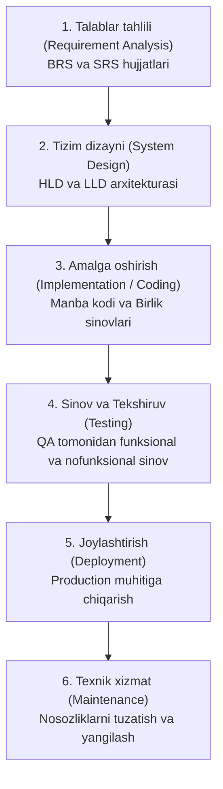

import { Callout } from 'nextra/components'

# Software Development Life Cycle (SDLC): Dasturiy Ta'minotni Ishlab Chiqish Hayotiy Sikli

**Software Development Life Cycle (SDLC)** — dasturiy mahsulotni noldan boshlab to to'liq foydalanishga topshirilgunga va keyingi texnik xizmat ko'rsatishgacha bo'lgan barcha jarayonlarni eng yuqori sifat, minimal xarajat va belgilangan muddatda amalga oshirishni ta'minlovchi tizimli, bosqichma-bosqich boshqaruv modelidir.

SDLC dasturiy ta'minot yaratish jarayonini oldindan rejalashtirilgan va bashorat qilib bo'ladigan intizomli muhandislik amaliyotiga aylantiradi.

---

## SDLC Bosqichlari Zanjiri

---

## SDLC Bosqichlarining Batafsil Mazmuni

### 1. Talablar tahlili (Requirement Gathering & Analysis)
- **Vazifasi:** Loyihaning maqsadi, biznes ehtiyojlari va foydalanuvchilar kutayotgan imkoniyatlar yig'iladi.
- **Ishtirokchilar:** Buyurtmachi, Mahsulot egasi (Product Owner), Biznes tahlilchi (Business Analyst) va QA mutaxassislari.
- **Natija:** BRS (Business Requirement Specification) va SRS (Software Requirement Specification) hujjatlari tasdiqlanadi.

### 2. Tizim dizayni va Arxitekturasi (System Design)
- **Vazifasi:** Dastur qanday arxitektura asosida qurilishi, ma'lumotlar bazasi jadvallari, aloqa protokollari va server quvvatlari belgilanadi.
- **Darajalari:**
  - *High-Level Design (HLD):* Tizimning umumiy arxitekturasi, ma'lumotlar oqimi va xizmatlararo aloqasi.
  - *Low-Level Design (LLD):* Alohida modullar, funksiyalar mantig'i, API interfeyslari va sinflar tuzilishi.

### 3. Kodlash va Dasturlash (Implementation / Coding)
- **Vazifasi:** Dasturchilar tasdiqlangan arxitektura va SRS asosida dasturlash tillarida (Java, Python, C#, JS) amaldagi dasturiy kodni yozadilar.
- **Natija:** Ishchi dasturiy modullar va dasturchilar tomonidan o'tkazilgan birlik sinovlari (Unit Tests).

### 4. Sinov va Sifat Kafolati (Testing)
- **Vazifasi:** QA jamoasi ishlab chiqilgan dasturiy ta'minotning dastlabki talablarga muvofiqligini, barqarorligini, yuklamaga chidamliligini va xavfsizligini tekshiradi.
- **Natija:** Aniqlangan nuqsonlar tuzatiladi, test hisobotlari (Test Summary Report) shakllantiriladi va sifat sertifikatlanadi.

### 5. Ishlab chiqarishga chiqarish (Deployment / Release)
- **Vazifasi:** Sinovdan muvaffaqiyatli o'tgan dastur ishlab chiqarish (Production) serverlariga, do'konlarga (App Store, Google Play) joylashtiriladi va foydalanuvchilarga taqdim etiladi.

### 6. Texnik qo'llab-quvvatlash va Xizmat ko'rsatish (Maintenance)
- **Vazifasi:** Real hayotda mijozlar duch keladigan yangi nosozliklar zudlik bilan bartaraf etiladi, xavfsizlik yangilanishlari va yangi qo'shimcha imkoniyatlar qo'shib boriladi.

<Callout type="info">
  **QA muhandisining o'rni:** Zamonaviy dasturiy ta'minot muhandisligida QA jamoasi faqat 4-bosqichda emas, balki 1-bosqichdanoq (Talablar tahlili paytida) faol ishtirok etadi va talablarni tekshiradi (Verification).
</Callout>
