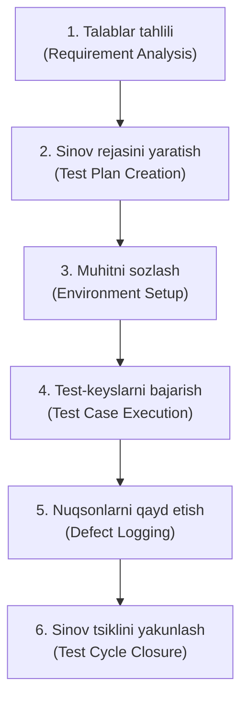

import { Callout } from 'nextra/components'

# Dasturiy Ta'minotni Sinash Hayotiy Davri (STLC)

Dasturiy ta'minotni sinash tartibi **STLC (Software Testing Life Cycle — Dasturiy Ta'minotni Sinash Hayotiy Davri)** deb ham yuritiladi va u sinov jarayonining barcha bosqichlarini o'z ichiga oladi. Sinov jarayoni puxta rejalashtirilgan va tizimli tarzda amalga oshiriladi. Barcha faoliyatlar dasturiy mahsulotning sifatini yaxshilash maqsadida bajariladi.

Keling, STLC ning turli bosqichlarini ko'rib chiqamiz.

Dasturiy ta'minotni sinash hayotiy davri quyidagi asosiy bosqichlardan iborat:
1. **Talablar tahlili (Requirement Analysis)**
2. **Sinov rejasini yaratish (Test Plan Creation)**
3. **Muhitni sozlash (Environment Setup)**
4. **Test-keyslarni bajarish (Test Case Execution)**
5. **Nuqsonlarni qayd etish (Defect Logging)**
6. **Sinov tsiklini yakunlash (Test Cycle Closure)**

---

## 1. Talablar Tahlili (Requirement Analysis)

Qo'lda sinash (manual testing) jarayonining birinchi qadami talablar tahlili hisoblanadi. Ushbu bosqichda tester mijoz tomonidan bildirilgan talablarni o'rganish uchun SDLC (Dasturiy ta'minotni ishlab chiqish hayotiy davri) ning talablar hujjatini tahlil qiladi. Talablarni chuqur o'rganib chiqqach, tester dastur talablarga javob berayotganligi yoki yo'qligini tekshirish uchun sinov rejasini tuzadi.

| Bo'lim | Tafsiloti |
| :--- | :--- |
| **Kirish mezonlari (Entry Criteria)** | Sinov rejasini tuzish uchun talablar spetsifikatsiyasi, ilova arxitekturasi hujjati hamda aniq belgilangan qabul mezonlari (acceptance criteria) mavjud bo'lishi kerak. |
| **Bajariladigan ishlar (Activities)** | • Barcha talablar va tushunarsiz savollar ro'yxatini tayyorlash hamda ularni texnik rahbar (Lead), tizim arxitektori, biznes tahlilchi va mijoz bilan hal qilish. • O'tkazilishi lozim bo'lgan barcha sinov turlari (Unumdorlik, Funksional va Xavfsizlik) ro'yxatini shakllantirish. • Test-keyslarni bajarish uchun kerak bo'ladigan barcha vositalarni o'z ichiga olgan sinov muhiti tafsilotlari ro'yxatini tayyorlash. |
| **Natijaviy hujjatlar (Deliverables)** | Sinovdan o'tkaziladigan talablar uchun zarur barcha sinovlar ro'yxati hamda Sinov muhiti tafsilotlari. |

---

## 2. Sinov Rejasini Yaratish (Test Plan Creation)

Sinov rejasini yaratish — STLC ning eng muhim bosqichi bo'lib, unda barcha sinov strategiyalari belgilanadi. Tester butun loyiha uchun sarflanadigan taxminiy mehnat va xarajatlarni aniqlaydi. Ushbu bosqich Talablar tahlili bosqichi muvaffaqiyatli yakunlangach boshlanadi. Sinov strategiyasi va mehnat sarfini baholash hujjatlari ushbu bosqichda taqdim etiladi. Test-keyslarni bajarish faqat sinov rejasini yaratish muvaffaqiyatli yakunlangandan keyingina boshlanishi mumkin.

| Bo'lim | Tafsiloti |
| :--- | :--- |
| **Kirish mezonlari (Entry Criteria)** | Talablar hujjati (Requirement Document). |
| **Bajariladigan ishlar (Activities)** | • Dasturiy ta'minotning maqsadi hamda qamrov doirasini (scope) belgilash. • Sinovda qo'llaniladigan usullarni ro'yxatga olish. • Sinov jarayonining umumiy ko'rinishi (sharhi). • Sinov muhitini belgilash. • Sinov jadvallari va nazorat tartib-qoidalarini tayyorlash. • Rollar va mas'uliyatlarni taqsimlash. • Sinov natijalari (deliverables) ro'yxatini tuzish va mavjud xatarlarni aniqlash. |
| **Natijaviy hujjatlar (Deliverables)** | • Sinov strategiyasi hujjati (Test strategy document). • Sinov mehnat sarfini baholash hujjatlari (Testing effort estimation documents). |

---

## 3. Muhitni Sozlash (Environment Setup)

Sinov muhitini sozlash mustaqil faoliyat turi bo'lib, uni test-keyslarni ishlab chiqish bilan parallel ravishda boshlash mumkin. Bu qo'lda sinash jarayonining ajralmas qismidir, chunki muhitsiz sinovni amalga oshirib bo'lmaydi. Muhitni sozlash test muhitini yaratish uchun zarur bo'lgan apparat va dasturiy ta'minotlar majmuasini talab qiladi. Test jamoasi sinov muhitini o'rnatishda bevosita ishtirok etmaydi, uni odatda katta (senior) dasturchilar yaratadilar.

| Bo'lim | Tafsiloti |
| :--- | :--- |
| **Kirish mezonlari (Entry Criteria)** | • Sinov strategiyasi va sinov rejasi hujjati. • Test-keyslar hujjati. • Sinov ma'lumotlari (Testing data). |
| **Bajariladigan ishlar (Activities)** | • Talablar spetsifikatsiyasini tahlil qilish orqali dasturiy va apparat ta'minoti ro'yxatini tayyorlash. • Sinov muhiti o'rnatilgach, muhitning sinovga tayyorligini tekshirish uchun Smoke test-keyslarni bajarish. |
| **Natijaviy hujjatlar (Deliverables)** | • Sinovni bajarish hisoboti (Execution report). • Nuqsonlar hisoboti (Defect report). |

---

## 4. Test-keyslarni Bajarish (Test Case Execution)

Test-keyslarni bajarish sinovni rejalashtirish muvaffaqiyatli yakunlangach amalga oshiriladi. Ushbu bosqichda test jamoasi test-keyslarni ishlab chiqish va ularni bajarish faoliyatini boshlaydi. Test jamoasi batafsil test-keyslarni yozadi, shuningdek, agar kerak bo'lsa, sinov ma'lumotlarini (test data) tayyorlaydi. Tayyorlangan test-keyslar jamoa a'zolari (peer review) yoki Sifat Nazorati rahbari (QA Lead) tomonidan ko'rib chiqiladi.

Ushbu bosqichda **RTM (Requirement Traceability Matrix — Talablarning Kuzatuvchanlik Matrisasi)** ham tayyorlanadi. RTM sanoat darajasidagi format bo'lib, talablarni kuzatib borish uchun ishlatiladi. Har bir test-keys talablar spetsifikatsiyasi bilan bog'lanadi (xaritaga tushiriladi). RTM orqali orqaga va oldinga qarab kuzatuvchanlikni (backward & forward traceability) amalga oshirish mumkin.

| Bo'lim | Tafsiloti |
| :--- | :--- |
| **Kirish mezonlari (Entry Criteria)** | Talablar hujjati (Requirement Document). |
| **Bajariladigan ishlar (Activities)** | • Test-keyslarni yaratish. • Test-keyslarni bajarish. • Test-keyslarni talablarga moslashtirish (bog'lash). |
| **Natijaviy hujjatlar (Deliverables)** | • Sinov ijro natijasi (Test execution result). • Nuqsonlarning batafsil tushuntirishiga ega funksiyalar ro'yxati. |

---

## 5. Nuqsonlarni Qayd Etish (Defect Logging)

Testerlar va dasturchilar dasturiy ta'minotning yakunlanish mezonlarini test qamrovi, sifati, vaqt sarfi, xarajatlar va muhim biznes maqsadlari asosida baholaydilar. Ushbu bosqich dasturiy ta'minotning xarakteristikalari va kamchiliklarini aniqlaydi. Test-keyslar va xatoliklar hisoboti (bug reports) nuqson turi hamda uning jiddiyligini (severity) aniqlash uchun chuqur tahlil qilinadi.

Nuqsonlarni qayd etish tahlili asosan xatoliklarning jiddiyligi va turlariga qarab taqsimlanishini aniqlash uchun ishlaydi. Agar biror nuqson aniqlansa, dastur xatolikni tuzatish uchun ishlab chiqish jamoasiga qaytariladi, so'ngra dasturiy ta'minot sinovning barcha jihatlari bo'yicha qayta sinovdan (re-test) o'tkaziladi.

Sinov tsikli to'liq tugagach, testni yakunlash hisoboti va test metrikalari tayyorlanadi.

| Bo'lim | Tafsiloti |
| :--- | :--- |
| **Kirish mezonlari (Entry Criteria)** | • Test-keyslarni bajarish hisoboti. • Nuqsonlar hisoboti (Defect report). |
| **Bajariladigan ishlar (Activities)** | • Dasturning tugallanish mezonlarini test qamrovi, sifati, vaqt sarfi, xarajati va muhim biznes maqsadlari asosida baholash. • Xatoliklarni turlari va jiddiyligiga ajratish orqali ularning taqsimlanishini aniqlash. |
| **Natijaviy hujjatlar (Deliverables)** | • Yakuniy hisobot (Closure report). • Test metrikalari (Test metrics). |

---

## 6. Sinov Tsiklini Yakunlash (Test Cycle Closure)

Sinov tsiklini yakunlash hisoboti dasturiy ta'minot dizayni, ishlab chiqilishi, sinov natijalari va nuqsonlar hisoboti bilan bog'liq barcha hujjatlarni o'z ichiga oladi.

Ushbu bosqich kelajakda xuddi shunday spetsifikatsiyaga ega dasturiy ta'minot ishlab chiqilsa, ushbu amaliyotlardan foydalanish maqsadida ishlab chiqish strategiyasini, sinov tartibini va ehtimoliy nuqsonlarni baholaydi.

| Bo'lim | Tafsiloti |
| :--- | :--- |
| **Kirish mezonlari (Entry Criteria)** | Dasturiy ta'minotga oid barcha hujjatlar va hisobotlar. |
| **Bajariladigan ishlar (Activities)** | Xuddi shunday spetsifikatsiyaga ega dastur bo'lganda kelajakda ushbu amaliyotlardan foydalanish uchun ishlab chiqish strategiyasi, sinov tartibi va ehtimoliy nuqsonlarni baholash. |
| **Natijaviy hujjatlar (Deliverables)** | Sinovni yakunlash hisoboti (Test closure report). |
