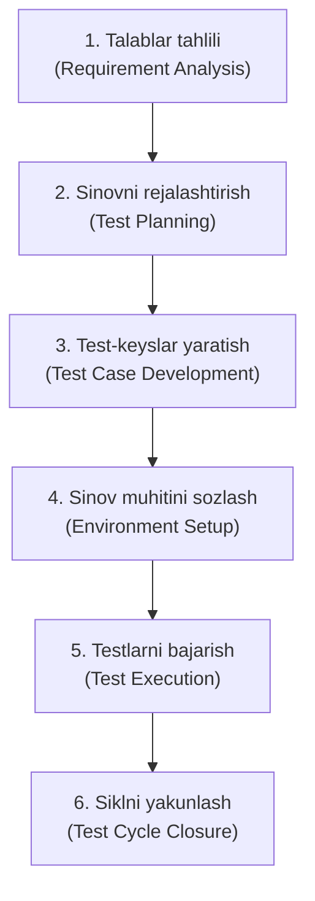

import { Callout } from 'nextra/components'

# Software Testing Life Cycle (STLC): Dasturiy Sinov Hayotiy Sikli

**Software Testing Life Cycle (STLC)** — dasturiy ta'minotning sifatini kafolatlash maqsadida faqat sinov faoliyatiga yo'naltirilgan, har biri aniq kirish va chiqish mezonlariga ega bo'lgan bosqichma-bosqich jarayonlar ketma-ketligidir.

STLC dasturiy ta'minotni ishlab chiqish sikli (SDLC) ichida mustaqil ravishda harakatlanadi va sinovlarning tizimli, o'lchanadigan hamda to'liq bo'lishini ta'minlaydi.

---

## STLC Bosqichlari Arxitekturasi

---

## STLC ning 6 Bosqichi Tafsiloti

### 1. Requirement Analysis (Talablar Tahlili)
- **Mazmuni:** QA jamoasi funksional va nofunksional talablarni batafsil tahlil qiladi, sinovdan o'tkazilishi mumkin bo'lgan (testable) talablarni aniqlaydi va noaniq joylar bo'yicha biznes tahlilchilarga savollar ro'yxatini (RFI / Query List) taqdim etadi.
- **Natijaviy hujjat:** RTM (Kuzatuvchanlik matrisasi qoralamasi), Talablar bo'yicha savol-javob qaydlari.

### 2. Test Planning (Sinovni Rejalashtirish)
- **Mazmuni:** QA rahbari (Test Lead / QA Manager) sinov strategiyasini, ko'lamini (Scope), zaruriy resurslar, muddatlar, sinov muhiti talablari va xatarlarni belgilaydi.
- **Natijaviy hujjat:** Test Plan (Sinov rejasi — IEEE 829 standarti), Vaqt va mehnat sarfi baholashi (Test Estimation).

### 3. Test Case Development (Test-keyslarni Ishlab Chiqish)
- **Mazmuni:** QA muhandislari talablar asosida batafsil sinov ssenariylari (Test Scenarios), test-keyslar (Test Cases) va kerakli sinov ma'lumotlarini (Test Data) tayyorlaydilar.
- **Natijaviy hujjat:** Tasdiqlangan Test-keyslar to'plami, Test ma'lumotlari.

### 4. Test Environment Setup (Sinov Muhitini Sozlash)
- **Mazmuni:** Sinovdan o'tkaziladigan dastur uchun serverlar, ma'lumotlar bazalari, tarmoq parametrlari va test asboblari o'rnatiladi va sozlanadi. Tizimning ishlashini dastlabki tekshirish uchun Smoke-test o'tkaziladi.
- **Natijaviy hujjat:** Ishga tayyor Test muhiti, Smoke-test natijalari.

### 5. Test Execution (Testlarni Bajarish)
- **Mazmuni:** QA muhandislari test-keyslarni belgilangan muhitda qadamma-qadam bajaradilar. Aniqlangan xatoliklar (Bug) tizimga (Jira, Bugzilla) kiritiladi, dasturchilar tuzatgach qayta tekshiriladi (Retest) va regressiya sinovlari o'tkaziladi.
- **Natijaviy hujjat:** Bajarilgan testlar hisoboti, Xatolik hisobotlari (Bug Reports).

### 6. Test Cycle Closure (Sinov Siklini Yakunlash)
- **Mazmuni:** Sinov muddati tugagach, jamoa erishilgan sifat natijalarini, qamrov foizini, qoldiq xatarlarni tahlil qiladi va xulosaviy hisobot tayyorlaydi. O'tkazilgan sinov darslari (Lessons learned) jamlanadi.
- **Natijaviy hujjat:** Test Summary Report (Yakuniy hisobot), Sifat ko'rsatkichlari metrikalari.

---

## Kirish va Chiqish Mezonlari (Entry & Exit Criteria)

Har bir STLC bosqichining sifatini kafolatlash uchun ikki asosiy mezon belgilanadi:
- **Kirish mezoni (Entry Criteria):** Muayyan bosqichni boshlash uchun nimalar tayyor bo'lishi shartligi (masalan: Testlarni bajarishni boshlash uchun dasturchilardan barqaror yig'ilma va tayyor muhit talab etiladi).
- **Chiqish mezoni (Exit Criteria):** Bosqichni yakunlangan deb hisoblash uchun qanday shartlar bajarilishi kerakligi (masalan: barcha kritik Blocker xatoliklar 100% yopilgan bo'lishi shart).
