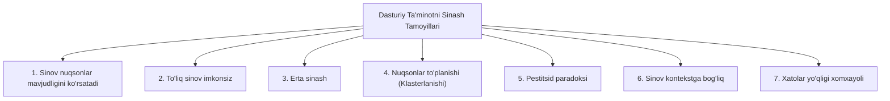

import { Callout } from 'nextra/components'

# Dasturiy Ta'minotni Sinash Tamoyillari

Dasturiy ta'minotni sinash — dastur yoki ilovadagi nuqson va xatoliklarni (bug) aniqlash uchun uni amalda ishga tushirish hamda tekshirish jarayonidir. Dasturiy ta'minot yoki ilovani samarali sinash uchun mahsulotni nuqsonlardan xoli qilishga yordam beruvchi muayyan tamoyillarga amal qilishimiz zarur. Ushbu qoidalar test muhandislariga (QA) o'z vaqti va kuch-g'ayratini to'g'ri taqsimlagan holda dasturni puxta tekshirish imkonini beradi. Mazkur bo'limda biz dasturiy ta'minotni sinashning 7 ta muhim tamoyilini o'rganamiz.

Keling, sinovning ushbu 7 ta asosiy tamoyilini birma-bir ko'rib chiqamiz:

1. **Sinov nuqsonlar mavjudligini ko'rsatadi (Testing shows the presence of defects)**
2. **To'liq (tugallangan) sinov o'tkazish imkonsiz (Exhaustive Testing is not possible)**
3. **Erta sinash (Early Testing)**
4. **Nuqsonlarning to'planishi (Defect Clustering)**
5. **Pestitsid paradoksi (Pesticide Paradox)**
6. **Sinov kontekstga bog'liqdir (Testing is context-dependent)**
7. **Xatoliklarning yo'qligi haqidagi xomxayol (Absence of errors fallacy)**

---

## 1. Sinov Nuqsonlar Mavjudligini Ko'rsatadi (Testing shows the presence of defects)

Test muhandisi ilovada hech qanday xatolik yoki nuqson yo'qligiga ishonch hosil qilish uchun uni sinovdan o'tkazadi. Biroq, sinov jarayonida biz faqatgina ilova yoki dasturda xatoliklar borligini aniqlashimiz mumkin. Sinovning asosiy maqsadi — turli xil usullar va sinov texnikalari yordamida noma'lum xatoliklar (bug) sonini aniqlashdir. Chunki butun sinov jarayoni buyurtmachi talablariga muvofiq kuzatib borilishi (traceable) lozim, ya'ni mahsulotning mijoz ehtiyojlarini qondirolmay qolishiga sabab bo'ladigan har qanday nuqsonlarni fosh etish kerak.

Har qanday ilovani sinovdan o'tkazish orqali biz xatoliklar sonini kamaytira olamiz, biroq bu dastur nuqsonlardan mutlaq xoli ekanligini anglatmaydi. Chunki ba'zan uning ustida bir necha turdagi sinovlar o'tkazilayotganda dasturiy ta'minot mutlaqo xatosizdek ko'rinishi mumkin. Ammo mahsulot ishchi serverga (production server) o'rnatilganda (deployment), yakuniy foydalanuvchi sinov jarayonida topilmagan yangi xatoliklarga duch kelishi ehtimoli doimo saqlanib qoladi.

---

## 2. To'liq (Tugallangan) Sinov O'tkazish Imkonsiz (Exhaustive Testing is not possible)

Haqiqiy sinov jarayonida barcha modullarni va ularning funksiyalarini kiritiladigan ma'lumotlarning barcha mumkin bo'lgan to'g'ri va noto'g'ri kombinatsiyalari orqali tekshirib chiqish ba'zan o'ta mushkul yoki imkonsizdir.

Shu sababli, to'liq (barcha ehtimollarni qamrab oluvchi) sinovni amalga oshirish haddan tashqari cheksiz kuch-g'ayrat talab qilishi va bu mehnating ko'p qismi samarasiz bo'lishi sababli, biz sinovlarni modullarning muhimlik darajasiga (prioritetiga) qarab tashkil qilamiz. Chunki mahsulotni yetkazib berish muddatlari (deadline) bizga barcha sinov ssenariylarini to'liq bajarishga imkon bermaydi.

---

## 3. Erta Sinash (Early Testing)

Bu yerda erta sinash deganda, dasturiy ta'minotni ishlab chiqish hayotiy davrining (SDLC) eng dastlabki — talablarni tahlil qilish bosqichidanoq barcha sinov harakatlarini boshlash tushuniladi. Chunki xatoliklarni dastlabki bosqichlarda topsak, ular o'sha zahotiyoq bartaraf etiladi. Bu esa sinov jarayonining keyingi bosqichlarida aniqlanadigan xatoliklarni tuzatishga qaraganda ancha kam xarajat talab qiladi.

Sinovni amalga oshirish uchun bizga talablar spetsifikatsiyasi hujjatlari kerak bo'ladi. Shuning uchun, agar talablar noto'g'ri yoki noaniq shakllantirilgan bo'lsa, ularni keyingi bosqichlarda — ya'ni ishlab chiqish (kodlash) davrida emas, balki to'g'ridan-to'g'ri talablar bosqichidayoq tuzatish maqsadga muvofiqdir.

---

## 4. Nuqsonlarning To'planishi (Defect clustering)

Nuqsonlarning to'planishi (klasterlanishi) shuni anglatadiki, sinov jarayonida biz aniqlaydigan xatoliklarning katta qismi tizimning kam sonli modullariga bog'liq bo'ladi. Buning turli sabablari bor: masalan, ushbu modullar haddan tashqari murakkab bo'lishi, dasturlash kodi chalkash tuzilganligi va boshqa omillar.

Bunday dasturiy ta'minot yoki ilovalar **Pareto tamoyili**ga (80/20 qoidasi) amal qiladi. Unga ko'ra, taxminan 80 foiz murakkablik va xatoliklar ilovaning atigi 20 foiz modullarida mujassamlashgan bo'ladi. Ushbu tamoyil yordamida biz xavfli va noaniq modullarni oldindan aniqlay olamiz. Biroq bu usulning ham o'ziga xos qiyinchiliklari bor: agar bir xil testlar muntazam ravishda bajarilsa, ular tizimda yangi paydo bo'ladigan nuqsonlarni aniqlay olmay qoladi.

---

## 5. Pestitsid Paradoksi (Pesticide paradox)

Ushbu tamoyilga ko'ra, agar biz muayyan vaqt davomida bir xil test-keyslar to'plamini qayta-qayta ishga tushiraversak, bunday testlar dastur yoki ilovadagi yangi paydo bo'lgan xatoliklarni topishga ojizlik qilib qoladi. Ushbu pestitsid paradoksini yengib o'tish uchun barcha test-keyslarni doimiy ravishda qayta ko'rib chiqish va yangilab borish nihoyatda muhimdir.

Dasturiy ta'minot yoki ilovaning turli qismlarini amalda sinash uchun yangi va bir-biridan farq qiluvchi testlarni yozish zarur bo'lib, bu bizga ko'proq xatoliklarni aniqlashga ko'maklashadi.

---

## 6. Sinov Kontekstga Bog'liqdir (Testing is context-dependent)

Sinov kontekstga bog'liq degan tamoyil shuni ta'kidlaydiki, bugungi kunda bozorda turli sohalarga oid ilovalar — elektron tijorat (e-commerce) veb-saytlari, tijoriy korporativ tizimlar va boshqa ko'plab yo'nalishlar mavjud. Tijoriy saytni hamda elektron tijorat saytlarini sinashning o'ziga xos aniq uslublari mavjud, chunki har bir ilova o'zining shaxsiy ehtiyojlari, o'ziga xos xususiyatlari va funksionalligiga ega.

Bunday turdagi ilovalarni tekshirish uchun biz turli xil sinov turlari, turlicha texnikalar, yondashuvlar va bir qancha usullardan foydalanamiz. Binobarin, sinov jarayoni bevosita ilovaning qaysi soha va kontekstga tegishli ekanligiga bog'liqdir.

---

## 7. Xatoliklarning Yo'qligi Haqidagi Xomxayol (Absence of errors fallacy)

Agar ilova to'liq sinovdan o'tkazilgan bo'lsa va mahsulot ommaga taqdim etilishidan (release) oldin unda hech qanday xatolik aniqlanmagan bo'lsa, biz ilovani 99 foiz nuqsonlardan xoli deb aytishimiz mumkin. Ammo ilova noto'g'ri shakllantirilgan talablar asosida sinovdan o'tkazilgan bo'lsa, nuqsonlarni aniqlash va ularni belgilangan muddatda tuzatish hech qanday naf keltirmaydi. Chunki sinov mijozning haqiqiy talablariga to'g'ri kelmaydigan noto'g'ri spetsifikatsiya bo'yicha amalga oshirilgan bo'ladi.

Xatoliklarning yo'qligi haqidagi xomxayol shuni bildiradiki: agar ilova foydalanish uchun noqulay bo'lsa hamda mijozning haqiqiy ehtiyojlari va talablarini bajara olmasa, undagi xatoliklarni topish va tuzatish mahsulotni muvaffaqiyatli qila olmaydi.
