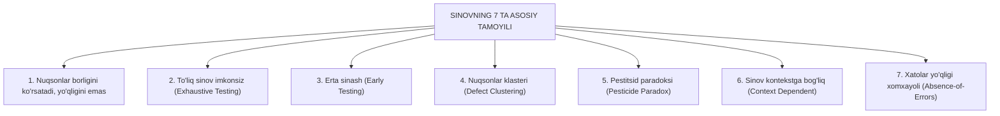

import { Callout } from 'nextra/components'

# Software Testing Principles: Sinovning 7 ta Asosiy Tamoyili

Dasturiy ta'minotni sinash shunchaki tajriba yoki tasodifiy qadamlarga emas, balki xalqaro **ISTQB (International Software Testing Qualifications Board)** tomonidan rasmiylashtirilgan va **TpointTech** dasturida bayon etilgan 7 ta fundamental qoidaga (tamoyilga) asoslanadi.

Ushbu tamoyillarni bilish QA muhandisiga xatolarga yo'l qo'ymaslik, vaqtni to'g'ri taqsimlash va loyihada to'g'ri sinov strategiyasini qurish imkonini beradi.

---

## Sinovning 7 ta Fundamental Tamoyili

---

## 1. Sinov Nuqsonlar Borligini Ko'rsatadi, Yo'qligini Emas

Sinov o'tkazish orqali dasturdagi mavjud nuqsonlarni topish va ularning sonini kamaytirish mumkin. Biroq, agar barcha testlar muvaffaqiyatli o'tsa ham, bu **"dasturda umuman xatolik qolmagan"** degan ma'noni anglatmaydi.
- *Xulosa:* QA muhandisi hech qachon "Dastur 100% bugsiz" deb kafolat bera olmaydi. Sinov faqat ochilmagan nuqsonlar ehtimolini kamaytiradi.

---

## 2. To'liq (Tugallangan) Sinov Imkonsiz

Dasturdagi barcha mumkin bo'lgan kiruvchi ma'lumotlar, bosilishi mumkin bo'lgan tugmalar va shartlar kombinatsiyasini (Exhaustive Testing) to'liq tekshirib chiqish cheksiz vaqt va resurs talab qiladi.
- *Misol:* Oddiygina 10 ta belgilik matn maydoniga harflar, raqamlar, probellar va maxsus belgilarni kiritish $10^{15}$ dan ortiq kombinatsiyani keltirib chiqaradi.
- *Yechim:* Barcha kombinatsiyalarni sinash o'rniga xatarlarni tahlil qilish (Risk-based testing) hamda test dizayn texnikalari (BVA, Equivalence Partitioning) qo'llaniladi.

---

## 3. Erta Sinash (Early Testing)

Sinov faoliyati dastur kodi yozilib bo'lishini kutmasdan, loyihaning eng birinchi bosqichida — talablar tahlili (Requirement Analysis) paytidayoq boshlanishi shart.
- *Nima uchun?* Talablardagi noaniqlik yoki xatolikni hujjat darajasidayoq tuzatish bir necha daqiqa vaqt oladi. Agar ushbu xato kodga aylanib, keyin ishlab chiqarishda aniqlansa, uni tuzatish xarajati yuz barobargacha ortadi.

---

## 4. Nuqsonlar To'planishi (Defect Clustering / Pareto Qonuni)

Amaliyotda dasturdagi nuqsonlarning qariyb **80% qismi tizim modullarining atigi 20% qismida** to'planadi (Pareto qoidasi).
- Tizimning eng murakkab, eng ko'p matematik hisob-kitoblarga yoki tashqi integratsiyalarga ega bo'lgan bir yoki ikki moduli asosiy xatoliklar manbai bo'ladi.
- *QA harakati:* Sinov resurslari aynan ushbu "xatarli klasterlar"ga ko'proq yo'naltirilishi lozim.

---

## 5. Pestitsid Paradoksi (Pesticide Paradox)

Agar qishloq xo'jaligida ekinlarga bir xil pestitsid dori qayta-qayta sepilsa, zararkunanda hasharotlar unga ko'nikib, o'lmaydigan bo'lib qoladi.
- Xuddi shuningdek, agar QA jamoasi har doim bir xil test-keyslarni takroran ishga tushiraversa, ushbu testlar yangi paydo bo'lgan nuqsonlarni aniqlay olmay qoladi.
- *Yechim:* Test-keyslar va avtomatlashtirilgan skriptlar doimiy ravishda yangilanib, yangi ssenariylar bilan boyitib borilishi shart.

---

## 6. Sinov Kontekstga Bog'liqdir (Context Dependent)

Hamma dasturlar bir xil tarzda sinovdan o'tkazilmaydi. Sinov usuli, chuqurligi va vositalari loyihaning tabiatiga qarab tubdan farq qiladi.
- Oddiy ma'lumot beruvchi blog yoki yangiliklar saytini sinash uslubi bilan, inson salomatligiga mas'ul bo'lgan tibbiyot apparati dasturini yoki millionlab tranzaksiyalarni o'tkazuvchi bank ilovasini sinash mutlaqo boshqa-boshqa yondashuvlarni talab qiladi.

---

## 7. Xatoliklarning Yo'qligi Haqidagi Xomxayol (Absence-of-Errors Fallacy)

Agar dastur barcha testlardan 100% xatosiz o'tgan bo'lsa-yu, ammo u mijozning haqiqiy biznes ehtiyojlarini qondirmasa yoki foydalanuvchiga umuman kerak bo'lmasa — bu dastur muvaffaqiyatsiz hisoblanadi.
- Tizim shunchaki "xatosiz" bo'lishi kifoya emas, u eng avvalo **foydalanuvchi talab qilgan to'g'ri vazifani bajarishi shart** (Validation tamoyili).
