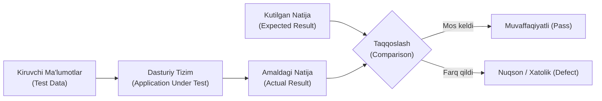

import { Callout } from 'nextra/components'

# Software Testing Tutorial: Dasturiy Ta'minotni Sinash Bo'yicha Boshlang'ich Qo'llanma

**Software Testing (Dasturiy ta'minotni sinash)** — bu dasturiy mahsulotning belgilangan talablarga to'liq mos kelishini aniqlash, uning xatolar va kamchiliklardan xoli ekanligini baholash hamda barcha xususiyatlarini (ishonchlilik, xavfsizlik, unumdorlik, qulaylik) tekshirishga qaratilgan tizimli jarayondir.

Dasturiy ta'minot sinovi har bir axborot texnologiyalari loyihasining ajralmas qismidir, chunki sinovdan o'tkazilmagan dasturni foydalanuvchilarga topshirish jiddiy moliyaviy, obro'-e'tibor va hatto inson hayotiga daxldor xatarlarni keltirib chiqaradi.

---

## 1. Sinov (Testing) O'zi Nima?

**Sinov** — bu dasturiy ta'minotni oldindan belgilangan ssenariylar asosida ishga tushirish, uning amaldagi xatti-harakatini kutilgan natija bilan solishtirish va mavjud nuqsonlarni (defektlarni) fosh etish texnikalari majmuidir.

Sinovning bosh maqsadi — dasturning barcha sharoitlarda mukammal ishlashini isbotlash emas, balki **uning qaysi sharoitlarda xato ishlashini yoki ishlamay qolishini aniqlash va tuzatishga erishishdir**.

---

## 2. Nima Uchun Dasturiy Ta'minotni Sinash Shart?

Dasturiy ta'minot insonlar tomonidan yaratiladi, inson esa tabiatan charchaydi, noaniq tushunadi yoki adashadi. Shu sababli dasturiy kodda nuqsonlar bo'lishi tabiiydir.

Sinovning zarurligini quyidagi 4 omil belgilaydi:
1. **Moliyaviy yo'qotishlarning oldini olish:** Ishlab chiqarishga (Production) chiqib ketgan bitta xatolik kompaniyaga millionlab dollar zarar keltirishi mumkin. Tarixda 2012 yilda *Knight Capital* kompaniyasi dasturdagi 45 daqiqalik xatolik tufayli 440 million dollar yo'qotgan.
2. **Foydalanuvchilar ishonchi va obro' (Reputation):** Agar bank ilovasi yoki to'lov tizimi bir necha daqiqa ishlamay qolsa, mijozlar raqobatchi xizmatlarga o'tib ketadilar.
3. **Xavfsizlik (Security):** Sinov dasturda yashirin teshiklar, zaifliklar va xakerlar kirishi mumkin bo'lgan ochiq eshiklar yo'qligini kafolatlaydi.
4. **Mahsulot sifati (Quality Assurance):** Mahsulotning uzoq muddat barqaror va kengayuvchan ishlashini ta'minlaydi.

---

## 3. Dasturiy Ta'minot Sifatining Asosiy Atributlari

Sinov jarayonida dastur quyidagi 5 ta muhim sifat mezoni bo'yicha baholanadi:

| Sifat Atributi | Mezon Mazmuni |
| :--- | :--- |
| **Ishonchlilik (Reliability)** | Tizimning belgilangan vaqt davomida uzluksiz va barqaror ishlay olish qobiliyati. |
| **Kengayuvchanlik (Scalability)** | Foydalanuvchilar va ma'lumotlar hajmi keskin oshganda tizimning yuklamani ko'tara olishi. |
| **Ko'chuvchanlik (Portability)** | Dasturning turli xil operatsion tizimlar, brauzerlar va qurilmalarda bir xil ishlashi. |
| **Qulaylik (Usability)** | Interfeysning intuitiv, o'rganishga oson va foydalanuvchi uchun yoqimli bo'lishi. |
| **Qayta ishlatiluvchanlik (Reusability)** | Dasturiy modullarning boshqa tizimlarda ham qo'shimcha o'zgarishsiz ishlatila olinishi. |

---

## 4. Dasturiy Sinovning Birlamchi Turlari

Bajarilish uslubiga ko'ra dasturiy ta'minot sinovi ikki asosiy yo'nalishga ajratiladi:

1. **Manual Testing (Qo'lda sinash):** QA muhandisining o'zi dastur bilan foydalanuvchi sifatida bevosita muloqot qiladi, tugmalarni bosadi va natijalarni qo'lda tekshiradi.
2. **Automation Testing (Avtomatlashtirilgan sinov):** Oldindan yozilgan test skriptlari (Playwright, Selenium, JMeter) orqali testlarni kompyuter tezligida, inson aralashuvisiz bajarish.

<Callout type="info">
  **O'rganish uchun talablar (Prerequisites):** Dasturiy ta'minotni sinash sohasini mukammal egallash uchun kompyuter savodxonligi, mantiqiy fikrlash, algoritmlar asoslari hamda ingliz tilidagi texnik atamalarni tushunish yetarlidir.
</Callout>
