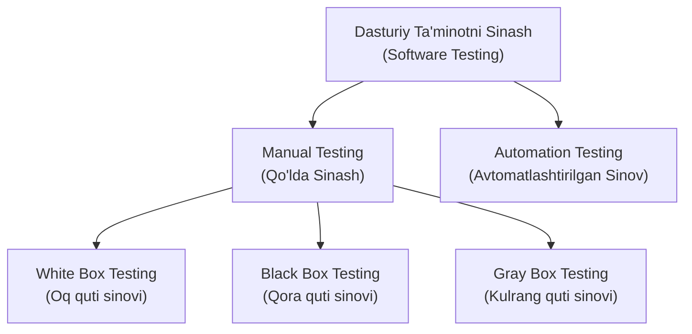

import { Callout } from 'nextra/components'

# Dasturiy Ta'minotni Sinash Qo'llanmasi (Software Testing Tutorial)

Ushbu dasturiy ta'minotni sinash qo'llanmasi dasturiy ta'minotni sinashning boshlang'ich va ilg'or tushunchalarini taqdim etadi. Bizning dasturiy ta'minotni sinash bo'yicha qo'llanmamiz yangi boshlovchilar hamda tajribali mutaxassislar uchun mo'ljallangan.

Dasturiy ta'minotni sinash axborot texnologiyalarida keng qo'llaniladigan soha hisoblanadi, chunki har bir dasturiy ta'minotni ishlab chiqarishga (deployment) chiqarishdan oldin uni to'liq sinovdan o'tkazish majburiydir.

Bizning dasturiy ta'minotni sinash qo'llanmamiz sinov sohasining barcha mavzularini o'z ichiga oladi: usullar (Black Box Testing — Qora quti sinovi, White Box Testing — Oq quti sinovi, Visual Box Testing — Vizual quti sinovi va Gray Box Testing — Kulrang quti sinovi); sinov darajalari (Unit Testing — Birlik sinovi, Integration Testing — Integratsion sinov, Regression Testing — Regressiya sinovi, Functional Testing — Funksional sinov, System Testing — Tizimli sinov, Acceptance Testing — Qabul sinovi, Alpha Testing, Beta Testing, Non-Functional Testing — Nofunksional sinov, Security Testing — Xavfsizlik sinovi, Portability Testing — Ko'chuvchanlik sinovi).

---

## Dasturiy Ta'minotni Sinash Nima? (What is Software Testing)

**Dasturiy ta'minotni sinash** — dasturning barcha sifat atributlarini (Ishonchlilik, Kengayuvchanlik, Ko'chuvchanlik, Qayta ishlatiluvchanlik, Qulaylik) inobatga olgan holda uning to'g'riligini aniqlash hamda dasturiy xatolar, nuqsonlar yoki defektlarni topish maqsadida dasturiy komponentlarning bajarilishini baholash jarayonidir.

Dasturiy ta'minotni sinash dasturga mustaqil va xolisona nigoh bilan qarash imkonini beradi hamda uning foydalanishga to'liq yaroqli ekanligiga kafolat beradi. U barcha komponentlarning belgilangan xizmatlar doirasida kerakli talablarni qondirayotganligi yoki yo'qligini tasdiqlash uchun ularni sinashni qamrab oladi. Bu jarayon, shuningdek, buyurtmachiga dasturiy ta'minotning sifati haqida to'liq va ishonchli ma'lumot taqdim etadi.

Sinov o'tkazish majburiydir, chunki yetarli darajada sinovdan o'tkazilmagani sababli dastur biror vaqt ishdan chiqsa, bu o'ta xavfli vaziyatni keltirib chiqarishi mumkin. Shu sababli, sinovdan o'tkazilmagan dasturiy ta'minot yakuniy foydalanuvchiga topshirilishi mumkin emas.

---

## Sinov O'zi Nima? (What is Testing)

**Sinov** — oldindan belgilangan ssenariylar asosida ilovaning to'g'riligini aniqlovchi texnikalar majmuidir, ammo sinov dasturdagi barcha nuqsonlarni mutlaq topib berishga qodir emas. Sinovning bosh niyati — ilovadagi nosozliklarni (failure) fosh etish, toki bu nosozliklar o'z vaqtida aniqlanib, to'g'rilansin. Sinov mahsulotning barcha sharoitlarda to'g'ri ishlashini isbotlamaydi, balki uning aynan qaysi muayyan sharoitlarda ishlamay qolishini ko'rsatib beradi.

Sinov dasturning xatti-harakati va holatini taqqoslash mexanizmlari bilan solishtirish imkonini beradi, chunki muammoni faqatgina mezonlar orqali tanib olish mumkin. Ushbu mexanizm aynan shu mahsulotning o'tmishdagi versiyalarini, o'xshash raqobatchi mahsulotlarni, kutilayotgan maqsadli interfeyslarni, tegishli standartlarni yoki boshqa mezonlarni o'z ichiga olishi mumkin, ammo bular bilan cheklanmaydi.

Sinov manba kodini tekshirishni hamda kodni turli muhitlarda, turli sharoitlarda ishga tushirishni va kodning barcha tahliliy jihatlarini ko'rib chiqishni qamrab oladi. Hozirgi dasturiy ta'minotni ishlab chiqish amaliyotida sinov jamoasi dasturchilar jamoasidan mustaqil faoliyat yuritishi mumkin, buning natijasida sinovdan olingan xolis axborot dasturiy ta'minotni ishlab chiqish jarayonining o'zini to'g'rilash va takomillashtirish uchun xizmat qiladi.

Dasturiy ta'minotning muvaffaqiyati uning maqsadli auditoriyasi tomonidan qabul qilinishiga, qulay grafik foydalanuvchi interfeysiga, kuchli funksionallik va yuklama sinovlariga bog'liqdir. Masalan, bank sohasining auditoriyasi video o'yinlar auditoriyasidan tubdan farq qiladi. Shuning uchun tashkilot dasturiy mahsulot ishlab chiqarayotganda, ushbu mahsulot o'z xaridorlari va boshqa auditoriyasiga real manfaat keltiradimi-yo'qligini baholay oladi.

---

## Dasturiy Sinov Turlari (Type of Software Testing)

Bozorda ilova yoki dasturiy ta'minotni sinash uchun qo'llaniladigan turli xil sinov turlari mavjud.

Quyidagi chizma orqali dasturiy ta'minotni sinash turlarini osongina tushunish mumkin:

### Manual Testing (Qo'lda Sinash)

Ilovaning funksionalligini avtomatlashtirish vositalaridan hech qanday yordam olmagan holda, mijozning ehtiyojlariga muvofiq tekshirish jarayoni **Manual testing (qo'lda sinash)** deb ataladi. Biror ilovada qo'lda sinovni amalga oshirishda bizdan qandaydir sinov vositasi bo'yicha maxsus bilim talab qilinmaydi, aksincha mahsulotni to'g'ri tushunish yetarlidir — shu orqali biz test hujjatlarini osongina tayyorlay olamiz.

Qo'lda sinash o'z navbatida uch turga bo'linadi:
- **White box testing (Oq quti sinovi)**
- **Black box testing (Qora quti sinovi)**
- **Gray box testing (Kulrang quti sinovi)**

### Automation Testing (Avtomatlashtirilgan Sinov)

Har qanday qo'lda bajariladigan test-keyslarni avtomatlashtirish asboblari yoki biror dasturlash tili yordamida test skriptlariga aylantirish jarayoni **Automation testing (avtomatlashtirilgan sinov)** deb ataladi. Avtomatlashtirilgan sinov yordamida biz testlarning ijro etilish tezligini sezilarli darajada oshira olamiz, chunki bu yerda inson mehnati talab etilmaydi. Biz test skriptini yozishimiz va ushbu skriptlarni avtomatik ishga tushirishimiz lozim bo'ladi.

---

## Boshlang'ich Talablar (Prerequisite)

Dasturiy ta'minotni sinashni o'rganishdan oldin siz kompyuterning asosiy ishlash funksiyalari, boshlang'ich matematika, dasturlash tili asoslari va mantiqiy operatorlar bo'yicha bazaviy bilimlarga ega bo'lishingiz lozim.

---

## Maqsadli Auditoriya (Audience)

Bizning dasturiy ta'minotni sinash bo'yicha qo'llanmamiz yangi boshlovchilar hamda sohadagi professional mutaxassislar uchun mo'ljallangan.
