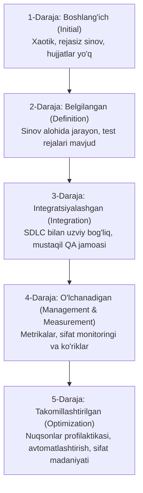

import { Callout } from 'nextra/components'

# Test Maturity Model (TMM): Test Yetuklik Modeli

Har bir IT tashkilotida sinov jarayonining sifat darajasi turlicha bo'ladi: ayrim kompaniyalarda sinov tartibsiz va rejasiz amalga oshirilsa, yetakchi korporatsiyalarda sinov aniq metrikalar va avtomatlashtirilgan profilaktika tizimiga asoslanadi.

**Test Maturity Model (TMM)** — tashkilotning dasturiy ta'minotni sinash jarayonlari qanchalik etuk, samarali va bashorat qilinadigan ekanligini baholovchi hamda ularni bosqichma-bosqich yuksaltirishga xizmat qiluvchi 5 darajali xalqaro modeldir.

---

## TMM Yetuklik Darajalari Zinapoyasi

---

## TMM ning 5 Bosqichi Tafsiloti

### 1-Daraja: Boshlang'ich Bosqich (Initial)
- **Xususiyati:** Sinov jarayoni xaotik, rejasiz va butunlay tizimsiz xarakterga ega.
- **Kamchiligi:** Aniq test rejasi, test-keyslar yoki sifat mezonlari mavjud emas. Sinov faqat kod yozib bo'lingandan so'ng dasturning umumiy ishlashini yuzaki ko'rish bilan cheklanadi.
- **Maqsad:** Faqat dasturning ishlayotganini isbotlash.

### 2-Daraja: Belgilangan Bosqich (Definition / Phase Definition)
- **Xususiyati:** Sinov dasturlashdan alohida mustaqil muhandislik bosqichi sifatida tan olinadi.
- **Yutuqlari:** Asosiy Test Plan tuziladi, sinov maqsadlari belgilanadi va test-keyslar yozila boshlaydi.
- **Kamchiligi:** Sinov hali ham reaktiv bo'lib, faqat kod tayyor bo'lgandan keyin (kechikib) boshlanadi.

### 3-Daraja: Integratsiyalashgan Bosqich (Integration)
- **Xususiyati:** Sinov butun SDLC davomida parallel ravishda olib boriladi (Erta sinash tamoyili).
- **Yutuqlari:** Tashkilotda professional, mustaqil QA bo'limi tashkil qilinadi. Talablar tahlili va dizayn hujjatlari ham tekshiruvdan (Verification & Reviews) o'tadi.

### 4-Daraja: Boshqariladigan va O'lchanadigan Bosqich (Management and Measurement)
- **Xususiyati:** Sinov jarayoni aniq sonli metrikalar (Metrics) yordamida o'lchanadi va boshqariladi.
- **Yutuqlari:** Defektlar zichligi (Defect Density), test qamrovi foizi, sinov tezligi va DRE (Defect Removal Efficiency) metrikalari monitoring qilinadi.

### 5-Daraja: Takomillashtirilgan Bosqich (Optimization / Defect Prevention)
- **Xususiyati:** Tashkilotning bosh maqsadi nuqsonlarni topishdan — **nuqsonlarning paydo bo'lishining oldini olishga (Defect Prevention)** o'zgaradi.
- **Yutuqlari:** O'tgan loyihalardagi xatolar tahlil qilinadi, ilg'or asboblar va avtomatlashtirish keng joriy etiladi, sifat nazorati butun kompaniya madaniyatiga aylanadi.

<Callout type="info">
  **TMM va CMMI:** TMM dasturiy ta'minot ishlab chiqish bo'yicha mashhur CMMI (Capability Maturity Model Integration) modeli asosida, aynan sinov jarayonlari uchun moslashtirib yaratilgan.
</Callout>
