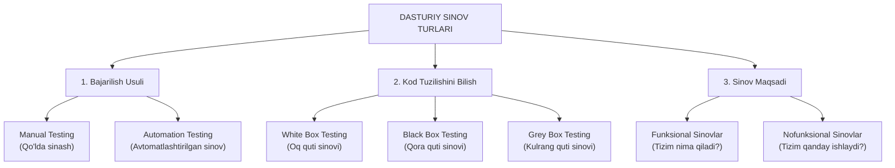

import { Callout } from 'nextra/components'

# Types of Software Testing: Dasturiy Sinov Turlarining To'liq Tasnifi

Dasturiy ta'minotni sinash — bu yagona bir harakat emas, balki loyihaning maqsadlari, talablari va xatarlariga qarab tanlanadigan turli sinov turlarining keng qamrovli tizimidir.

TpointTech va xalqaro dasturiy muhandislik standartlari bo'yicha sinov turlari quyidagi asosiy mezonlar bo'yicha tasniflanadi.

---

## Dasturiy Sinov Turlari Ierarxiyasi

---

## 1. Bajarilish Usuli Bo'yicha

- **Manual Testing (Qo'lda sinash):** QA muhandisining o'zi dastur bilan foydalanuvchi sifatida muloqot qiladi, hech qanday avtomatlashtirish skriptlarisiz tugmalarni bosib, funksionallikni tekshiradi.
- **Automation Testing (Avtomatlashtirilgan sinov):** Oldindan yozilgan dasturiy skriptlar yordamida test-keyslarni kompyuter tezligida, inson aralashuvisiz takroriy ishga tushirish.

---

## 2. Kod Tuzilishini Bilish Darajasi Bo'yicha

- **White Box Testing (Oq quti sinovi):** Dasturning ichki kodi, arxitekturasi va algoritmlarini to'liq bilgan holda sinash (asosan dasturchilar tomonidan bajariladi).
- **Black Box Testing (Qora quti sinovi):** Kodning ichki tuzilishini bilmagan holda, faqat tashqi talablar va foydalanuvchi interfeysi orqali sinash.
- **Grey Box Testing (Kulrang quti sinovi):** Ichki ma'lumotlar bazasi, API va arxitekturani qisman bilgan holda, tashqi interfeyslar orqali chuqur sinov o'tkazish.

---

## 3. Funksional Sinov Turlari (Functional Testing)

Tizimning bevosita biznes talablariga mos ishlashini tekshiruvchi sinovlar:
1. **Unit Testing:** Kodning eng kichik mustaqil qismlarini (funksiyalarni) alohida sinash.
2. **Integration Testing:** Modullar o'zaro birlashtirilganda ularning birgalikdagi aloqasini tekshirish.
3. **System Testing:** Butun yig'ilgan yaxlit dasturning talablarga muvofiqligini sinash.
4. **Acceptance Testing (UAT):** Mahsulotni buyurtmachi tomonidan foydalanishga rasman qabul qilinishi.
5. **Smoke Testing:** Yangi yig'ilmaning eng asosiy funksiyalari ishlayotganligini tezkor tekshirish.
6. **Sanity Testing:** Xatolik tuzatilgandan so'ng tegishli modulning to'g'ri ishlashini tekshirish.
7. **Regression Testing:** Kodga kiritilgan o'zgarishlar ilgari to'g'ri ishlab turgan joylarni buzmaganligiga ishonch hosil qilish.

---

## 4. Nofunksional Sinov Turlari (Non-Functional Testing)

Dasturning tezligi, ishonchliligi, xavfsizligi va qulayligini baholovchi sinovlar:
1. **Performance Testing:** Tizimning yuklama ostidagi tezligi va unumdorligini tekshirish (Load, Stress, Spike, Soak).
2. **Usability Testing:** Foydalanuvchi interfeysining qulayligi, tushunarliligi va ergonomikasini baholash.
3. **Compatibility Testing:** Dasturning turli brauzerlar, operatsion tizimlar va qurilmalarga mosligini tekshirish.
4. **Security Testing:** Tizimning kiberhujumlar va ma'lumotlar sizib chiqishidan himoyalanganligini ta'minlash.
5. **GUI Testing:** Grafik elementlar, ranglar, shriftlar va piktogrammalarning dizaynga mosligini tekshirish.
