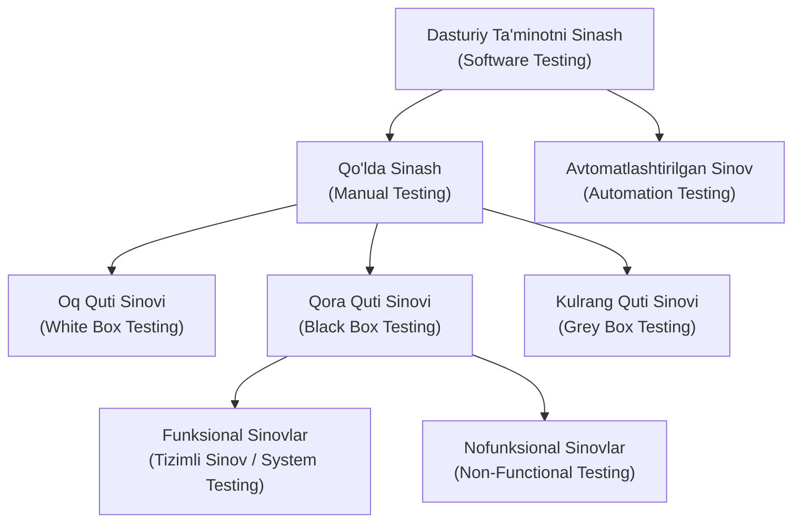
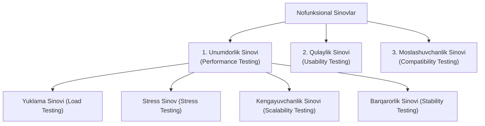

import { Callout } from 'nextra/components'

# Dasturiy Ta'minotni Sinash Turlari

Ushbu bo'limda biz dasturiy ta'minotni ishlab chiqish hayotiy davrida (SDLC) qo'llaniladigan dasturiy ta'minotni sinashning turli xil turlarini batafsil o'rganamiz.

Ma'lumki, dasturiy ta'minotni sinash — bu ilovaning funksionalligini mijozning dastlabki talablariga muvofiq tahlil qilish jarayonidir. Dasturiy ta'minotning barqaror va xatoliklardan xoli bo'lishini ta'minlash uchun biz sinovning turli xil turlarini amalga oshirishimiz shart, chunki sinov ilovani nuqsonsiz qilishning yagona ishonchli usulidir.

Dasturiy sinovlarni tasniflash sinov strategiyasi, natijaviy hujjatlar va aniq belgilangan sinov maqsadlari kabi turli xil faoliyatlarning bir qismidir. Sinov turiga ega bo'lishning bosh maqsadi — **AUT (Application Under Test — Sinovdagi Ilova)** sifatini tasdiqlashdir.

Sinovni boshlash uchun bizda talablar hujjati, sinovga tayyor dastur va barcha zaruriy resurslar mavjud bo'lishi kerak. Mas'uliyatni to'g'ri taqsimlash uchun tegishli modullar turli xil test muhandislariga biriktiriladi.

---

## Dasturiy Sinovning Asosiy Bo'linishi

Bajarilish uslubiga ko'ra dasturiy ta'minotni sinash asosan ikki katta qismga bo'linadi:

---

## 1. Qo'lda Sinash (Manual Testing)

Har qanday dasturiy ta'minot yoki ilovani hech qanday avtomatlashtirish vositalaridan foydalanmagan holda, mijozning talablariga muvofiq tekshirish jarayoni **qo'lda sinash (manual testing)** deb ataladi.

Boshqacha aytganda, bu tekshirish (verification) va tasdiqlash (validation) jarayonidir. Qo'lda sinash ilovaning xatti-harakatini talablar spetsifikatsiyasiga nisbatan solishtirib tekshirish uchun xizmat qiladi.

Qo'lda bajariladigan test-keyslarni ijro etish uchun sinov vositalari bo'yicha chuqur maxsus bilim talab qilinmaydi. Qo'lda sinov paytida biz test hujjatlarini osongina tayyorlay olamiz.

### Qo'lda Sinashning Tasnifi

Dasturiy ta'minotni qo'lda sinash o'z navbatida uch turga bo'linadi:

#### A. Oq Quti Sinovi (White Box Testing)
Oq quti sinovida dasturchi kodni test jamoasiga yoki tegishli test muhandislariga topshirishdan oldin uning har bir satrini tekshirib chiqadi.

Sinov davomida dastur kodi ishlab chiquvchiga to'liq ko'rinib turganligi sababli, bu jarayon **WBT (White Box Testing)** deb ataladi. Dasturchi ma'lum bir dastur uchun to'liq oq quti sinovini o'tkazadi va so'ngra ilovani sinov jamoasiga topshiradi.

Oq quti sinovining asosiy maqsadi — dastur bo'ylab kiruvchi va chiquvchi ma'lumotlar oqimini tekshirish hamda ilovaning xavfsizligini oshirishdir.

> Oq quti sinovi shuningdek: *Open Box, Glass Box, Clear Box, Structural Testing* hamda *Transparent Box Testing* deb ham ataladi.

#### B. Qora Quti Sinovi (Black Box Testing)
Qo'lda sinashning ikkinchi asosiy turi — bu qora quti sinovidir. Ushbu sinovda test muhandisi dasturiy ta'minotni talablarga nisbatan tahlil qiladi, nuqson va xatoliklarni (bug) aniqlaydi hamda ularni ishlab chiquvchilar guruhiga qaytaradi.

Dasturchilar ushbu nuqsonlarni tuzatadilar, yana bir bor oq quti sinovini o'tkazadilar va dasturni qaytadan test guruhiga yuboradilar. Bu yerda nuqsonni tuzatish degani — muammo to'liq bartaraf etilib, tegishli funksiya belgilangan talablarga muvofiq ishlayotganligini anglatadi.

Qora quti sinovining bosh maqsadi mijozning biznes talablarini tasdiqlashdir. Bu jarayonda dasturning manba kodi test muhandisiga ko'rinmaydi, shu sababli u "qora quti" deb ataladi.

#### C. Kulrang Quti Sinovi (Grey Box Testing)
Kulrang quti sinovi — qora quti va oq quti sinovlarining o'zaro birikmasidir. 

Unda test-keyslarni yaratish uchun ichki dasturiy kodga qisman kirish imkoniyati mavjud bo'ladi. Kulrang quti sinovi ham dasturlashni, ham sinovni yaxshi biladigan mutaxassislar tomonidan amalga oshiriladi. Agar bitta mutaxassis oq quti va qora quti sinovlarining ikkalasini ham bajarsa, bu kulrang quti sinovi hisoblanadi.

---

## 2. Funksional va Nofunksional Sinovlar

Qora quti sinovi doirasida sinovlar ikki katta yo'nalishga ajraladi:

### Tizimli Sinov (System Testing / Funksional Sinov)
Tizimli sinovda sinov muhiti ishlab chiqarish (production) muhitiga to'liq parallel qilib yaratiladi. U **end-to-end testing (boshidan oxirigacha sinov)** deb ham ataladi.

Ushbu sinovda biz dasturiy ta'minotning har bir atributini ko'rib chiqamiz va yakuniy funksiya biznes talablariga muvofiq ishlayotganligini yaxlit tizim sifatida tahlil qilamiz.

---

### Nofunksional Sinovlar (Non-Functional Testing)
Qora quti sinovining yana bir muhim qismi bu nofunksional sinovlardir. U dasturiy mahsulotning unumdorligi va qo'llanilgan texnologiyalar haqida batafsil ma'lumot beradi. Nofunksional sinovlar ishlab chiqarishdagi xatarlarni va dasturiy ta'minot bilan bog'liq xarajatlarni minimallashtirishga yordam beradi.

Nofunksional sinov quyidagi asosiy yo'nalishlarga bo'linadi:

#### 1. Unumdorlik Sinovi (Performance Testing)
Unumdorlik sinovida test muhandisi ilovaning ish faoliyatini unga ma'lum bir yuklama berish orqali tekshiradi. Bunda asosiy e'tibor javob qaytarish vaqti (Response time), yuklama (Load), kengayuvchanlik (Scalability) va tizim barqarorligiga (Stability) qaratiladi.

- **Yuklama Sinovi (Load Testing):** Ilovaning unumdorligini tekshirish uchun unga rejalashtirilgan ishchi yuklamani (normadagi yoki maksimal chegaradagi) berish. Bu tizimning maksimal ish hajmini va qayerda to'siqlar (bottlenecks) paydo bo'lishini aniqlashga yordam beradi.
- **Stress Sinov (Stress Testing):** Dasturning mustahkamligi va bardoshliligini odatiy funksional chegaralardan ancha yuqori bo'lgan haddan tashqari og'ir yuklamalar ostida sinash.
- **Kengayuvchanlik Sinovi (Scalability Testing):** Ilovaga beriladigan yuklamani bosqichma-bosqich oshirish yoki kamaytirish orqali tizimning o'sib boruvchi ehtiyojlarni qondirish qobiliyatini tekshirish.
- **Barqarorlik Sinovi (Stability Testing):** Muayyan yuklamani uzoq vaqt davomida uzluksiz berish orqali tizimning barqarorligini va mahsulotning samaradorligini baholash (xotira sizib chiqishini aniqlash).

#### 2. Qulaylik Sinovi (Usability Testing)
Qulaylik sinovida biz ilovaning foydalanuvchi uchun qay darajada oson va tushunarli ekanligini (user-friendliness) tahlil qilamiz:
- **Tushunish osonligi:** Barcha funksiyalar va imkoniyatlar yakuniy foydalanuvchi uchun ochiq va ravshan bo'lishi lozim.
- **Tashqi ko'rinish (Look and feel):** Ilovaning dizayni ko'rkam, yoqimli bo'lishi va foydalanuvchida undan muntazam foydalanish istagini uyg'otishi kerak.

#### 3. Moslashuvchanlik Sinovi (Compatibility Testing)
Moslashuvchanlik sinovida ilovaning muayyan apparat va dasturiy ta'minot muhitlarida to'g'ri ishlashi tekshiriladi. Ilova funksional jihatdan barqaror bo'lgandagina ushbu sinovga o'tiladi.
- **Dasturiy moslik:** Turli xil operatsion tizimlar (Windows, macOS, Linux, Android, iOS) va turli veb-brauzerlar (Chrome, Firefox, Safari, Edge).
- **Apparat mosligi:** Turli xil ekran o'lchamlari va qurilma quvvatlari.

---

## 3. Avtomatlashtirilgan Sinov (Automation Testing)

Dasturiy ta'minotni sinashning eng muhim qismlaridan biri **avtomatlashtirilgan sinov (automation testing)** dir. U inson aralashuvisiz, qo'lda yozilgan test-keyslarni avtomatlashtirish uchun maxsus vositalardan (Playwright, Selenium, Cypress va boshqalar) foydalanadi.

Avtomatlashtirilgan sinov sinovning samaradorligini, unumdorligini va qamrovini oshirishning eng yaxshi usulidir. U qo'lda bajarilgan test ssenariylarini tezkor va takroriy ravishda qayta ishga tushirish (re-run) uchun xizmat qiladi.

Ilovada bir nechta yangi relizlar chiqarilganda yoki ko'p sonli regressiya tsikllari o'tkazilishi kerak bo'lganda avtomatlashtirishga murojaat qilinadi. Dasturlash tillarini tushunmasdan turib test skriptlarini yozish yoki avtomatlashtirilgan sinovni o'tkazish mumkin emas.

---

## 4. Dasturiy Sinovning Boshqa Muhim Turlari

Yuqoridagi toifalardan tashqari, amaliyotda dasturiy ta'minotni sifatli tekshirish uchun talab etiladigan quyidagi muhim sinov turlari ham mavjud:

### Smoke Testing (Tutun Sinovi)
Chuqur va qat'iy sinov bosqichiga kirishdan oldin, barcha ijobiy va salbiy qiymatlarni tekshirmasdan turib, ilovaning eng asosiy va o'ta muhim funksiyalari ishlayotganligini tezkor tekshirish. Bosh maqsad — ilovaning asosiy funksiyalari ishchi holatdaligini tasdiqlashdir.

### Sanity Testing (Aql-idrok Sinovi)
Dasturga kiritilgan o'zgarishlar tufayli yangi muammolar kelib chiqmaganligi va aniqlangan barcha xatolar to'g'ri tuzatilganligiga ishonch hosil qilish uchun o'tkaziladi. Sanity testing ssenariysiz (unscripted) bo'lib, hujjatlashtirilmaydi. U yangi qo'shilgan komponentlar va funksiyalarning to'g'riligini tezkor tekshiradi.

### Regression Testing (Regressiya Sinovi)
Dasturiy ta'minot sinovida eng keng qo'llaniladigan sinov turi. "Regressiya" atamasi dasturning o'zgarish kiritilmagan qismlarini qayta sinashni anglatadi. Dasturchilar xatolikni tuzatgandan so'ng yoki loyihaga yangi imkoniyatlar qo'shilganda, ushbu yangiliklar avvaldan to'g'ri ishlab turgan eski funksiyalarni buzmaganligiga ishonch hosil qilish uchun o'tkaziladi. Bu turdagi sinov avtomatlashtirish uchun eng qulay hisoblanadi.

### User Acceptance Testing (Foydalanuvchi Qabul Sinovi / UAT)
UAT alohida guruh — soha mutaxassislari (domain experts), buyurtmachi yoki mijoz tomonidan amalga oshiriladi. Yakuniy mahsulotni qabul qilishdan oldin uni amalda bilish jarayoni UAT deb ataladi. UAT muhitida real biznes ssenariylari tekshiriladi va mijozning rasmiy ma'qullashi olinadi.

### Exploratory Testing (Tadqiqiy Sinov)
Talablar mavjud bo'lmaganda, tezkor iteratsiya zarur bo'lganda yoki jamoaga yangi test muhandisi kelganda qo'llaniladi. Bunda test muhandisi dasturni barcha mumkin bo'lgan yo'llar bilan o'rganadi, uning mantiqiy oqimini tushunadi va o'rganish jarayonining o'zidayoq uni sinovdan o'tkazadi.

### Adhoc Testing (Ixtiyoriy / Rejasiz Sinov)
Dastur yig'ilmasini hech qanday rejasiz, tasodifiy tarzda sinash **Adhoc testing** deb ataladi. U shuningdek **Monkey testing** va **Gorilla testing** deb ham ataladi. Bunda ilova mijozning talablariga zid ravishda, tizimni sindirish maqsadida tekshiriladi (salbiy sinov). Oddiy foydalanuvchi ilovani erkin ishlatayotganda kutilmagan xatoni topishi mumkin, professional tester esa standart qoidalarga ko'ra uni ko'rmasligi mumkin — Adhoc sinov aynan shunday noan'anaviy xatolarni fosh etadi.

### Security Testing (Xavfsizlik Sinovi)
Dasturiy ilovadagi zaifliklar, xatarlar yoki tahdidlarni aniqlash uchun qo'llaniladigan eng muhim sinov qismidir. Xavfsizlik sinovi tashqi xakerlik hujumlarining oldini olishga va konfidentsial ma'lumotlarning himoyalanganligini kafolatlashga xizmat qiladi.

### Globalization Testing (Globallashuv Sinovi)
Dasturiy ta'minotning bir nechta xorijiy tillarni, turli valyutalarni, vaqt mintaqalari va madaniy formatlarni to'g'ri qo'llab-quvvatlay olishini tekshirish uchun o'tkaziladi. Ilovalar butun dunyo bo'ylab global miqyosda ishlatilishi uchun mo'ljallangan hozirgi davrda bu sinov o'ta muhim hisoblanadi.
