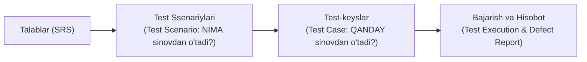

import { Cards, Callout } from 'nextra/components'

# Test Hujjatlari va Test-keys Yaratish (Test Case Development)

Dasturiy ta'minotni sinash shunchaki interfeysni bosib ko'rish emas, balki qat'iy standartlar asosida rejalashtirilgan, o'lchanadigan va hujjatlashtirilgan muhandislik jarayonidir.

Yaxshi yozilgan test hujjatlari har qanday yangi xodimga loyihani tez tushunish, sinovlarni bir xil sifatda takrorlash va mahsulot sifatining yozma isbotini taqdim etish imkonini beradi.

---

## Test Hujjatlarining Asosiy Zanjiri

---

## Modul Bo'limlari

<Cards num={2}>
  <Cards.Card
    title="▶️ Sinov Hujjatlari (Testing Documentation)"
    href="/docs/test-case-development/testing-documentation"
  >
    SDLC davomida QA jamoasi tomonidan yuritiladigan barcha rasmiy hujjatlar to'plami va ularning ahamiyati.
  </Cards.Card>
  <Cards.Card
    title="▶️ Test Scenario (Sinov Ssenariysi)"
    href="/docs/test-case-development/test-scenario"
  >
    Yuqori darajadagi sinov ssenariylari nima, ular nima uchun zarur va Test Case dan farqi.
  </Cards.Card>
  <Cards.Card
    title="▶️ Test Case (Test-keys Tuzilishi)"
    href="/docs/test-case-development/test-case"
  >
    Professional test-keysning barcha majburiy komponentlari, sifat mezonlari va amaliy namunalar.
  </Cards.Card>
</Cards>
