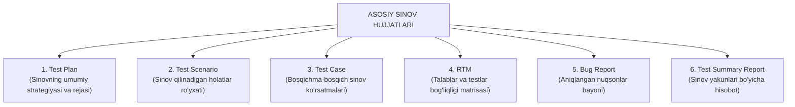

import { Callout } from 'nextra/components'

# Sinov Hujjatlari (Testing Documentation)

**Testing Documentation** — dasturiy ta'minotni sinash jarayonida va undan oldin tayyorlanadigan barcha yozma rasmiy materiallar, hisobotlar va rejalarning umumiy to'plamidir.

Hujjatlashtirish sinov jarayonining shaffofligini ta'minlaydi, xatarlarni kamaytiradi va natijalarni rahbar hamda buyurtmachi oldida asoslab beradi.

---

## Asosiy Sinov Hujjatlari Ro'yxati

---

## Hujjatlarning Mazmuni va Vazifasi

1. **Test Plan (Sinov rejasi):** Sinovning ko'lami, maqsadlari, jamoa a'zolarining mas'uliyati, muddatlar, sinov muhiti, xatarlar va yakunlash mezonlarini belgilovchi bosh strategik hujjat (IEEE 829 standarti).
2. **Test Scenario (Sinov ssenariysi):** Tizimda qaysi funksionallik sinovdan o'tkazilishini belgilovchi yuqori darajadagi yo'nalish (masalan: "Foydalanuvchi tizimga kirishini tekshirish").
3. **Test Case (Test-keys):** Ssenariyni amalda tekshirish uchun zarur bo'lgan kiruvchi ma'lumotlar, bajarish qadamlari va kutilgan natijalarning batafsil bayoni.
4. **Requirement Traceability Matrix (RTM):** Har bir biznes talabning (SRS) tegishli test-keyslar bilan qamrab olinganligini isbotlovchi jadval.
5. **Bug Report (Xatolik hisoboti):** Topilgan nosozlikni dasturchi osongina qayta takrorlay olishi uchun uning qadamlari, skrinshotlari va muhit tafsilotlarini aks ettiruvchi hujjat.
6. **Test Summary Report (Sinov yakuniy hisoboti):** Sinov sikli tugagach, loyiha rahbariyatiga mahsulotning ishlab chiqarishga (Production) tayyor yoki tayyor emasligini xulosa qilib beruvchi hujjat.

<Callout type="info">
  **Nega hujjatlashtirish shart?** Agar dastur sinovdan o'tgan bo'lsa-yu, ammo bu haqda hech qanday test-keys yoki hisobot yozilmagan bo'lsa, xalqaro audit va biznes nuqtai nazaridan sinov umuman o'tkazilmagan deb hisoblanadi.
</Callout>
