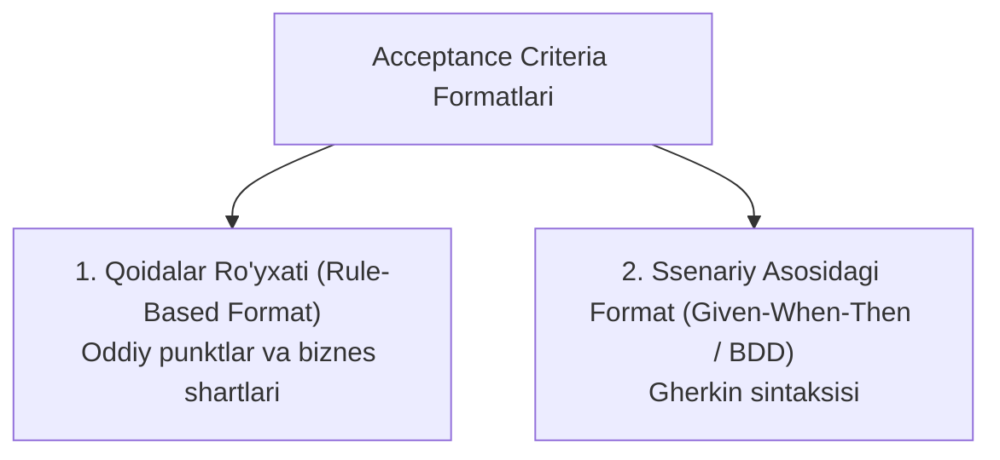

import { Callout } from 'nextra/components'

# Qabul Qilish Mezonlari (Acceptance Criteria)

**Qabul Qilish Mezonlari (Acceptance Criteria — AC)** — muayyan Foydalanuvchi Tarixi (*User Story*) to'liq va to'g'ri ishlab chiqilgan deb hisoblanishi uchun dasturiy ta'minot qondirishi shart bo'lgan aniq shartlar, biznes qoidalari va chegaraviy talablar ro'yxatidir.

Ular dasturchilar va QA muhandislari uchun yagona "muvaffaqiyat mezoni" bo'lib, QA mutaxassisi ushbu mezonlar asosida bevosita **Test Keyslarni (Test Cases)** shakllantiradi.

---

## 1. Acceptance Criteria Qanday Yoziladi?

Amaliyotda Qabul Qilish Mezonlarini yozishning ikkita asosiy formati qo'llaniladi:

### 1-Format: Qoidalar Ro'yxati (Rule-Based / Checklist Format)
Oddiy punktlar ko'rinishida biznes talablar sanab o'tiladi:
- Parol uzunligi kamida 8 ta belgidan iborat bo'lishi shart;
- Parol tarkibida kamida bitta katta harf va bitta raqam bo'lishi lozim;
- Agar email noto'g'ri kiritilsa, qizil rangda *"Email formati noto'g'ri"* xatosi chiqishi kerak;
- "Saqlash" tugmasi barcha majburiy maydonlar to'ldirilmaguncha nofaol (disabled) bo'lishi kerak.

### 2-Format: Ssenariy Formati (Given — When — Then / Gherkin BDD)
**BDD (Behavior-Driven Development)** yondashuvida ssenariylar foydalanuvchi xatti-harakati orqali ifodalanadi:
- **Given (Dastlabki holat):** Tizim qanday holatda turgani;
- **When (Harakat):** Foydalanuvchi qanday amalni bajargani;
- **Then (Natija):** Tizim qanday javob qaytargani.

> **Misol (Parolni tiklash):**
> - **Given:** Foydalanuvchi tizimda ro'yxatdan o'tgan va parolni tiklash sahifasida turibdi;
> - **When:** Foydalanuvchi o'zining to'g'ri pochtasini kiritib, "Havola yuborish" tugmasini bosganda;
> - **Then:** Tizim pochtaga 15 daqiqalik bir martalik havola yuborishi va ekranda *"Xat pochtangizga jo'natildi"* xabari paydo bo'lishi kerak.

---

## 2. Acceptance Criteria (AC) va Definition of Done (DoD) Farqi

Ushbu ikki tushuncha Scrum jamoalarida sifat chegaralarini belgilashda birgalikda ishlaydi:

| Xususiyat | Acceptance Criteria (AC) | Definition of Done (DoD) |
| :--- | :--- | :--- |
| **Qamrovi** | **Faqat bitta aniq User Story** uchun unikal | **Barcha vazifalar** uchun umumiy jamoa standarti |
| **Mazmuni** | Biznes logika va funksional talablar | Texnik talablar: Kod revyusi (Code Review), Unit testlar yozilganligi, CI/CD dan muvaffaqiyatli o'tganligi |
| **Kim yozadi?** | Product Owner / Biznes Analitik + QA | Butun ishlab chiqish jamoasi (Dev + QA + DevOps) |
| **Misol** | *"To'lov muvaffaqiyatli o'tganda kvitansiya generatsiya bo'lishi"* | *"Unit test qamrovi 80% dan yuqori bo'lishi va SonarQube xatosi bo'lmasligi"* |

---

## 3. QA Muhandisi Uchun Ahamiyati

- **Test keyslar uchun to'g'ridan-to'g'ri manba:** QA muhandisi har bir Acceptance Criteria bandini olib, unga kamida bitta ijobiy va bir nechta salbiy test keys yozadi;
- **Bahslarga chek qo'yish:** Dasturchi *"Bu xato emas, shunday ishlashi kerak edi"* deganida, AC rasmiy hakam vazifasini o'taydi;
- **Sinovni yakunlash mezoni:** Agar User Story-dagi barcha AC bandlari bo'yicha testlar muvaffaqiyatli o'tsa (*Pass* bo'lsa), vazifa qabul qilingan deb hisoblanadi.
