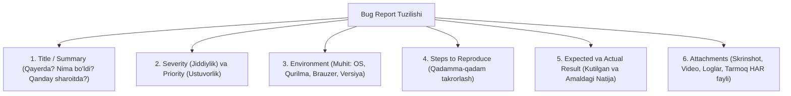
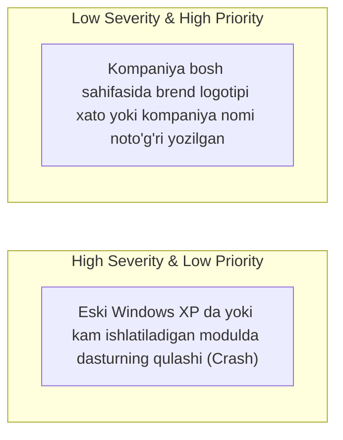
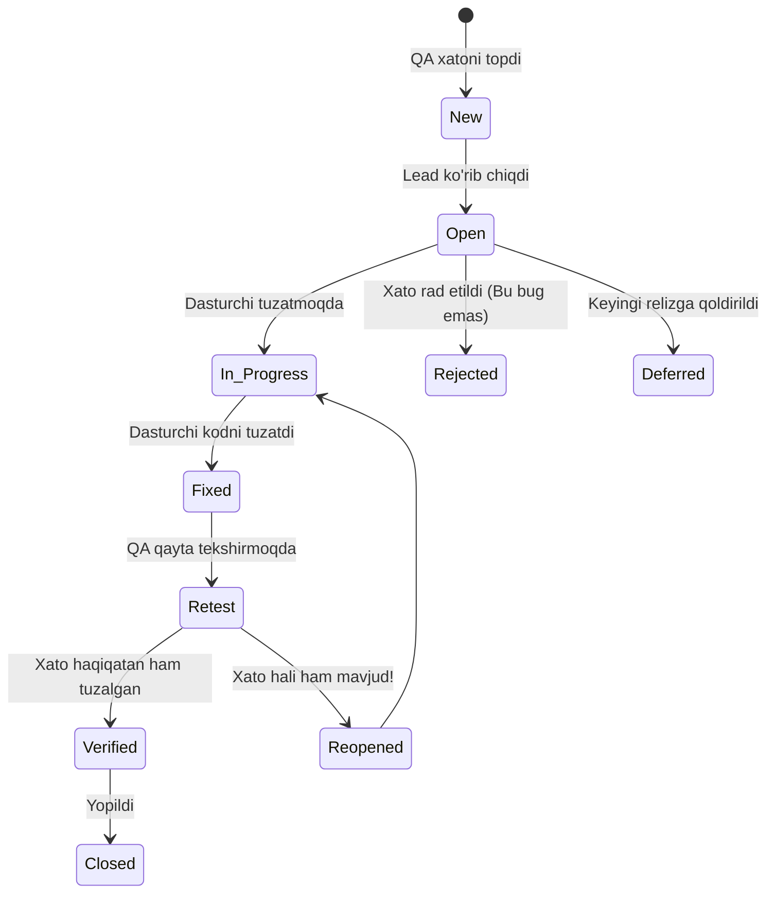

import { Callout } from 'nextra/components'

# Xatolik Hisoboti (Bug Report / Defect Report)

**Xatolik Hisoboti (Bug Report / Defect Report)** — dasturiy ta'minotni sinash jarayonida amaldagi natija (*Actual Result*) kutilayotgan natijaga (*Expected Result*) yoki biznes talablarga to'g'ri kelmagan holatda rasmiylashtiriladigan, nuqsonning mohiyati, sababi va uni takrorlash qadamlarini bayon qiluvchi rasmiy texnik hujjatdir.

Sifatli yozilgan Bug Report dasturchiga muammoni qo'shimcha savollarsiz tezda tushunish, o'z kompyuterida takrorlash va uni zudlik bilan tuzatish imkonini beradi.

---

## 1. Sifatli Bug Report Anatomiyasi (Asosiy Maydonlar)

Har qanday professional xatolik hisoboti (Jira, Bugzilla, YouTrack) quyidagi asosiy bandlarni o'z ichiga olishi shart:

1. **Bug ID:** Tizim tomonidan berilgan unikal raqam (masalan: `PROJ-1042`).
2. **Title / Summary (Sarlavha):** Xatoning qisqa va lo'nda mazmuni. Oltin qoida: **Qayerda? + Nima sodir bo'ldi? + Qanday sharoitda?**  
   - *Yomon sarlavha:* "To'lov ishlamayapti!"  
   - *Yaxshi sarlavha:* "Checkout sahifasida Humo kartasi tanlanganda 'To'lash' tugmasi bosilmayapti (Status: 500 error)".
3. **Severity (Jiddiylik):** Xatoning dastur texnik holatiga va biznesiga ta'siri darajasi.
4. **Priority (Ustuvorlik):** Xato qanchalik tez tuzatilishi kerakligi (biznes nuqtai nazaridan).
5. **Environment (Muhit):** OS (iOS 17.4 / Windows 11), Qurilma (iPhone 14 / Desktop), Brauzer (Chrome 122), App Version (v2.4.1), Server muhiti (Staging/Dev).
6. **Preconditions (Old shartlar):** Xatoni takrorlashdan oldingi boshlang'ich holat.
7. **Steps to Reproduce (Takrorlash Qadamlari):** 1, 2, 3 tartibida raqamlangan, dasturchi amalga oshirishi lozim bo'lgan qadamlar.
8. **Expected Result (Kutilgan Natija):** Talab bo'yicha nima bo'lishi kerak edi.
9. **Actual Result (Amaldagi Natija):** Haqiqatda nima yuz berdi (ekrandagi xato xabari, crash, kutilmagan javob).
10. **Attachments (Ilovalar):** Skrinshotlar (qizil doira bilan xato joyi ko'rsatilgan), qisqa video yozuv (Loom / MP4), Crash loglar yoki DevTools Console/Network loglari.

---

## 2. Severity (Jiddiylik) va Priority (Ustuvorlik) Farqi

Bu ikki tushuncha QA sohasida eng ko'p beriladigan intervyu savollaridan biridir:

| Daraja | Severity (Jiddiylik - Texnik Ta'siri) | Priority (Ustuvorlik - Biznes va Vaqt) |
| :--- | :--- | :--- |
| **Ta'rifi** | Xato tizimning ishlashiga qanchalik kuchli zarar yetkazadi? | Xato qanchalik tez fursatda tuzatilishi shart? |
| **Kim belgilaydi?** | Asosan **QA muhandisi** belgilaydi. | **Product Owner, PM yoki QA Lead** belgilaydi. |
| **Darajalari** | Blocker, Critical, Major, Minor, Trivial | High (Zudlik bilan), Medium (Reja bo'yicha), Low (Keyinroq) |

---

## 3. Xatolik Hayot Sikli (Bug Life Cycle)

Har bir xatolik ochilganidan to butunlay yopilguniga qadar ma'lum statuslar ketma-ketligidan o'tadi:

---

## 4. To'liq Namunaviy Bug Report

| Maydon | Mazmuni |
| :--- | :--- |
| **Bug ID** | `BUG-MOBILE-312` |
| **Summary** | Savatda mahsulot soni 100 dan oshirilganda savat sahifasi qulab tushmoqda (Crash) |
| **Severity** | Critical |
| **Priority** | High |
| **Muhit** | Android 14, Samsung Galaxy S23, Ilova versiyasi: v3.1.0-stage |
| **Old Shartlar** | Foydalanuvchi tizimga kirgan va savatida 1 ta mahsulot mavjud. |
| **Takrorlash Qadamlari**| 1. Ilovani oching va "Savat" bo'limiga kiring. 2. Mahsulot soni maydoniga `999` raqamini kiriting. 3. "Qayta hisoblash" tugmasini bosing. |
| **Kutilgan Natija** | Tizimda ogohlantirish chiqadi: *"Bitta buyurtmada maksimal 99 ta mahsulot tanlash mumkin"*. Ilova barqaror ishlaydi. |
| **Amaldagi Natija** | Ilova zudlik bilan yopilib, "App has stopped unexpectedly" xatosi bilan qulaydi. |
| **Ilovalar** | `crash_log_2026-09-25.txt`, `screen_record_bug.mp4` |
