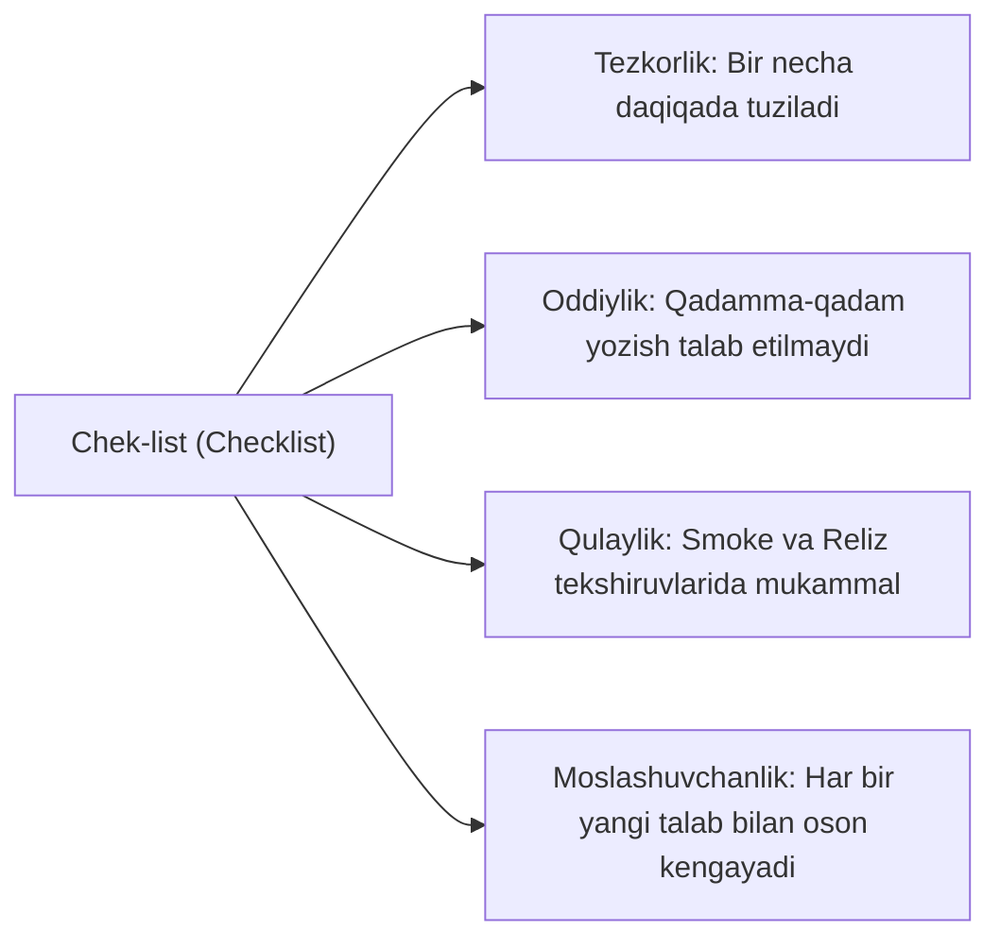

import { Callout } from 'nextra/components'

# Chek-list (Checklist)

**Chek-list (Checklist / Nazorat Ro'yxati)** — dasturiy ta'minotda tekshirilishi yoki bajarilishi lozim bo'lgan vazifalar, funksional talablar yoki holatlarning tartibli ro'yxati bo'lib, har bir band yonida uning bajarilganligi haqida belgi (*checkbox* yoki holat) qo'yiladi.

Test Keysdan farqli ravishda, chek-listda har bir mayda qadam va kiruvchi ma'lumotlar yozilmaydi, faqatgina **tekshiriladigan yakuniy holat** qayd etiladi.

---

## 1. Nima Uchun Chek-listlar Ishlatiladi?

Chek-listlar tezkor va moslashuvchan dasturiy ta'minot ishlab chiqish muhitlarida (Agile/Scrum) juda mashhur:

- **Vaqtni tejash:** Yuzlab test keyslar yozish va ularni yangilab turish o'rniga, ixcham nazorat ro'yxati orqali butun tizimni tezda tekshirish mumkin;
- **Hech narsani unutmaslik:** Muhim parametrlar (masalan: push-bildirishnoma, orientatsiya o'zgarishi, til almashishi) esdan chiqib qolishining oldini oladi;
- **Smoke va Sanity sinovlari uchun ideal:** Yangi yig'ilma (build) kelganda asosiy funksiyalarning tirikligini 10-15 daqiqa ichida tekshirish imkonini beradi.

---

## 2. Namunaviy Mobil Ilova Smoke Test Chek-listi

Quyida mobil bank ilovasining yangi reliz oldi Smoke tekshiruvi uchun chek-list namunasi keltirilgan:

| # | Tekshiriladigan Xususiyat (Check Item) | Kutilayotgan Holat | Holat | Izoh |
| :- | :--- | :--- | :---: | :--- |
| **1** | Ilovaning o'rnatilishi va birinchi ochilishi | Ilova qulamasdan ochiladi, splash-screen to'g'ri ko'rinadi | [x] | Pass |
| **2** | Login va PIN-kod orqali kirish | Foydalanuvchi asosiy ekranga o'tadi | [x] | Pass |
| **3** | Kartalar balansi ko'rinishi | Barcha faol kartalar va ularning qoldiqlari to'g'ri aks etadi | [x] | Pass |
| **4** | Kartadan kartaga o'tkazma (P2P) | Kichik summali o'tkazma muvaffaqiyatli bajariladi | [x] | Pass |
| **5** | Kommunal to'lovlar bo'limi | Provayderlar ro'yxati ochiladi, hisob tekshiriladi | [ ] | Fail (JIRA-402) |
| **6** | Internet uzilgandagi xatti-harakat | Offline rejimda foydalanuvchiga ogohlantirish xabari chiqadi | [x] | Pass |
| **7** | Bildirishnomalar (Push Notifications) | Tranzaksiyadan so'ng push-xabar keladi | [x] | Pass |
| **8** | Ilovadan chiqish (Logout) | Sessiya yopiladi, kesh tozalangan holda login ekrani chiqadi | [x] | Pass |

---

## 3. Chek-list va Test Keys Taqqoslovi

| Xususiyat | Chek-list (Checklist) | Test Keys (Test Case) |
| :--- | :--- | :--- |
| **Tafsilot darajasi** | Yuqori darajadagi ro'yxat, qadamlar yo'q | Har bir qadam va ma'lumotlar batafsil yoziladi |
| **Tuzish tezligi** | Juda tez (10-30 daqiqa) | Uzoq vaqt talab qiladi (soatlar/kunlar) |
| **Qo'llanish sohasi** | Smoke, Sanity, Reliz nazorati, Regression | Regressiya sinovlari, yangi funksiyalar chuqur sinovi |
| **Tajribaga bog'liqlik** | Sinovchidan tizimni bilishni talab qiladi | Istalgan yangi boshlovchi ham bajara oladi |
| **Hujjatni yuritish** | Yangilash juda oson va qulay | Talab o'zgarganda ko'plab qadamlarni yangilash kerak |
