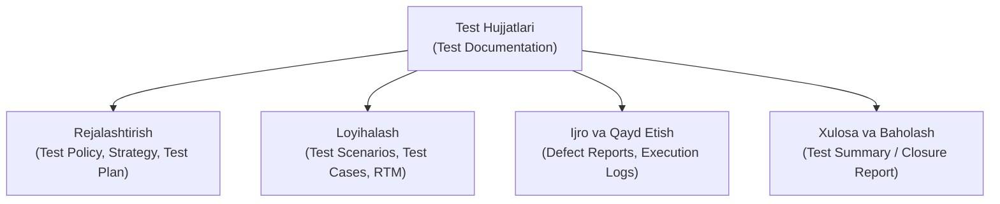
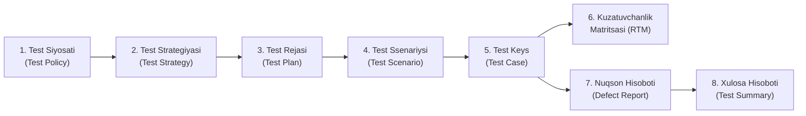

import { Callout } from 'nextra/components'

# Test Hujjatlari (Test Documentation in Software Testing)

> Oxirgi yangilanish: 25-iyul, 2026

Dasturiy ta'minotni sinash shunchaki ilovani ishlatib ko'rish va xatoliklarni topishdan iborat emas. Bu aniq rejalashtirish, tizimli tahlil, sinchkovlik bilan qayd etish va natijalarni hisobot qilishni talab qiluvchi muhandislik intizomidir. Ushbu jarayonning asosi va poydevori esa **Test Hujjatlari (Test Documentation)** hisoblanadi.

Loyihaning yetuklik darajasi (*Project Maturity*) va sinov jarayonining sifati bevosita test hujjatlarining qay darajada to'liq, aniq va standartlarga mos yuritilishiga bog'liqdir.

---

## Test Hujjatlari Nima? (What is Test Documentation?)

**Test Hujjatlari (Test Documentation)** — dasturiy ta'minotni sinashdan oldin, sinov davomida va sinov yakunlangach yaratiladigan barcha yozma artefaktlar, rejalar, test holatlari, ko'rsatkichlar va hisobotlar to'plamidir.

Ushbu hujjatlar test jamoasiga sinov qamrovini (*test coverage*) belgilash, talab qilinadigan mehnat va resurslarni baholash, xatoliklarni tizimli ro'yxatga olish hamda loyiha manfaatdor tomonlariga (*stakeholders*) mahsulot sifati bo'yicha to'liq axborot berish imkonini yaratadi.

Qoidaga ko'ra, test hujjatlarining asosiy qismi (masalan, Test Plan, Test Scenarios va Test Cases) dasturchilar dastur kodini yozayotgan paytdayoq parallel ravishda ishlab chiqiladi.

---

## Nima Uchun Test Hujjatlari Zarur?

Sifatli yuritilgan test hujjatlari quyidagi muhim afzalliklarni ta'minlaydi:

1. **Noaniqliklarni bartaraf etish (*Eliminate Ambiguity*):** Sinov nimalarni o'z ichiga olishi va nimalar tekshirilmasligi (*Scope: In-Scope / Out-of-Scope*) aniq belgilanadi, bu esa jamoalar o'rtasidagi tushunmovchiliklarning oldini oladi.
2. **Vaqt va moliyaviy xarajatlarni tejash:** Aniq yozilgan test keyslar xatoliklarni erta aniqlashga xizmat qiladi hamda bir xil ishlarni behuda takrorlashga chek qo'yadi.
3. **Kuzatuvchanlikni kafolatlash (*Traceability*):** Har bir biznes talab qaysi test holati orqali tekshirilganini ko'rsatib, tizimning 100% qamrab olinganligiga ishonch hosil qilishga imkon beradi.
4. **Yangi xodimlarni moslashtirish (*Easy Onboarding*):** Jamoaga yangi test muhandisi qo'shilganda, u tayyor hujjatlarni o'qib chiqish orqali loyihani qisqa fursatda mustaqil o'rganib oladi.
5. **Shaffoflik va hisobdorlik:** Buyurtmachi va rahbariyat dasturning sinovdan o'tganlik darajasini raqamlar, metrikalar va hisobotlar orqali aniq ko'rib turadi.
6. **Regressiya sinovlari uchun tayyor baza:** Keyingi relizlar va yangilanishlarda dastur buzilmaganligini tezda qayta tekshirish uchun test keyslar to'plami tayyor turadi.

---

## Test Hujjatlarining Asosiy Turlari

Dasturiy ta'minotni sinash hayotiy siklida (STLC) quyidagi muhim test hujjatlari yaratiladi:

### 1. Test Siyosati (Test Policy)
Tashkilot miqyosidagi eng yuqori darajadagi hujjat bo'lib, kompaniya sifatga qanday qarashi, sinovning asosiy falsafasi, maqsadlari va mezonlarini belgilab beradi.

### 2. Test Strategiyasi (Test Strategy)
Loyiha yoki mahsulot darajasidagi hujjat. Unda sinov turlari, qo'llaniladigan vositalar, avtomatlashtirish darajasi, muhitlar va umumiy sinov mezonlari aks ettiriladi. Odatda QA Lead yoki QA Menejer tomonidan tuziladi.

### 3. Test Rejasi (Test Plan)
Muayyan loyihaning sinov jarayonini boshqaruvchi asosiy hujjat. U IEEE 829 standarti asosida shakllantiriladi va quyidagilarni o'z ichiga oladi:
- Sinov doirasi (*Scope: In-Scope va Out-of-Scope*);
- Kerakli resurslar, test jamoasi va rollar;
- Sinov jadvali va muddatlari (*Timelines*);
- Sinov muhiti (*Test Environment*);
- Ehtimoliy xatarlar va ularni yumshatish choralari (*Risks & Mitigation*);
- Sinovga kirish va sinovdan chiqish mezonlari (*Entry & Exit Criteria*).

### 4. Test Ssenariysi (Test Scenario)
Ilovaning qaysi funksiyasi yoki xususiyatini tekshirish kerakligini yuqori darajada belgilovchi qisqa bir satrli tavsif.  
> **Savol:** *"Nimani tekshirish kerak?"*  
> **Misol:** *"Foydalanuvchining login sahifasidan muvaffaqiyatli kirishini tekshirish."*

### 5. Test Keys (Test Case)
Muayyan test ssenariysini batafsil tekshirish uchun yozilgan qadamma-qadam yo'riqnoma.  
> **Savol:** *"Qanday tekshirish kerak?"*  
Har bir test keys quyidagi rekvizitlarni o'z ichiga oladi:
- **Test Case ID:** Unikal identifikator (masalan, `TC_LOGIN_001`);
- **Tavsif (Description):** Sinov maqsadi;
- **Old shartlar (Preconditions):** Sinovni boshlashdan oldin bajarilishi lozim bo'lgan holat (masalan: foydalanuvchi ro'yxatdan o'tgan bo'lishi);
- **Sinov ma'lumotlari (Test Data):** Kiritiladigan login va parol;
- **Ijro qadamlari (Test Steps):** Bosqichma-bosqich harakatlar ketma-ketligi;
- **Kutilayotgan natija (Expected Result):** Tizim qanday javob qaytarishi kerakligi;
- **Amaldagi natija (Actual Result):** Sinov paytida nima yuz berganligi;
- **Status:** *Pass* (O'tdi) yoki *Fail* (Yiqildi).

### 6. Talablar Kuzatuvchanlik Matritsasi (RTM — Requirement Traceability Matrix)
Mijozning biznes talablari bilan sinov holatlari (test cases) o'rtasidagi bog'liqlikni ifodalovchi jadval. U loyihada birorta ham talab testdan chetda qolib ketmasligini kafolatlaydi.

### 7. Nuqsonlar Hisoboti (Defect / Bug Report)
Sinov jarayonida kutilgan natija amaldagi natijaga to'g'ri kelmaganida rasmiylashtiriladigan hujjat. Unda xatoning takrorlash qadamlari (*Steps to Reproduce*), jiddiyligi (*Severity*), ustuvorligi (*Priority*), skrinshotlar va tizim loglari biriktiriladi.

### 8. Sinov Xulosa Hisoboti (Test Summary / Closure Report)
Sinov bosqichi to'liq yakunlangach tuziladi. Unda o'tkazilgan testlar soni, aniqlangan va tuzatilgan xatolar statistikasi, qolgan ochiq kamchiliklar hamda dasturiy mahsulotni ishlab chiqarishga (*Production / Release*) chiqarish mumkinligi bo'yicha yakuniy xulosa beriladi.

---

## Test Ssenariysi va Test Keys O'rtasidagi Farq

Ko'pincha boshlovchi mutaxassislar Test Scenario va Test Case tushunchalarini chalkashtiradilar. Quyidagi jadval ularning farqini yaqqol ko'rsatadi:

| Xususiyati | Test Ssenariysi (Test Scenario) | Test Keys (Test Case) |
| :--- | :--- | :--- |
| **Mohiyati** | Yuqori darajadagi umumiy tushuncha: *"Nimani tekshirish kerak?"* | Pastki darajadagi aniq yo'riqnoma: *"Qanday tekshirish kerak?"* |
| **Tafsiloti** | Qisqa, bir qatorda yoziladi. Aniq qadamlar va ma'lumotlar berilmaydi. | Juda batafsil. Qadamlar, kiruvchi qiymatlar, kutilgan natija ko'rsatiladi. |
| **Yaratish vaqti** | Tez yoziladi va kamroq vaqt talab qiladi. | Yozish va shakllantirish uchun ko'proq vaqt sarflanadi. |
| **Bog'liqlik** | Bitta test ssenariysi o'z ichiga **bir nechta test keyslarni** olishi mumkin. | Muayyan bitta ssenariy doirasidagi bitta aniq holatni ifodalaydi. |
| **Misol** | *"To'lov modulining to'g'ri ishlashini tekshirish"* | *"Haqiqiy Visa karta raqami, amal qilish muddati va CVV kodi kiritilganda to'lov o'tishini tekshirish"* |

---

## Sifatli Test Hujjatlarini Yuritish Qoidalari (Best Practices)

1. **Oddiy va tushunarli til:** Hujjatlar murakkab jumlalardan xoli, har qanday yangi mutaxassis osongina tushunadigan tilda yozilishi kerak.
2. **Jonli hujjat (*Living Document*):** Talablar o'zgarganda test hujjatlari ham zudlik bilan yangilab borilishi shart, aks holda ular eskirib o'z ahamiyatini yo'qotadi.
3. **Standart shablonlardan foydalanish:** Kompaniyada barcha test keyslar va hisobotlar yagona qabul qilingan shablon asosida yuritilishi maqsadga muvofiq.
4. **Qayta ko'rib chiqish (*Review Process*):** Yozilgan test keyslar boshqa sinovchilar yoki loyiha yetakchisi (QA Lead) tomonidan tekshirilib tasdiqlanishi lozim.

---

## Zamonaviy Test Hujjatlari Boshqaruv Vositalari

Bugungi kunda test hujjatlari qog'ozda yoki faqat Excel jadvallarida emas, balki maxsus **Test Management** platformalarida yuritiladi:

- **Jira + Xray / Zephyr:** Atlassian ekotizimidagi eng ommabop test boshqaruvi plaginlari;
- **TestRail:** Test-keyslar, test-ranlar va to'liq tahliliy hisobotlarni yuritish uchun mo'ljallangan ixtisoslashgan tizim;
- **Confluence:** Test rejalari, strategiyalar va bilimlar bazasini (*Knowledge Base*) saqlash platformasi;
- **Qase:** Zamonaviy, sodda va qulay bulutli test boshqaruv platformasi.
