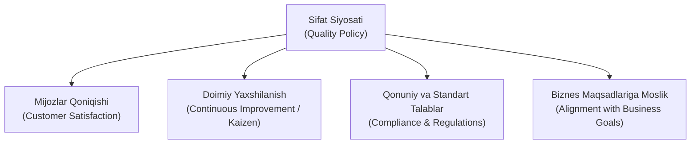
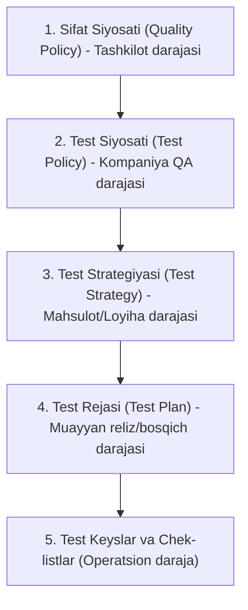

import { Callout } from 'nextra/components'

# Sifat Siyosati (Quality Policy)

**Sifat Siyosati (Quality Policy)** — tashkilotning oliy rahbariyati (*Senior Management / C-level*) tomonidan rasmiy ravishda tasdiqlangan, kompaniyaning mahsulot va xizmatlar sifatiga bo'lgan umumiy niyati, falsafasi, qadriyatlari hamda strategik yo'nalishini belgilab beruvchi eng yuqori darajadagi boshqaruv hujjatidir.

U xalqaro **ISO 9001** (Sifat menejmenti tizimi) va **ISO/IEC/IEEE 29119** (Dasturiy ta'minotni sinash) standartlari talablariga muvofiq shakllantiriladi va barcha quyi jarayonlar, shu jumladan dasturiy sinov (testing) faoliyati uchun poydevor hisoblanadi.

---

## 1. Sifat Siyosatining Asosiy Maqsadlari

Sifat siyosati shunchaki rasmiy deklaratsiya emas, balki kompaniyadagi har bir muhandis va bo'lim amal qilishi shart bo'lgan harakatlar mezonidir:

1. **Mijozlar ehtiyojini qondirish:** Foydalanuvchilarning talab va umidlariga to'liq javob beruvchi, ishonchli va qulay dasturiy ta'minot yetkazib berish.
2. **Doimiy takomillashtirish (Continuous Improvement):** Ishlab chiqish va sinov jarayonlarini muntazam tahlil qilish, xatolardan xulosa chiqarib, rivojlanish siklini ta'minlash.
3. **Standartlarga muvofiqlik:** Xalqaro xavfsizlik (masalan, ISO 27001, GDPR) va sanoat me'yorlariga qat'iy rioya etish.
4. **Biznes qiymatini oshirish:** Yuqori sifat orqali kompaniya nufuzini ko'tarish, texnik qarz (*technical debt*) va qayta ishlash xarajatlarini kamaytirish.

---

## 2. Hujjatlar Ierarxiyasidagi O'rni

Dasturiy ta'minot sifatini ta'minlashda hujjatlar ma'lum bir qat'iy pog'onali tartibda yaratiladi. Sifat siyosati ushbu piramidaning eng yuqori cho'qqisida turadi:

- **Sifat Siyosati:** Kompaniya sifatga qanday qaraydi? (Oliy rahbariyat)
- **Test Siyosati:** Sifat siyosatiga erishish uchun testlashdan qanday foydalaniladi? (QA rahbariyati)
- **Test Strategiyasi:** Muayyan mahsulot qanday usullar bilan sinovdan o'tkaziladi? (QA Lead)
- **Test Rejasi:** Joriy sprit/reliz doirasida kim, qachon va nimani tekshiradi? (QA Team)

---

## 3. Sifat Siyosati Hujjatining Tuzilishi

Odatda Sifat Siyosati qisqa, tushunarli va 1-2 sahifadan oshmaydigan ixcham shaklda bo'ladi:

1. **Kompaniyaning sifat falsafasi:** Tashkilot sifat deganda nimani tushunishi.
2. **Asosiy sifat prinsiplari:** Xavfsizlik, ishonchlilik, qulaylik (Usability), tezlik.
3. **Rahbariyat majburiyatlari:** Sifatni ta'minlash uchun kerakli resurslar, asbob-uskunalar va ta'lim bilan ta'minlash va'dasi.
4. **Mas'uliyat taqsimoti:** *"Sifat faqat QA ning ishi emas, u butun jamoaning umumiy mas'uliyatidir"* tamoyili.
5. **Davriy ko'rib chiqish:** Siyosat kamida yilda bir marta yangilanib borilishi.

---

## 4. Namunaviy Sifat Siyosati (Real Misol)

> **"FinTech Innovatsiya" MChJ Sifat Siyosati**
> 
> Biz mijozlarimizga xavfsiz, barqaror va qulay moliyaviy xizmatlarni taqdim etishga intilamiz. Sifat bizning biznes strategiyamizning asosi bo'lib, har bir xodimimiz quyidagi tamoyillarga amal qiladi:
> - Mahsulotlarimiz har doim xalqaro xavfsizlik (PCI DSS) talablariga mos keladi;
> - Dasturiy ta'minotdagi kritik nuqsonlar sonini relizgacha nolga yetkazish ustuvor vazifadir;
> - Biz har bir yangi relizda foydalanuvchilar qoniqish indeksini (CSAT) doimiy oshirib boramiz;
> - Butun jamoamiz xatoliklarning oldini olishga qaratilgan *Quality Assurance* madaniyatini qo'llab-quvvatlaydi.
> 
> *Bosh Direktor (CEO): __________________ Sana: 15.01.2026*

---

## 5. QA Muhandisi Uchun Ahamiyati

Nega oddiy sinovchi yoki QA muhandisi kompaniyaning Sifat Siyosatini bilishi kerak?

- **Prioritetlarni to'g'ri belgilash:** Agar kompaniya siyosatida birinchi o'ringa "Maksimal tezlik" emas, balki "Moliyaviy xavfsizlik va barqarorlik" qo'yilgan bo'lsa, QA xavfsizlik va chegaraviy holatlarga ko'proq vaqt ajratadi.
- **Reliz mezonlarini tushunish:** Sifat siyosati kritik xatolar bilan mahsulotni ishlab chiqarishga (Production) chiqarish mumkin yoki yo'qligini belgilovchi oliy mezon hisoblanadi.
- **Auditorlik tekshiruvlari:** ISO yoki boshqa xalqaro sertifikatlash tekshiruvlarida auditorlar birinchi navbatda xodimlardan kompaniya Sifat Siyosatini qay darajada tushunishlarini so'rashadi.
